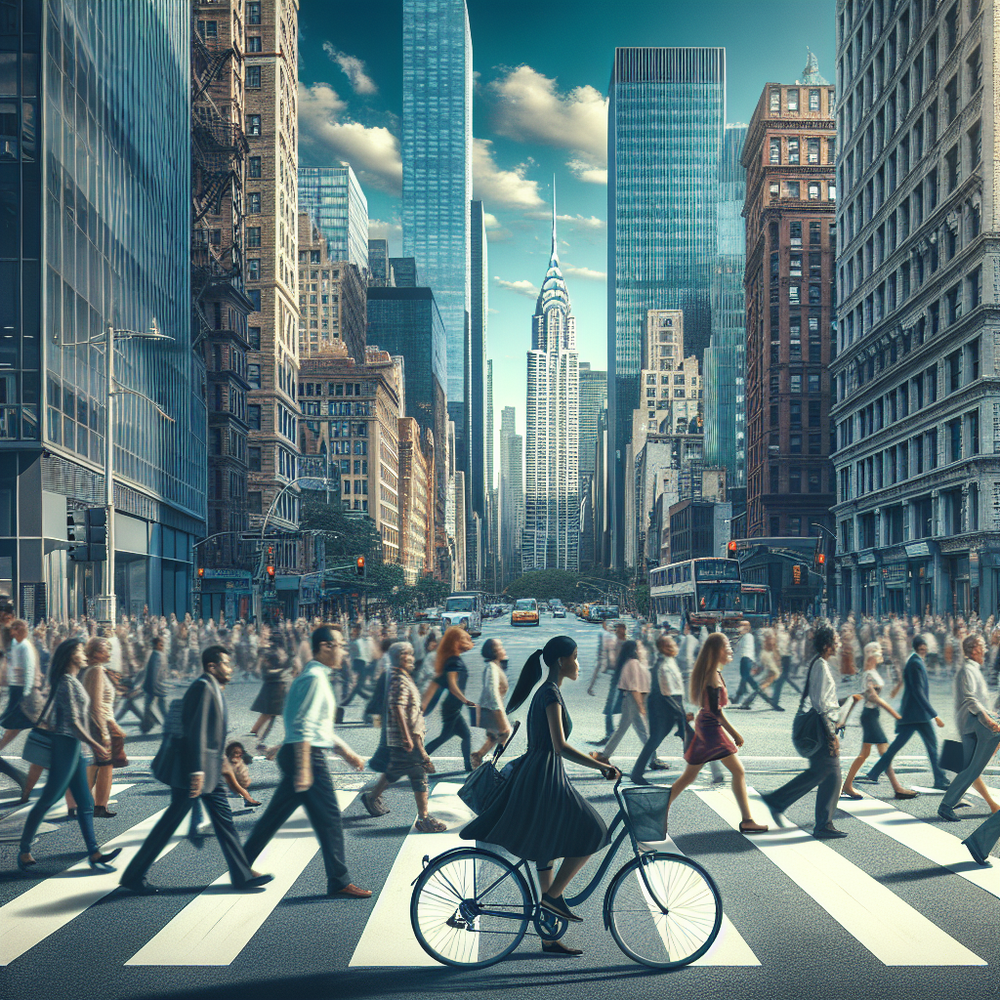

# Prompt "a city street with much traffic"

## Iteration 1

### Differences

- The image depicts a bustling city street scene with pedestrians crossing the road and a cyclist in the foreground.
- There are modern high-rise buildings lining the street, creating a corridor of glass and steel architecture under a blue sky.
- Vehicles, including a bus and cars, are visible on the street, suggesting a busy urban environment with mixed traffic.

### Prompt

Amidst the urban rhythm of a busy city street, pedestrians navigate the crosswalk while a lone cyclist weaves through the throng, all framed by towering high-rises under an expansive blue sky.

### Image

## Iteration 2

### Differences

- The image shows a bustling city street with pedestrians crossing a zebra crossing.
- Tall buildings, including one with a distinctive spire, line the street, suggesting a downtown area in a large city.
- A woman with a bicycle stands out in the foreground, while the rest of the crowd appears in motion, some blurred, indicating movement.

### Prompt

On a lively downtown street, pedestrians swarm a zebra crossing, flanked by towering skyscrapers with a standout spire, while a woman with a bicycle pauses, offering a still contrast to the blur of the city's relentless pace.

### Image

## Iteration 3

### Differences

- A woman with long hair, standing and holding a bicycle, is facing away from the camera towards a busy pedestrian crossing.
- Numerous people are walking across the crosswalk, suggesting a bustling city environment.
- Tall buildings line the street, creating an urban canyon effect, with a mix of architectural styles visible.

### Prompt

A woman with flowing hair stands gripping her bicycle, her gaze fixed on a throng of pedestrians navigating the busy crosswalk ahead, encapsulated by the soaring facades of diverse buildings that sculpt an urban canyon in the heart of the city.

### Image

## Iteration 4

### Differences

- A woman with long hair is standing with her back to the camera, holding onto a bicycle.
- A busy urban street scene with a crowd of people crossing the street.
- Tall buildings line the street, and various commercial signs are visible, suggesting a bustling city environment.

### Prompt

With her long hair cascading down her back, a woman clutches her bicycle, observing the hustle of a crowded urban street where a multitude of pedestrians cross amidst tall buildings adorned with commercial signage, painting a vivid picture of city life in motion.

### Image

## Iteration 5

### Differences

- A woman with long hair is seen from behind, holding onto the handlebars of a bicycle.
- The street is bustling with a dense crowd of pedestrians and cyclists, suggesting a busy urban environment.
- Storefronts with various signs and advertisements line the sides of the street, adding to the sense of a crowded city scene.

### Prompt

From behind, a woman with long hair grips the handlebars of her bicycle, poised on the edge of a teeming street where a dense tapestry of pedestrians and cyclists weaves through a canyon of storefronts emblazoned with a mosaic of signs and advertisements, encapsulating the vibrant pulse of city life.

### Image

## Iteration 6

### Differences

- A woman with long hair is seen from behind, standing with a bicycle, looking down a busy city street.
- The street is crowded with people walking in both directions, and the scene appears to be set in an urban area with shops and signs on either side.
- The image has a vibrant, colorful quality, with reflections on the wet street surface suggesting recent rain.

### Prompt

A woman with long hair stands with her bicycle, her gaze cast down a rain-slicked city street alive with a colorful crowd moving amidst urban shops, their signs a vivid backdrop to the reflections dancing on the wet pavement, capturing a moment of metropolitan vibrancy just after a downpour.

### Image

## Iteration 7

### Differences

- A bustling city street scene with neon signs and advertisements in various languages.
- People are walking on the wet pavement, suggesting recent rain, with some carrying umbrellas.
- A woman in the foreground is holding onto a bicycle, standing out with her focused gaze and detailed features.

### Prompt

Against the backdrop of a bustling city street illuminated by neon signs and advertisements in a babel of languages, people traverse the glistening wet pavement, some sheltered by umbrellas hinting at recent rain, while a woman in the foreground holds steadfast to her bicycle, her focused gaze and sharp features cutting through the urban tapestry.

### Image

## Iteration 8

### Differences

- The image features a bustling city street scene with vibrant colors, likely depicting a rainy evening with reflections on the wet ground.
- Numerous people with umbrellas and a woman on a bicycle are visible, suggesting a busy urban environment.
- Colorful signs and billboards with various scripts and languages adorn the buildings, adding to the multicultural atmosphere of the scene.

### Prompt

The image captures a rainy evening on a city street, where the vibrant colors of the night come alive in the reflections on the wet pavement; amidst the bustle, people with umbrellas and a woman on a bicycle navigate the scene, while colorful signs and billboards in a multitude of scripts and languages drape the buildings, contributing to the rich, multicultural ambiance.

### Image

## Iteration 9

### Differences

- The image is a vibrant, colorful illustration of a bustling city street at night, likely inspired by an East Asian cityscape, with neon signs displaying characters that suggest it might be a representation of a street in a Chinese-speaking area.
- People with umbrellas are walking on the rain-soaked pavement, reflecting the neon lights and creating a lively, wet-look effect.
- The street is lined with buildings covered in a multitude of brightly lit signs and advertisements, adding to the dynamic and busy atmosphere of the scene.

### Prompt

The illustration paints a vivid, neon-lit tableau of a bustling city street at night, reminiscent of an East Asian metropolis with neon characters hinting at a Chinese-speaking locale. Amidst the rain-soaked pavement, pedestrians with umbrellas stroll, their silhouettes casting reflections that shimmer with the vibrant glow of overhead lights, while buildings cloaked in a kaleidoscope of signs and advertisements pulse with the frenetic energy of urban life.

### Image

## Iteration 10

### Differences

- The image depicts a vibrant, neon-lit street scene, possibly inspired by an East Asian cityscape, with a multitude of colorful signs and advertisements in various scripts.
- Numerous people are shown walking with umbrellas, indicating rainy weather, and the wet ground reflects the myriad of neon lights above.
- The artwork has a cyberpunk or futuristic aesthetic, with a highly stylized and saturated color palette, enhancing the sense of a bustling, urban night life.

### Prompt

The artwork immerses the viewer in a neon-drenched street scene, evocative of an East Asian cityscape, where a tapestry of colorful signs and advertisements in diverse scripts festoons the night. Amidst the rain, throngs of people with umbrellas traverse the reflective wet ground, their forms bathed in the electric glow of neon. The piece exudes a cyberpunk or futuristic vibe, with its highly stylized and saturated colors amplifying the pulsating energy of the urban nightlife.

### Image

## Iteration 11

### Differences

- The street is lined with high-rise buildings adorned with vibrant, colorful neon signs, many of which display characters from various Asian scripts.
- People with umbrellas are walking on the wet street, reflecting the neon lights, suggesting it might be raining or have recently rained.
- The atmosphere is reminiscent of a cyberpunk aesthetic, with a futuristic and slightly dystopian feel.

### Prompt

High-rise buildings tower over a street aglow with neon signs, their bright hues and Asian characters casting a kaleidoscopic reflection on the rain-slicked pavement below where people with umbrellas amble by. The scene resonates with a cyberpunk essence, blending the futuristic with the faintly dystopian to create an atmosphere charged with nocturnal energy.

### Image

## Iteration 12

### Differences

- The image depicts a vibrant city street at night with a futuristic or cyberpunk aesthetic.
- Neon signs with Asian characters illuminate the scene, suggesting the setting may be inspired by East Asian cities like Tokyo or Hong Kong.
- People with umbrellas are walking on the wet street, reflecting the colorful lights, which gives the image a moody and atmospheric feel.

### Prompt

In the image, a city street comes alive at night, bathed in the glow of a futuristic or cyberpunk aesthetic. Neon signs adorned with Asian characters suggest a setting reminiscent of iconic East Asian metropolises such as Tokyo or Hong Kong. Below, people clutching umbrellas stroll along the rain-drenched pavement, their figures casting reflections amidst the vibrant lights, lending the scene a moody and atmospheric quality.

### Image

## Iteration 13

### Differences

- The image depicts a vibrant city street scene at night or during a dark period, illuminated by numerous neon signs with Asian characters, suggesting a setting in an East Asian city.
- People with umbrellas are seen walking, creating silhouettes against the bright lights, which indicates it might be raining or has recently rained given the wet ground reflecting the lights.
- The architecture and signage suggest a blend of modern and traditional elements, with a cyberpunk aesthetic, characterized by the high density of glowing advertisements and signs.

### Prompt

The image captures a city street at night or in the dim twilight, where neon signs scrawled with Asian characters cast an ethereal glow, hinting at the heart of an East Asian metropolis. Silhouetted figures with umbrellas meander through the scene, their outlines set against the luminous backdrop, a telltale sign of rain's recent kiss upon the streets that now mirror the electric dance of lights above. Amidst this interplay of light and shadow, the architecture melds the modern with the traditional, all under the watchful eyes of a cyberpunk aesthetic defined by a dense constellation of glowing advertisements and signs.

### Image

## Iteration 14

### Differences

- The image depicts a neon-lit urban street scene at night, with an array of colorful signs and advertisements, many of which feature Asian characters, suggesting the setting could be in a city like Tokyo, Hong Kong, or a fictional cyberpunk-inspired location.
- People with umbrellas are walking on the wet street, reflecting the neon lights, which gives the scene a moody and atmospheric vibe.
- The architecture is dense with high-rise buildings on either side of the street, contributing to the bustling, crowded feel of the scene.

### Prompt

The scene unfolds on an urban street at night, where neon lights cast their vibrant hues across the canvas of the city, their Asian characters pointing to a setting reminiscent of Tokyo, Hong Kong, or perhaps a fictional city born of cyberpunk lore. Figures with umbrellas traverse the rain-slicked streets, their forms mirrored in the shimmering pavement, adding a moody and atmospheric depth to the tableau. Flanking the thoroughfare, dense high-rise buildings reach skyward, their presence amplifying the sense of a bustling, crowded metropolis pulsating with life.

### Image

## Iteration 15

### Differences

- The image depicts a vibrant city street at night, illuminated by numerous neon signs with Chinese characters, suggesting an East Asian urban setting.
- People with umbrellas are walking on the wet street, reflecting the neon lights, which indicates recent rain.
- The architecture includes a mix of traditional and modern buildings, creating a sense of depth and a bustling metropolitan atmosphere.

### Prompt

The image portrays a lively city street at night, awash with the glow of neon signs bearing Chinese characters, hinting at the rich tapestry of an East Asian urban landscape. Pedestrians with umbrellas meander along the rain-dappled street, their reflections mingling with the neon radiance, a testament to the recent showers. A juxtaposition of traditional and contemporary architecture lines the thoroughfare, adding layers of depth to the bustling metropolitan ambiance.

### Image

## Iteration 16

### Differences

- The image depicts a vibrant city street scene at night with numerous neon signs displaying Chinese characters, suggesting an urban setting in a Chinese-speaking region.
- People with umbrellas are walking on the wet street, reflecting the ambient light and creating a colorful, atmospheric effect.
- The scene has a cyberpunk aesthetic, with a futuristic and slightly dystopian feel characterized by the dense urban environment and the predominance of artificial lighting.

### Prompt

The image captures the essence of a city street at night, alive with the electric buzz of neon signs emblazoned with Chinese characters, placing it firmly in the heart of a Chinese-speaking metropolis. Umbrella-clad pedestrians tread upon the wet asphalt, their forms casting reflections in a kaleidoscope of ambient light, weaving a rich, atmospheric tapestry. This urban landscape is steeped in a cyberpunk aesthetic, where the future converges with a hint of dystopia, underscored by the crush of high-density living and the omnipresence of artificial luminescence.

### Image

## Iteration 17

### Differences

- The image depicts a bustling city street at night, illuminated by numerous neon signs with Asian characters.
- People with umbrellas are walking on the wet pavement, reflecting the vibrant lights from the signs above.
- The architecture has a dense, urban feel with multiple levels of walkways and buildings closely packed together.

### Prompt

The image paints a scene of a bustling city street at night, where neon signs adorned with Asian characters cast a radiant glow upon the scene. Below, people clutch their umbrellas as they navigate the rain-slicked pavement, their silhouettes reflecting the kaleidoscope of vibrant lights above. The architecture looms dense and multifaceted, with layers of walkways and tightly clustered buildings contributing to the sense of a tightly woven urban tapestry.

### Image

## Iteration 18

### Differences

- The image depicts a vibrant city street at night illuminated by numerous neon signs with Chinese characters.
- People with umbrellas are walking on the wet street, suggesting it may be raining.
- The scene has a futuristic or cyberpunk aesthetic, with reflections on the ground enhancing the colorful ambiance.

### Prompt

The image reveals a city street at night, pulsating with the glow of neon signs etched in Chinese script, casting a luminous sheen over the urban tableau. Figures wielding umbrellas stroll along the rain-kissed pavement, hinting at a drizzle from above. This nocturnal landscape is steeped in a futuristic or cyberpunk ambiance, with the slick ground mirroring the vivid colors overhead, deepening the visual feast of light and reflection.

### Image

