# Prompt "a red cube in a white room"

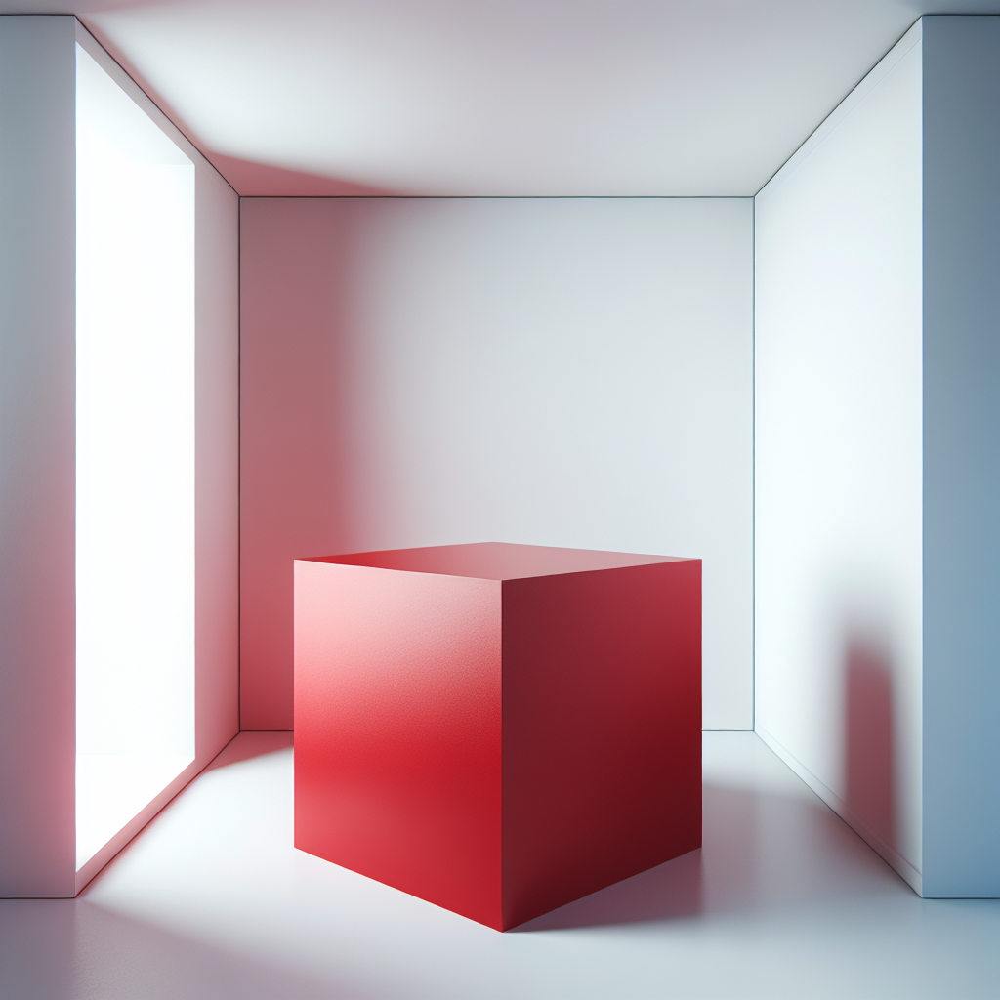

## Iteration 1

### Differences

- There's a solid red cube centered on the floor of a white room.
- The room has a soft light source, creating a gradient on the walls and casting a diffuse shadow of the cube.
- The room corners and edges are sharp and clean, suggesting a minimalist or abstract setting.

### Prompt

In the stark minimalism of the white room, a solid red cube rests precisely at the center, its diffuse shadow stretching softly across the floor as a gentle light casts a gradient along the pristine walls.

### Image

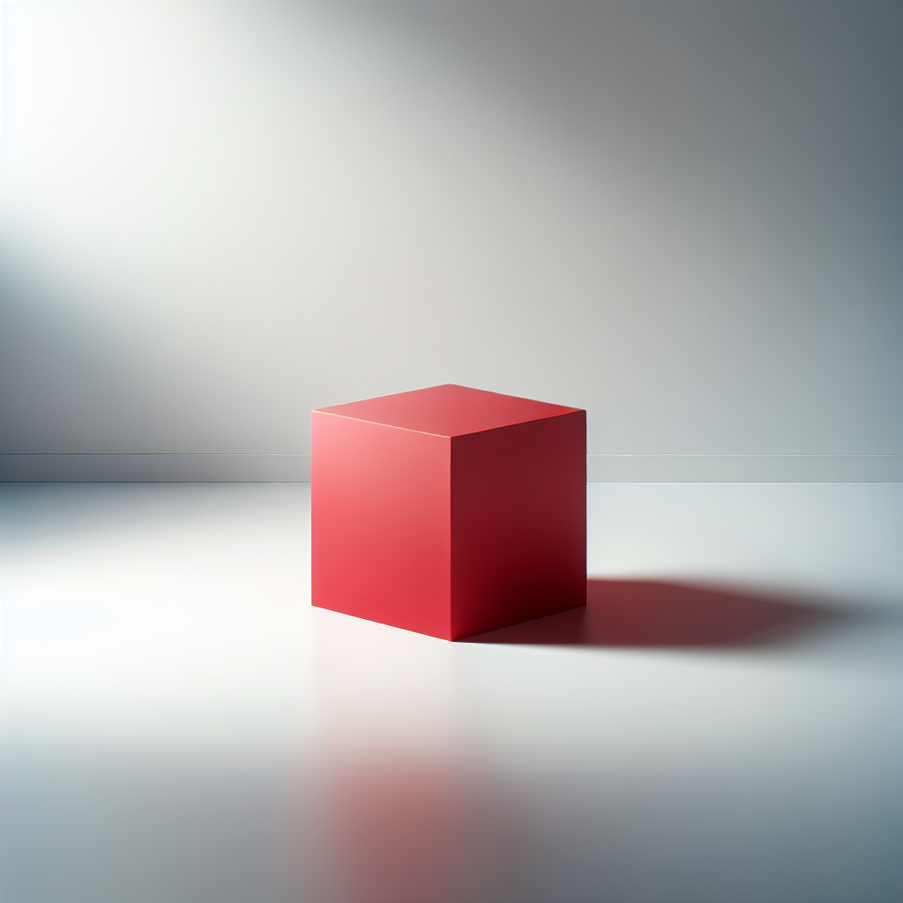

## Iteration 2

### Differences

- A red cube is centered in the image.
- The cube is placed on a reflective white surface, which appears to be the floor of a room.
- The background is a gradient from white to grey, with a shadow cast by the cube indicating a light source from the upper left.

### Prompt

The image captures a red cube perfectly centered on a reflective white surface, with a background transitioning from white to grey and a shadow hinting at a light source from the upper left corner.

### Image

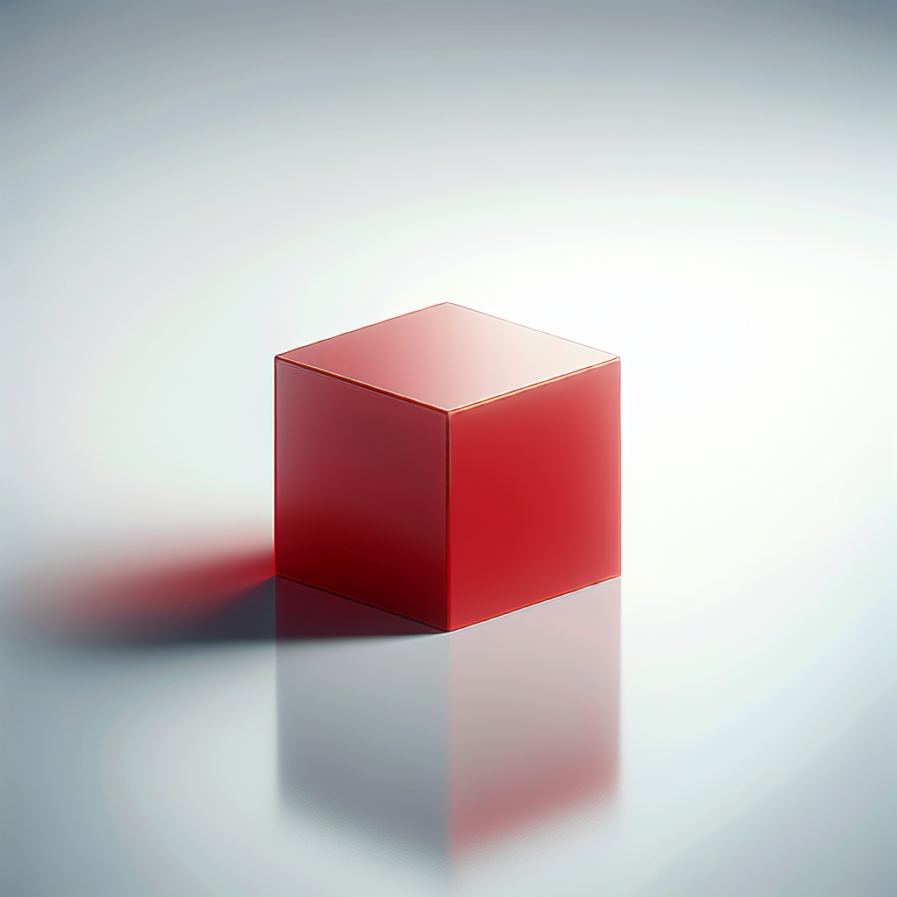

## Iteration 3

### Differences

- A glossy red cube is centered in the image.
- The cube casts a soft shadow on a reflective surface.
- The background is a gradient from white to a light grey, giving the impression of a spacious, illuminated room.

### Prompt

A glossy red cube sits prominently at the center of the image, casting a subtle shadow on the reflective surface beneath it, while the background fades from white to light grey, evoking the feel of an expansive, well-lit room.

### Image

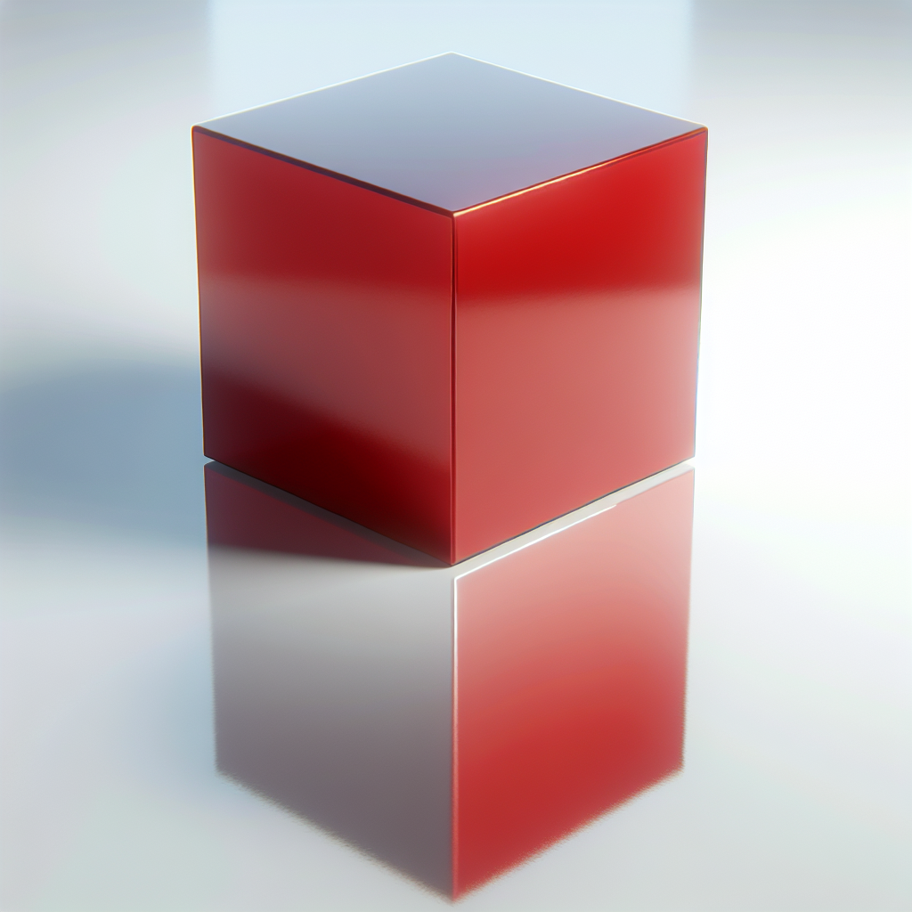

## Iteration 4

### Differences

- A glossy red cube is centrally positioned.
- The cube is casting a reflection on a shiny surface.
- The background is a gradient from white to light blue, suggesting a spacious or infinite environment.

### Prompt

At the heart of the composition lies a glossy red cube, its image mirrored on the shiny surface below, while the background's gradient shifts from white to light blue, hinting at the vastness or infinity of the surrounding space.

### Image

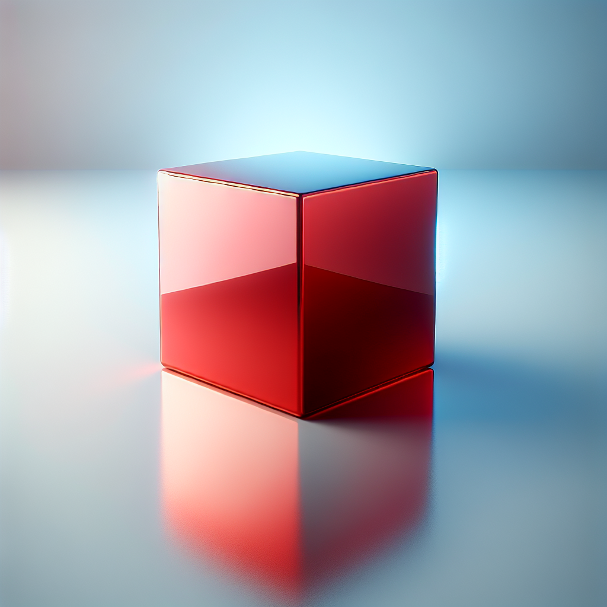

## Iteration 5

### Differences

- A glossy red cube is centered in the image.
- The cube casts a soft reflection and shadow on a glossy surface.
- The background has a gradient from white to blue, creating a cool, ambient atmosphere.

### Prompt

The image features a glossy red cube at its center, with a gentle reflection and shadow upon the glossy surface, set against a background that fades from white to blue, contributing to a serene and cool ambient atmosphere.

### Image

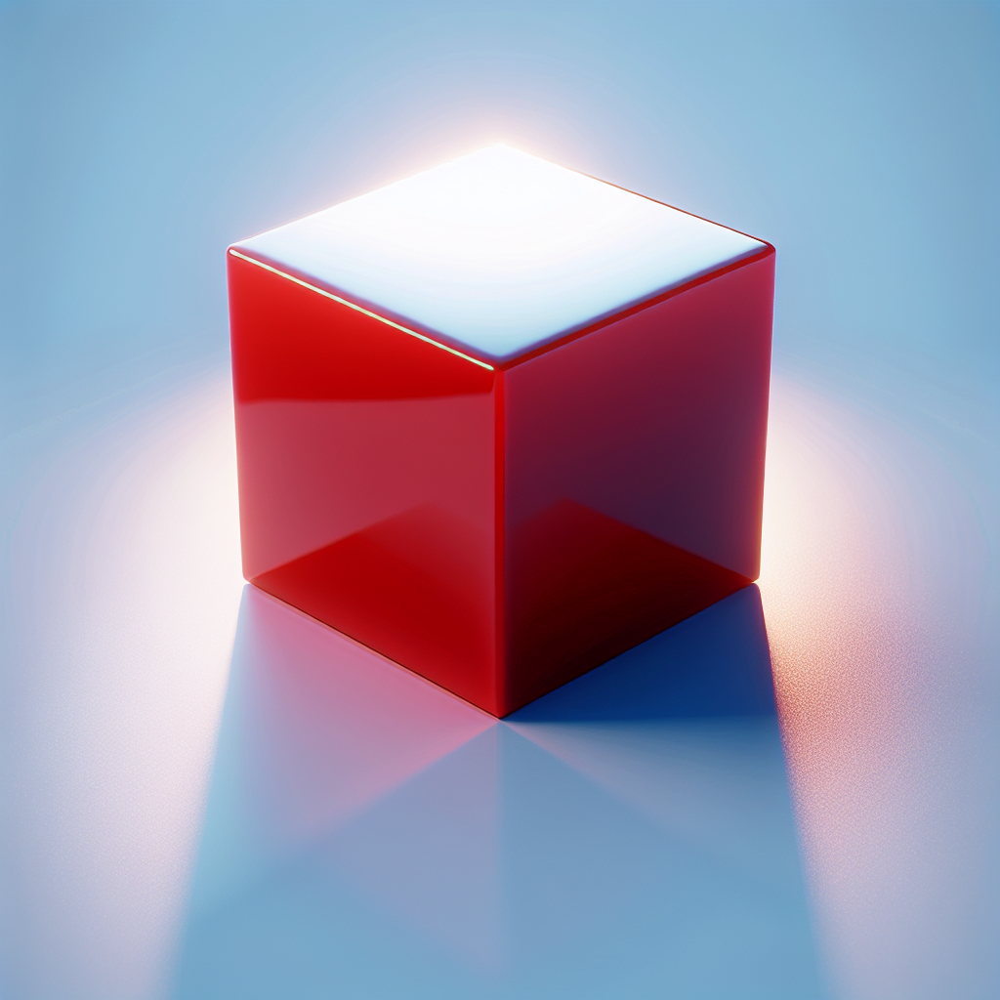

## Iteration 6

### Differences

- A shiny red cube is centered in the image.
- The cube is casting a soft shadow on a reflective surface.
- The background has a gradient from white to a soft blue, creating a calm atmosphere.

### Prompt

In the image, a shiny red cube is perfectly centered, casting a gentle shadow on the reflective surface below, while the background's smooth gradient from white to soft blue adds to the scene's tranquil atmosphere.

### Image

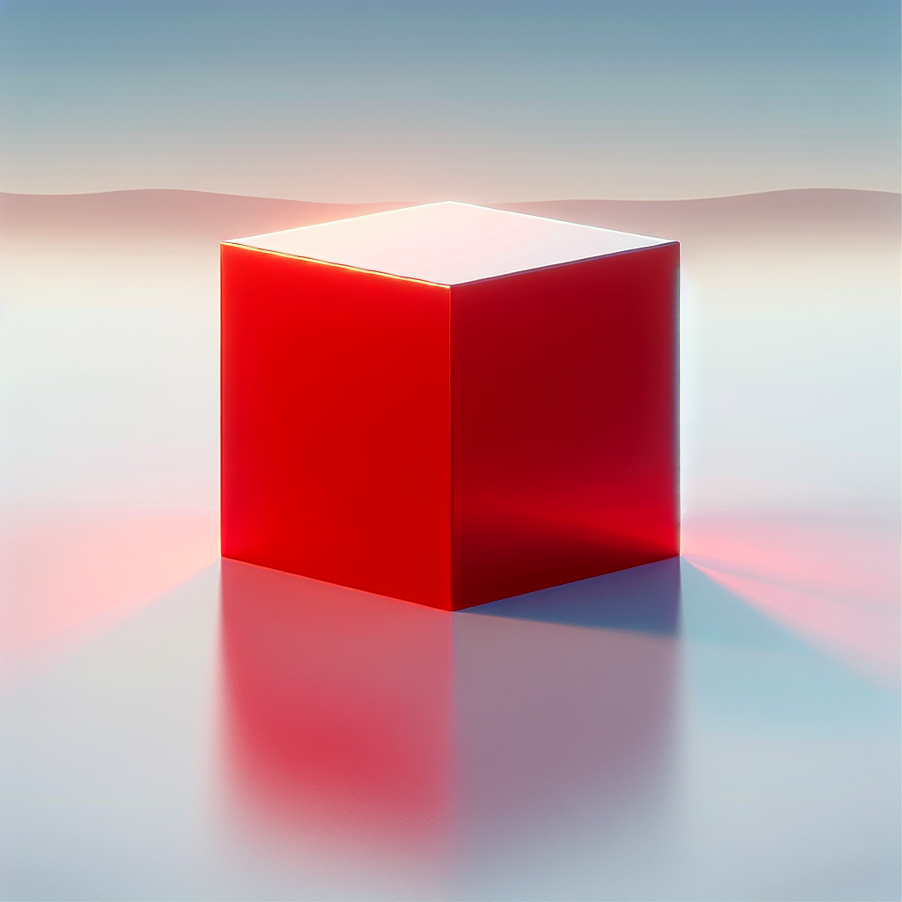

## Iteration 7

### Differences

- A vibrant red cube is centered in the image.
- The cube is casting a soft shadow and reflection on a glossy surface.
- The background has a smooth gradient, transitioning from a lighter tone near the horizon to a pinkish hue closer to the cube.

### Prompt

The image showcases a vibrant red cube prominently centered, with its soft shadow and reflection gracing the glossy surface beneath it, all set against a soothing background that transitions from a lighter tone at the horizon to a subtle pinkish hue near the cube.

### Image

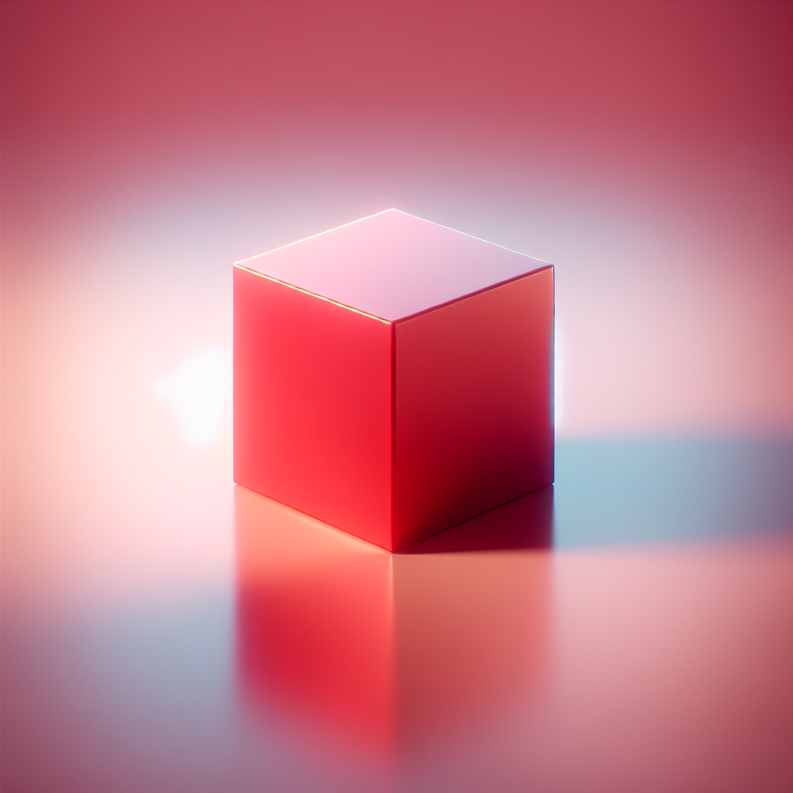

## Iteration 8

### Differences

- A red cube is centered in the image.
- The cube is on a reflective surface, casting a soft shadow and reflection.
- The background and ambient lighting have a gradient of pink to red tones, contrasting with the cube's solid red color.

### Prompt

A red cube takes center stage in the image, resting on a reflective surface that echoes its form with a soft shadow and reflection, while the background and ambient lighting blend in a gradient of pink to red tones, creating a striking contrast with the cube's solid red color.

### Image

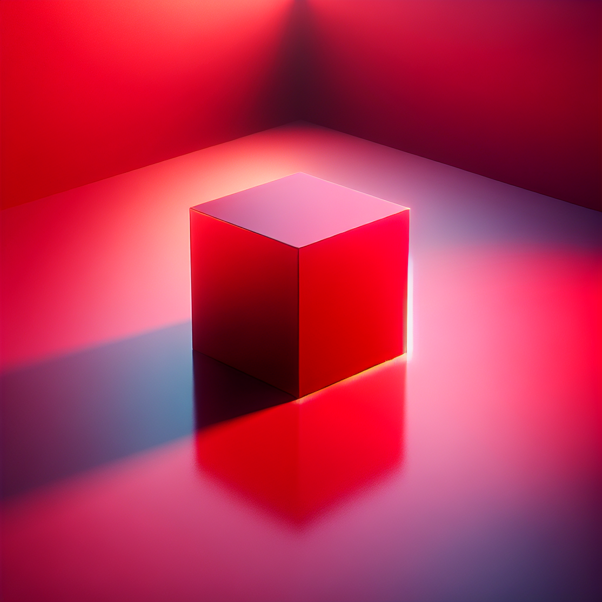

## Iteration 9

### Differences

- A glossy red cube is centered in the image.
- The cube is casting a soft shadow on a reflective surface.
- The room appears to be illuminated with red lighting, creating a gradient effect on the walls and floor.

### Prompt

A glossy red cube sits at the heart of the image, its presence marked by a soft shadow upon the reflective surface, as the room is bathed in a red glow, casting a gradient of deeper hues across the walls and floor.

### Image

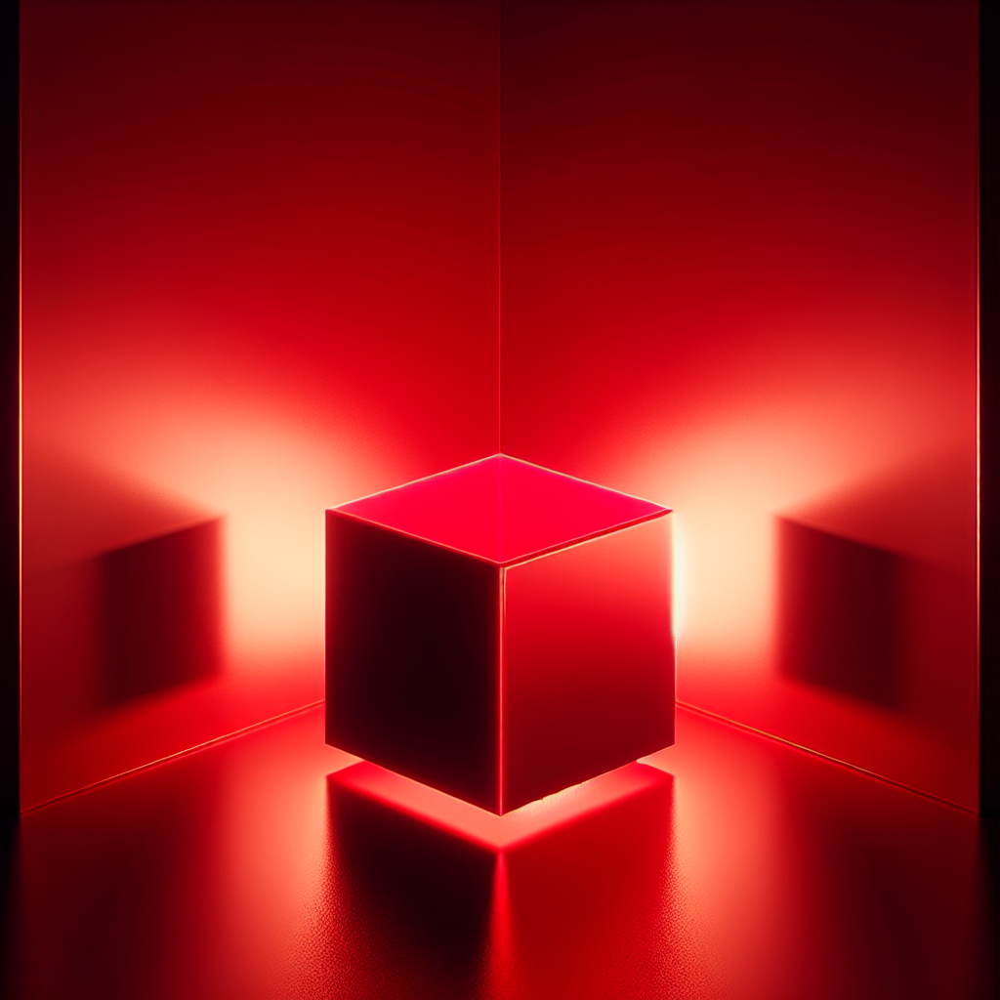

## Iteration 10

### Differences

- A glowing red cube is centered in the image.
- The room has red walls, floor, and ceiling, with a reflective surface.
- The lighting creates a soft gradient on the walls and intense highlights on the edges of the cube.

### Prompt

In the image, a glowing red cube is perfectly centered, surrounded by a room with red walls, floor, and ceiling that boast a reflective quality, where the lighting delicately casts a soft gradient on the walls and produces intense highlights along the cube's edges.

### Image

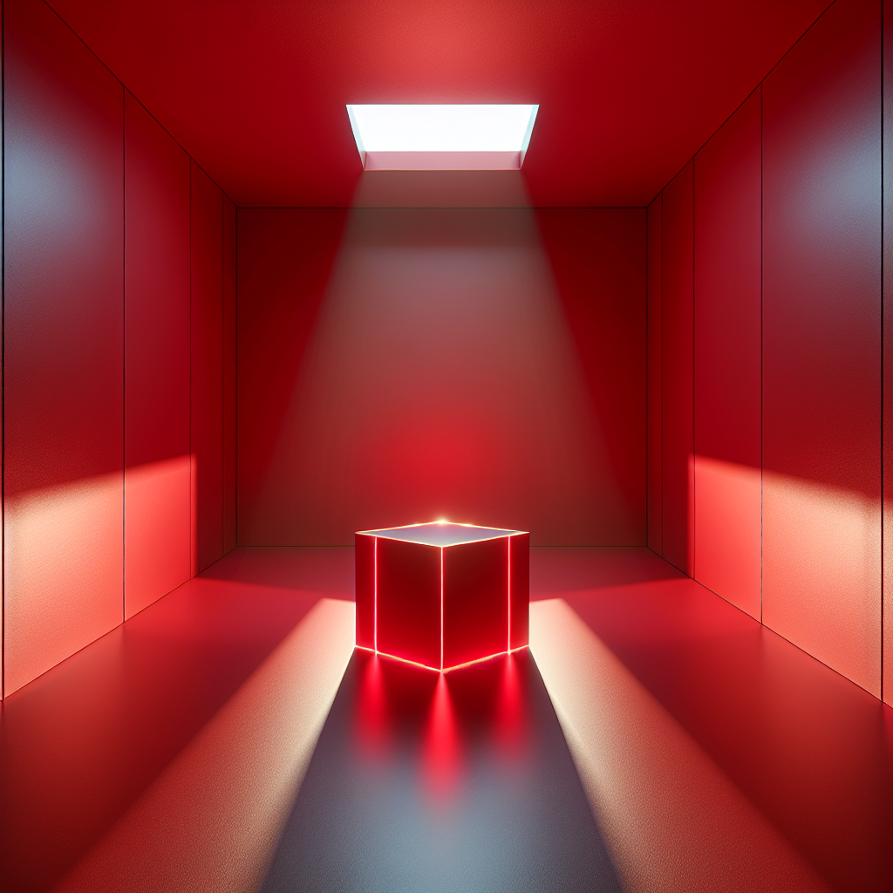

## Iteration 11

### Differences

- The room is illuminated with a red ambient light, casting a warm glow on all surfaces.
- A red cube with illuminated edges sits in the center of the room, creating a focal point.
- Light from a ceiling fixture casts shadows on the walls and floor, highlighting the cube's geometry.

### Prompt

Bathed in a red ambient light, the room exudes a warm glow across all surfaces, while an illuminated-edge red cube commands attention at the center, with light from a ceiling fixture accentuating the cube's geometric form through shadows on the walls and floor.

### Image

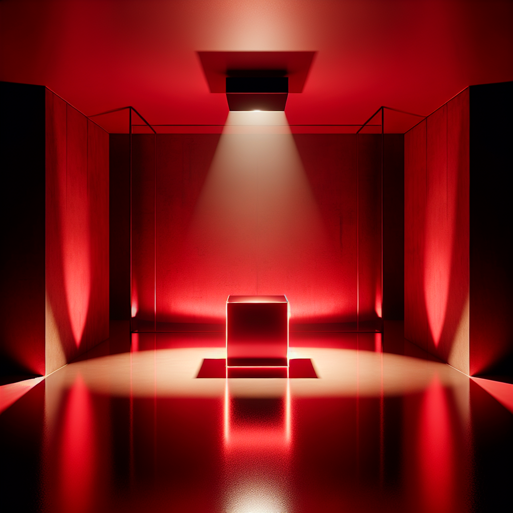

## Iteration 12

### Differences

- The room is illuminated in red with a single source of light from above, casting a focused beam.
- A red cube is centered on the floor, and it appears to be the focal point of the lighting, creating a highlighted outline and reflection on the glossy surface.
- The walls and ceiling have a smooth texture, and the room has a minimalist design, emphasizing the cube and the dramatic lighting effect.

### Prompt

With a single light source from above casting a focused red beam, the room is awash in a crimson hue, centering on a red cube on the floor that gleams with a highlighted outline and reflection on the glossy surface, all within a minimalist space with smooth walls and ceiling, designed to accentuate the cube and the striking play of light.

### Image

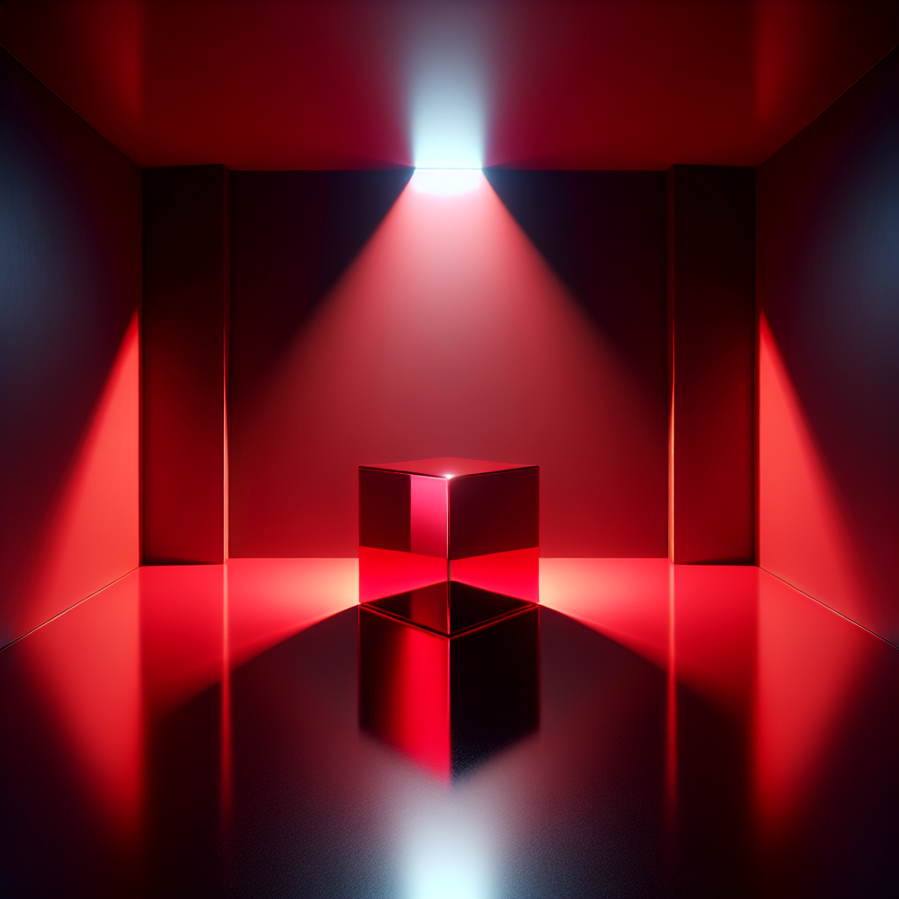

## Iteration 13

### Differences

- A red cube is centered on a reflective surface.
- The room has red lighting, with a bright light source above the cube creating a spotlight effect.
- The walls and floor appear to be dark, enhancing the contrast with the red cube and light.

### Prompt

In the midst of a darkened room, a red cube is centered on a reflective surface, illuminated by a bright light source from above that creates a dramatic spotlight effect, with the red lighting enhancing the stark contrast between the cube, the light, and the surrounding darkness.

### Image

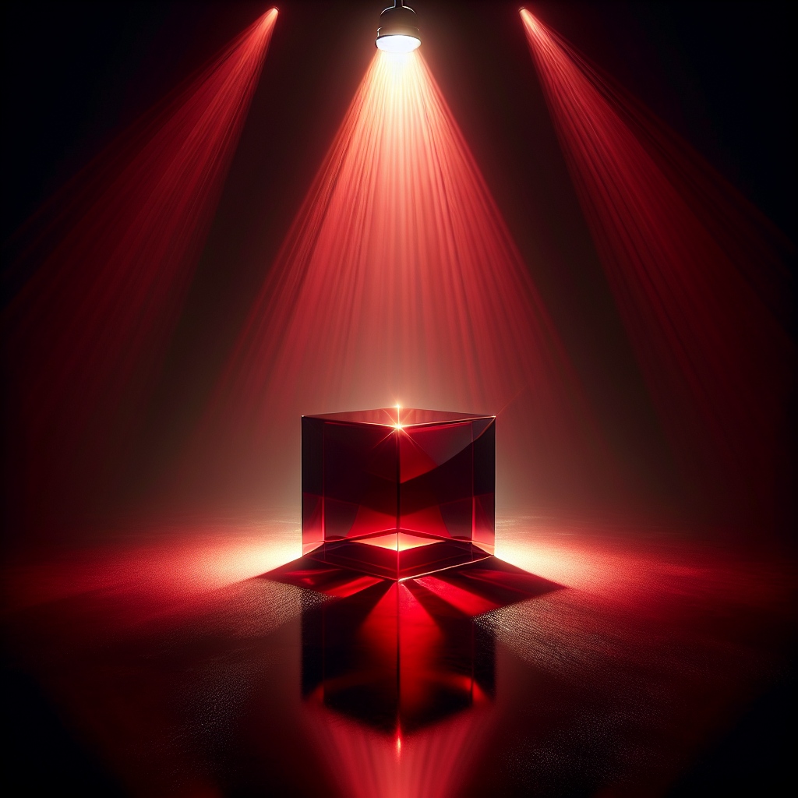

## Iteration 14

### Differences

- A transparent red cube is centered in the image, illuminated by a light above.
- The cube casts a vivid red reflection on the glossy surface below it.
- Three beams of light converge on the cube from the light source, creating a dramatic and atmospheric scene.

### Prompt

A transparent red cube is the focal point of the image, bathed in light from above that casts a vivid red reflection on the glossy surface beneath, while three beams of light converge on the cube, setting a dramatic and atmospheric tone to the scene.

### Image

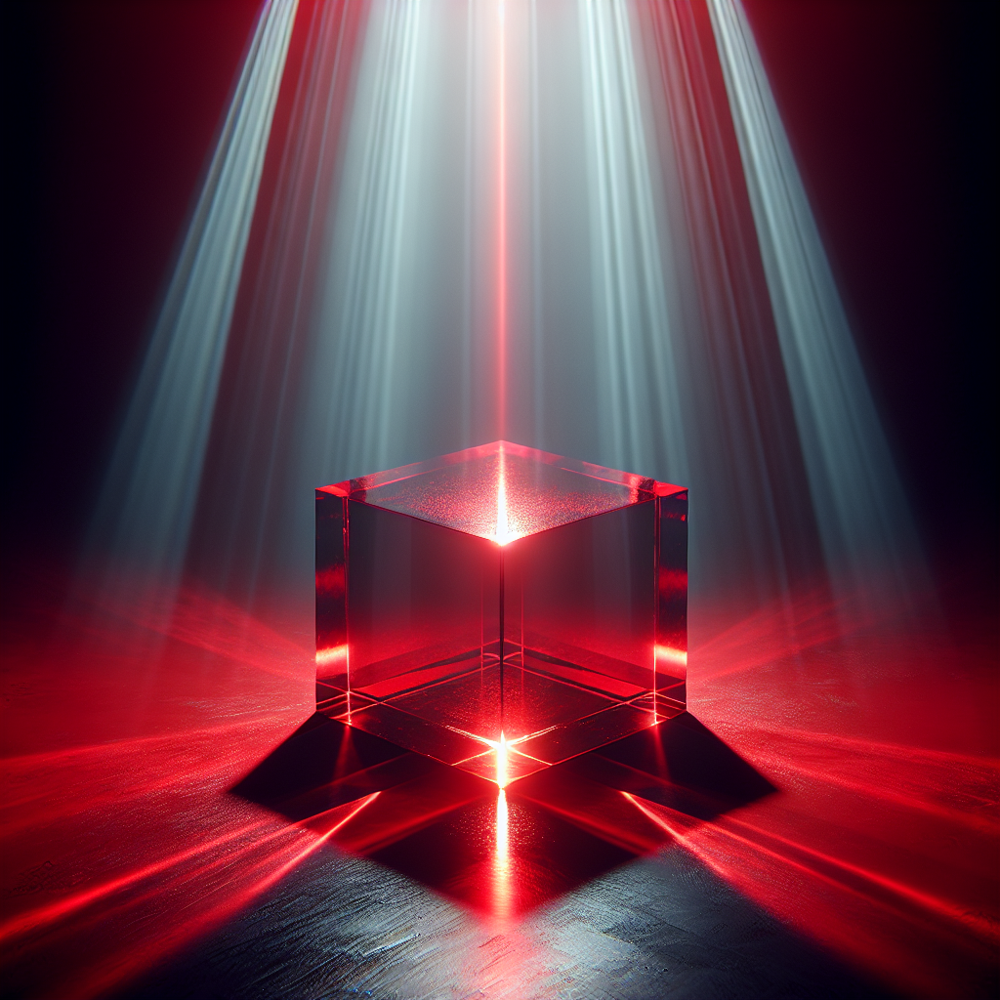

## Iteration 15

### Differences

- A transparent red cube is centered in the image, illuminated by light.
- Beams of white light shine down from above, highlighting the cube and creating a dramatic effect.
- The cube casts bright red reflections and shadows on the dark floor, enhancing its glowing appearance.

### Prompt

In the image, a transparent red cube is strategically placed at the center, caught in the glow of white light beams that shine down from above, their brilliance highlighting the cube and crafting a theatrical effect, while bright red reflections and shadows dance on the dark floor, intensifying the cube's radiant presence.

### Image

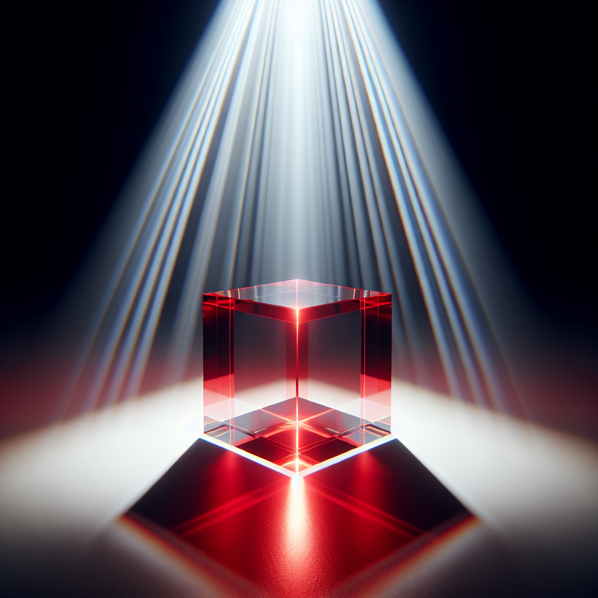

## Iteration 16

### Differences

- A transparent red cube is illuminated by light from above.
- The cube is casting a red reflection on the glossy surface below it.
- The background is dark with beams of light converging on the cube, highlighting it.

### Prompt

A transparent red cube is bathed in light from above, its form casting a crimson reflection on the glossy surface beneath, all set against a dark backdrop where beams of light converge dramatically on the cube, emphasizing its presence.

### Image

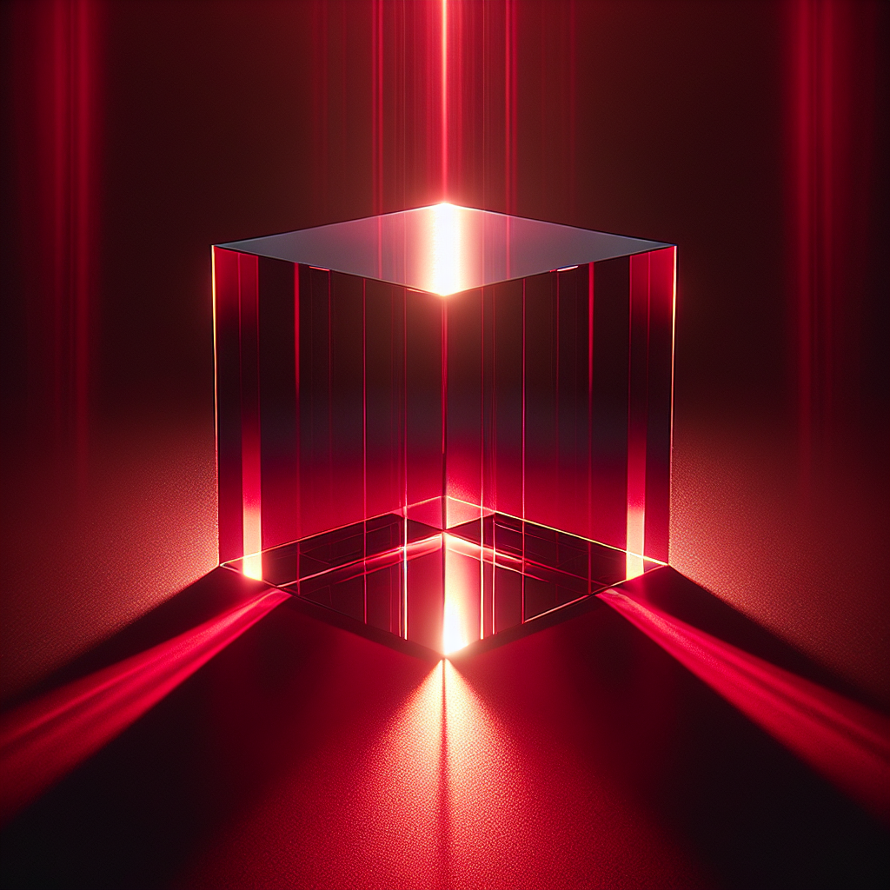

## Iteration 17

### Differences

- The image features a transparent red cube in a room illuminated with red light.
- Light beams are emanating from the cube's edges, casting a glow on the floor and walls.
- The cube appears to be the central focus of the image, with a reflective surface that enhances its geometric shape.

### Prompt

The image captures a transparent red cube in a room bathed in red light, with beams radiating from its edges, casting a soft glow on the floor and walls, making the cube the central focus and its reflective surface accentuating its sharp geometric form.

### Image

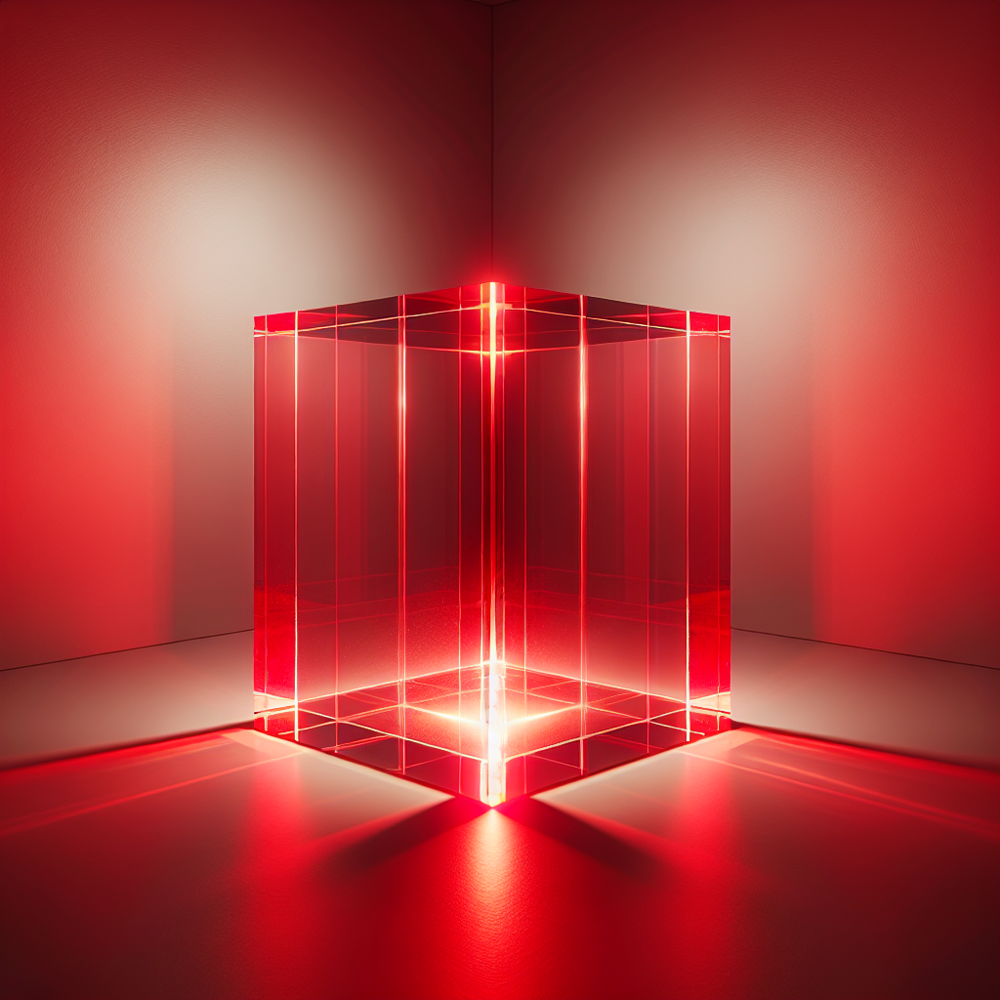

## Iteration 18

### Differences

- The image features a transparent red cube in the center of a room.
- The room has a red ambient light that casts a soft glow on the walls and floor.
- The cube appears to be illuminated from within, with bright lines running along its edges, enhancing its geometric shape.

### Prompt

In the image, a transparent red cube sits at the heart of a room enveloped in a red ambient light that casts a gentle glow across the walls and floor, while the cube itself seems to be lit from within, its edges traced with bright lines that accentuate its crisp geometric shape.

### Image

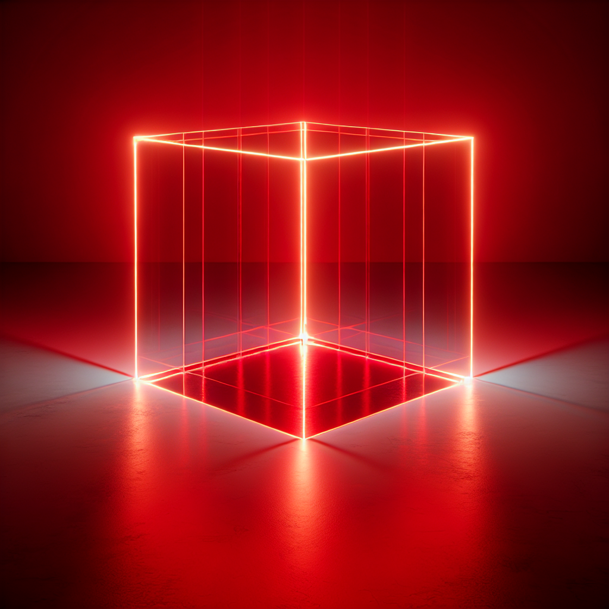

## Iteration 19

### Differences

- The image features a glowing red cube outlined by bright lines against a dark background.
- The cube appears to be emitting light, which is casting a soft red glow on the surrounding surfaces.
- The environment is minimalistic, with the focus solely on the illuminated cube structure.

### Prompt

Against a dark backdrop, the image showcases a glowing red cube defined by bright lines, with the cube itself seeming to emit light, bathing the nearby surfaces in a soft red luminescence, all within a minimalistic setting that draws the eye solely to the radiant cube structure.

### Image

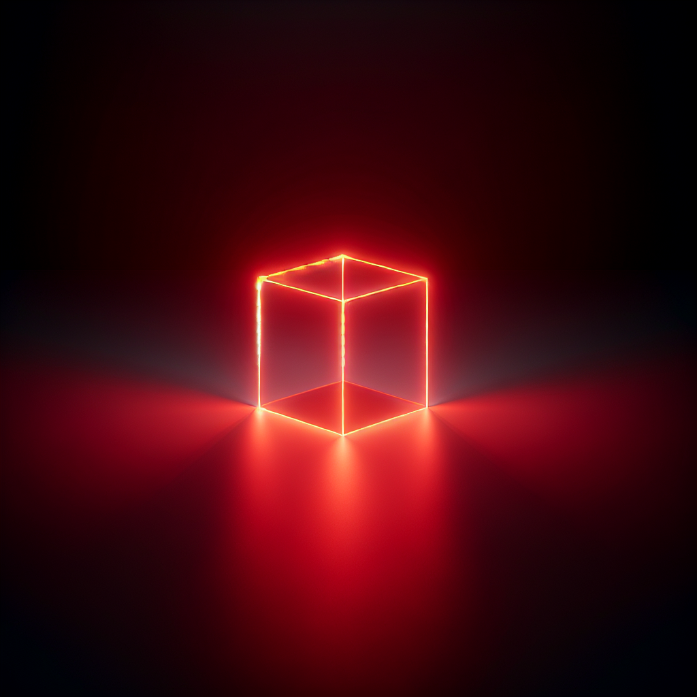

## Iteration 20

### Differences

- The image features a glowing red cube with its edges highlighted.
- The cube appears to be in a dark environment rather than a white room, with a subtle reflection on the surface below it.
- The background is dark with a vignette effect, focusing the attention on the illuminated cube.

### Prompt

The image presents a glowing red cube with distinctly highlighted edges, situated in a dark environment that contrasts with its luminosity, and casts a subtle reflection on the surface beneath, while the background fades into darkness with a vignette effect, directing all attention to the radiant cube.

### Image

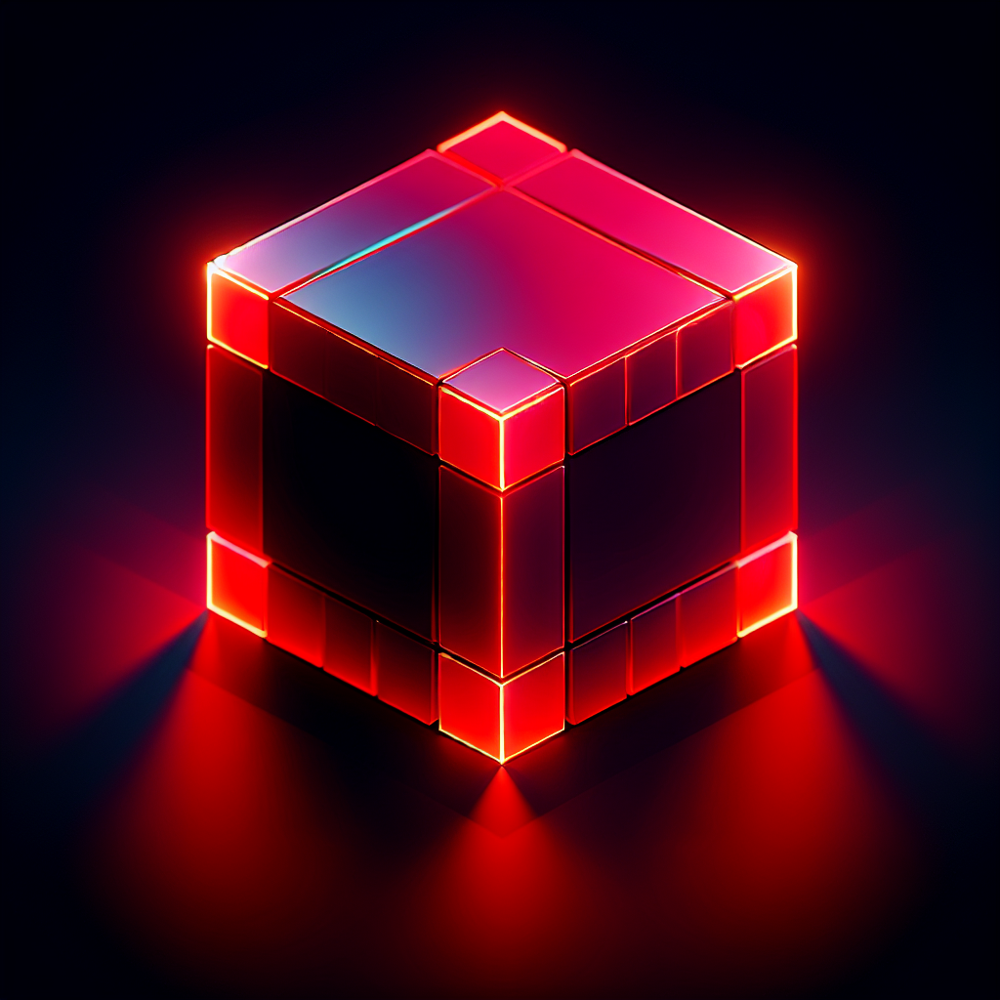

