# Prompt "the sea by night on fullmoon"

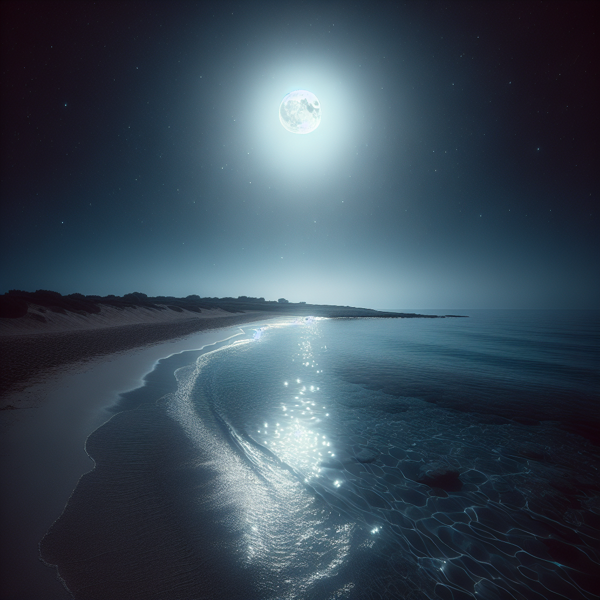

## Iteration 1

### Differences

- A full moon illuminates the night sky, casting a bright glow and reflection on the sea.
- The moonlight creates a shimmering path on the water's surface, leading towards the horizon.
- The beach is tranquil and deserted, with gentle waves lapping the shore and a starry sky overhead.

### Prompt

Under the full moon's radiant glow, a shimmering path stretched across the tranquil sea, while gentle waves whispered to the deserted beach under a starry sky.

### Image

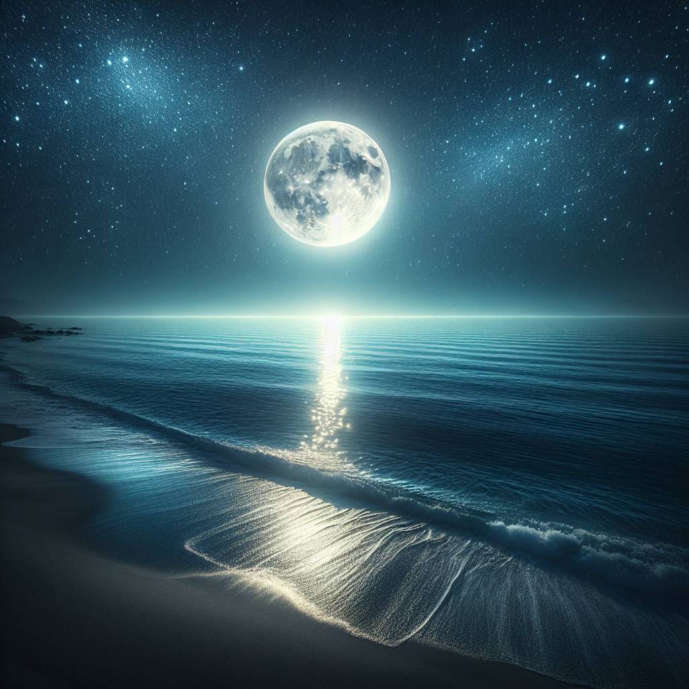

## Iteration 2

### Differences

- A large, bright full moon illuminates the night sky, casting a reflection on the sea.
- Gentle waves wash onto a sandy beach under a star-studded sky.
- The serene scene captures the tranquil beauty of a moonlit seascape.

### Prompt

The serene beauty of a moonlit seascape unfolds as a large, bright full moon casts its reflection on the sea, while gentle waves wash onto a sandy beach under a star-studded sky.

### Image

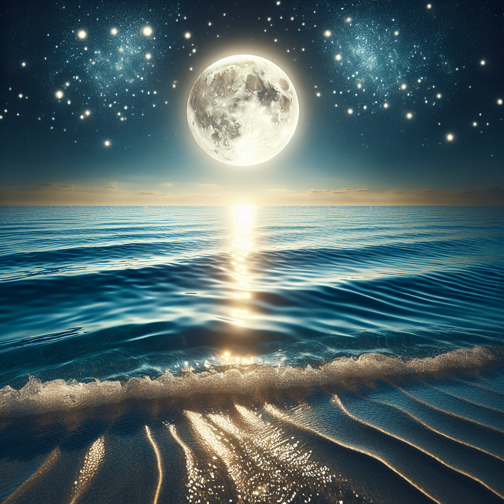

## Iteration 3

### Differences

- A full moon is prominently displayed in a star-filled night sky.
- The moonlight is reflecting on the calm sea, creating a bright path on the water's surface.
- Gentle waves are washing onto a sandy shore, with the sand glistening under the moonlight.

### Prompt

As a full moon hangs prominently in the star-filled night sky, its light reflects off the calm sea, creating a luminous path on the water's surface while gentle waves wash onto a glistening sandy shore.

### Image

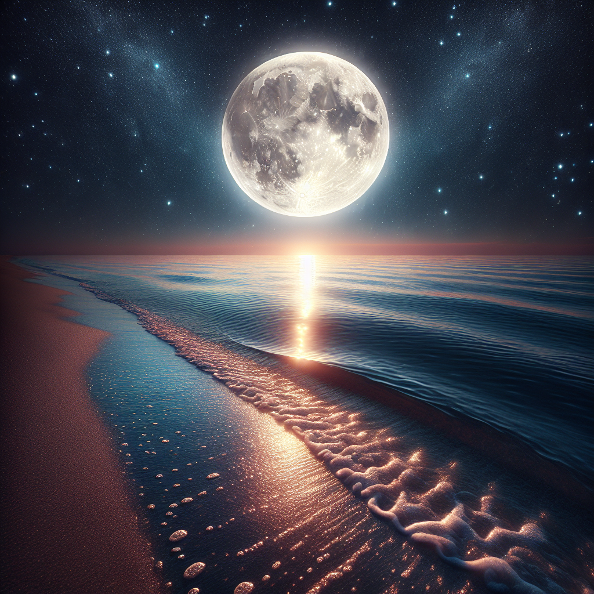

## Iteration 4

### Differences

- A large full moon dominates the night sky, casting a bright reflection on the calm sea below.
- The shoreline is visible with gentle waves lapping onto the sandy beach, creating a serene scene.
- Stars are scattered across the sky, enhancing the celestial atmosphere of the image.

### Prompt

A large full moon dominates the night sky, its bright reflection on the calm sea below complementing the gentle waves lapping onto the sandy beach, while scattered stars enhance the celestial atmosphere of the serene scene.

### Image

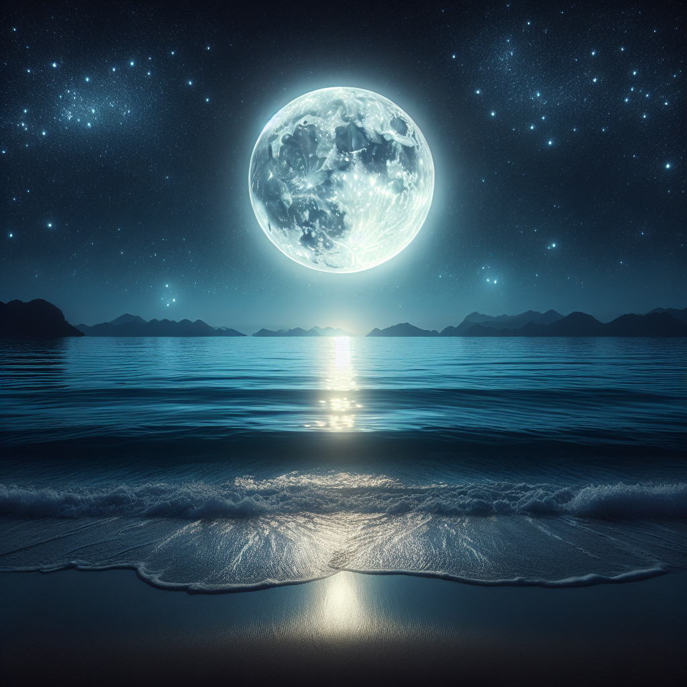

## Iteration 5

### Differences

- A large full moon dominates the night sky, casting a bright reflection on the sea below.
- Gentle waves lap at a sandy shore, illuminated by the moonlight.
- Stars twinkle in the dark blue sky, with a mountainous silhouette visible on the horizon.

### Prompt

The large full moon reigns over the night sky, casting its bright reflection on the sea below, while gentle waves lap at a moonlit sandy shore and twinkling stars dot the dark blue expanse above a mountainous silhouette on the horizon.

### Image

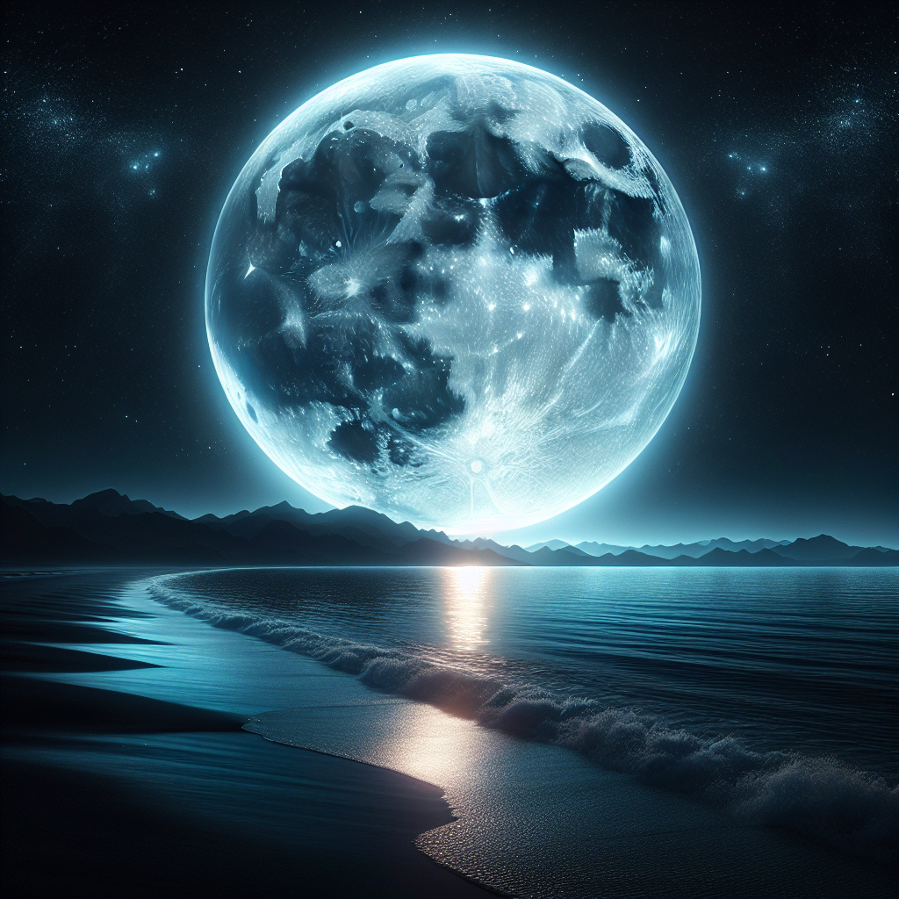

## Iteration 6

### Differences

- An oversized full moon dominates the night sky, illuminating the scene with a bright glow.
- Gentle waves lap against a sandy shore, reflecting the moonlight and creating a tranquil atmosphere.
- The backdrop features a silhouette of mountain ranges under a star-studded sky, enhancing the surreal and majestic setting.

### Prompt

An oversized full moon casts a bright glow over the scene, where gentle waves lap against a sandy shore, their moonlit reflections contributing to a tranquil atmosphere, all set against the silhouette of mountain ranges under a star-studded sky, enhancing the surreal and majestic setting.

### Image

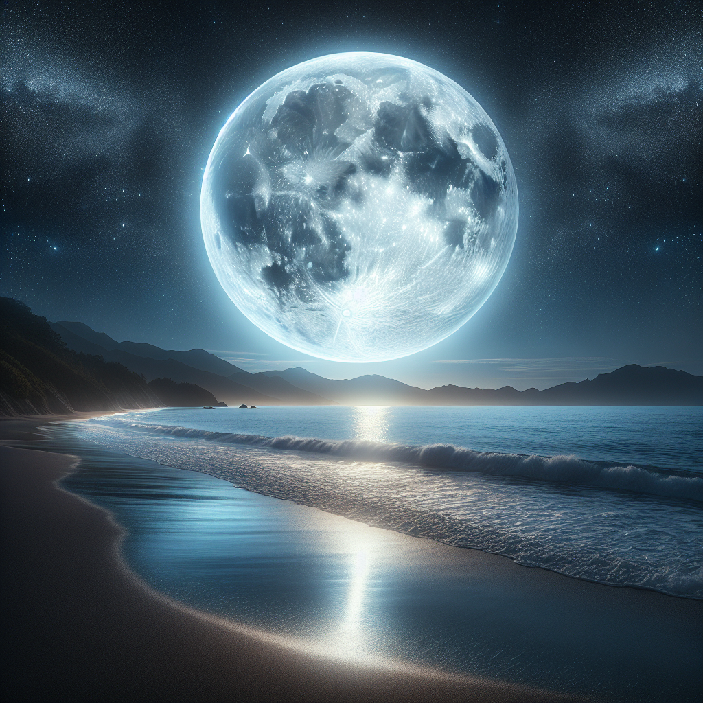

## Iteration 7

### Differences

- A strikingly large full moon dominates the night sky, casting a bright reflection on the sea.
- Gentle waves wash onto a sandy beach, with the coastline receding into the distance under a star-speckled sky.
- Mountain silhouettes form a backdrop against the moonlit horizon, enhancing the peaceful nocturnal landscape.

### Prompt

The strikingly large full moon casts a bright reflection upon the sea, while gentle waves wash onto a sandy beach that recedes into the distance under a star-speckled sky, with mountain silhouettes forming a tranquil backdrop against the moonlit horizon.

### Image

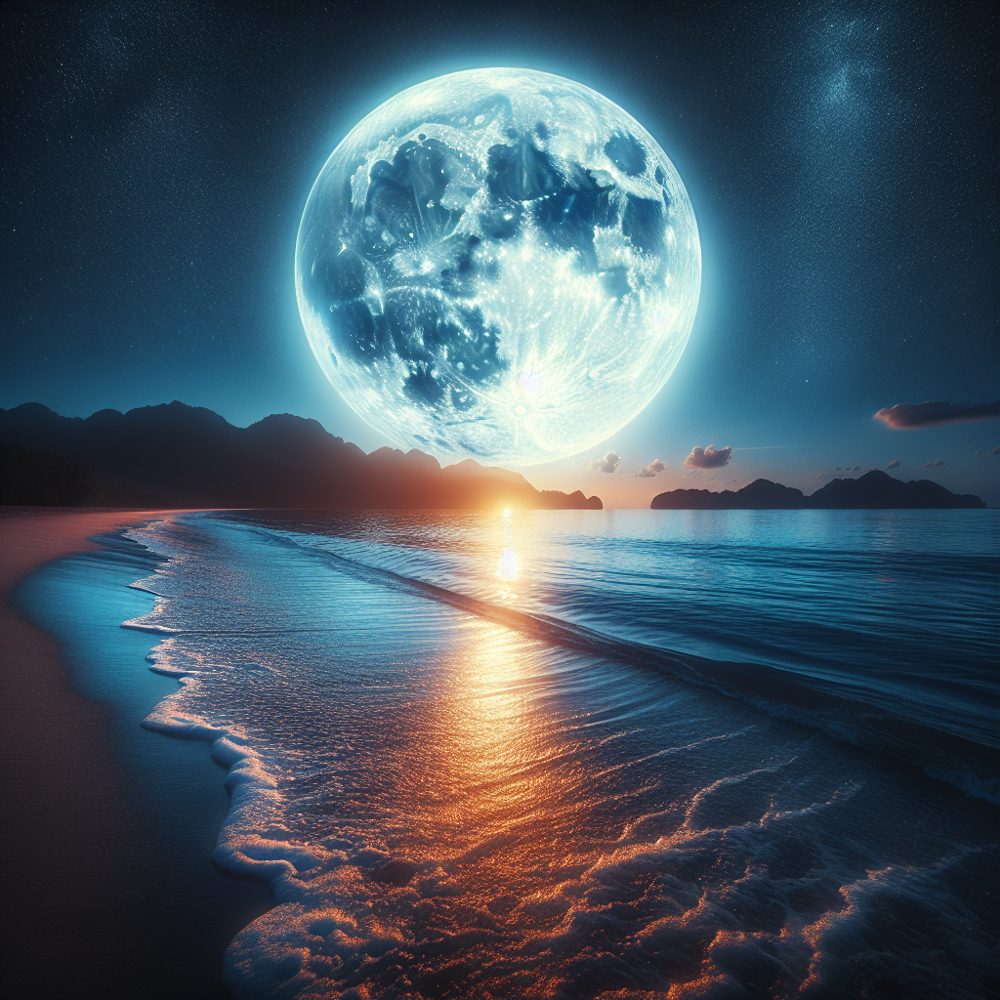

## Iteration 8

### Differences

- A large, luminous full moon dominates the night sky, casting a bright reflection on the sea.
- Gentle waves lap onto a sandy beach, with the moon's reflection creating a pathway of light on the water's surface.
- In the background, silhouettes of mountains or hills are visible against the night sky, adding to the serene scene.

### Prompt

A large, luminous full moon dominates the night sky, its bright reflection creating a pathway of light on the sea as gentle waves lap onto a sandy beach, with the silhouettes of mountains or hills adding to the serene scene in the background.

### Image

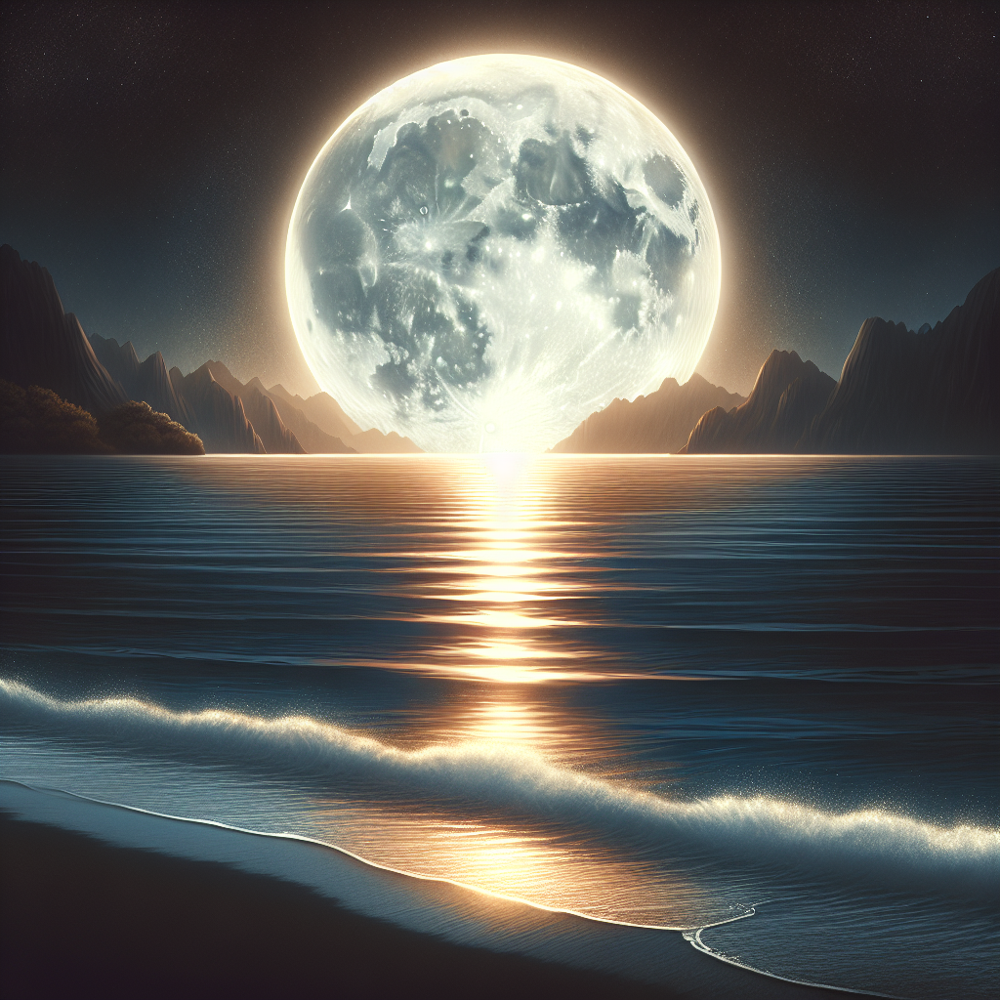

## Iteration 9

### Differences

- A large, luminous full moon dominates the sky, casting a bright reflection across the sea.
- Gentle waves lap onto a sandy shore, with the moon's reflection creating a path of light on the water's surface.
- Rugged mountains form a silhouette against the night sky on either side of the scene, adding to the tranquil and picturesque setting.

### Prompt

A large, luminous full moon commands the sky, its reflection casting a path of light across the sea, while gentle waves lap onto a sandy shore, all framed by the rugged silhouettes of mountains against the night sky, contributing to the tranquil and picturesque setting.

### Image

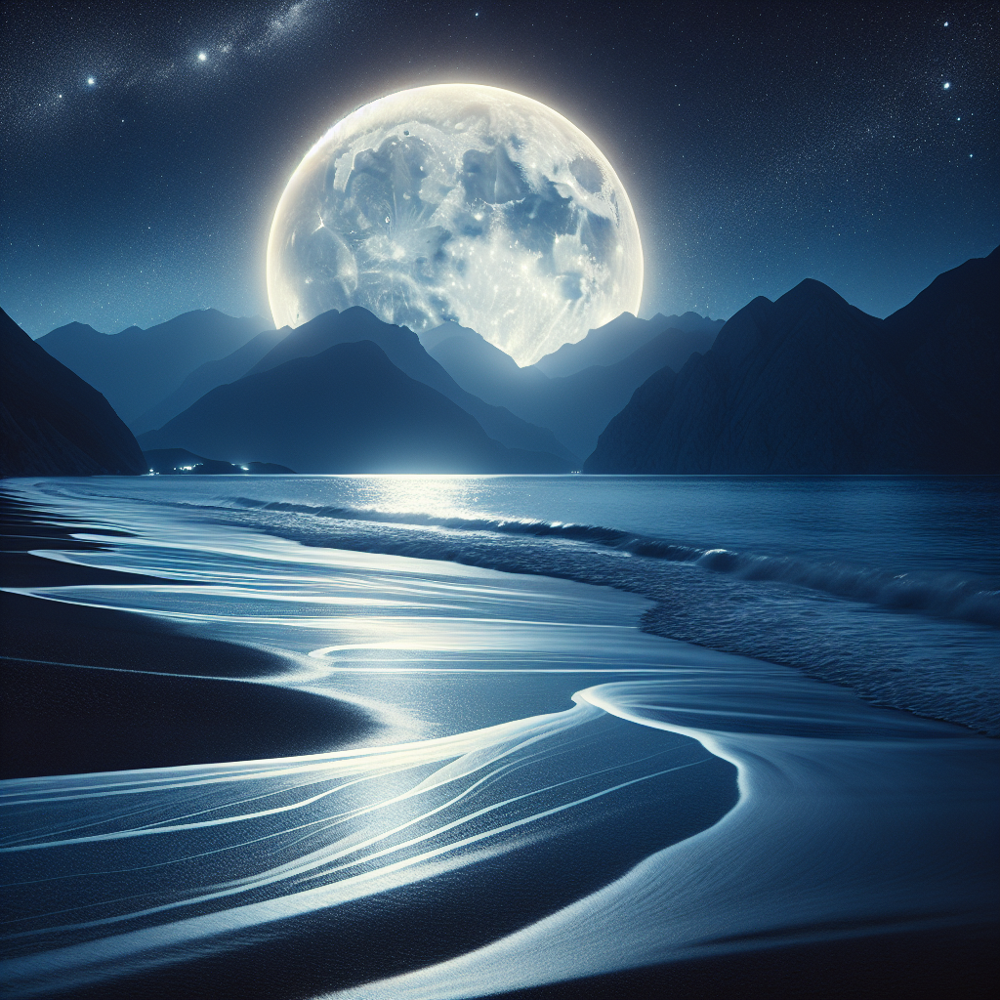

## Iteration 10

### Differences

- A large full moon illuminates the scene with its bright light, casting a serene glow over the sea and mountains.
- Gentle waves lap onto a sandy shore, creating smooth, reflective patterns in the sand under the moonlight.
- Rugged mountains frame the backdrop, adding a sense of majesty and tranquility to this nocturnal landscape.

### Prompt

The large full moon bathes the scene in its serene glow, illuminating the sea and mountains, as gentle waves create smooth, reflective patterns on the sandy shore under the moonlight, with rugged mountains framing the majestic and tranquil nocturnal landscape.

### Image

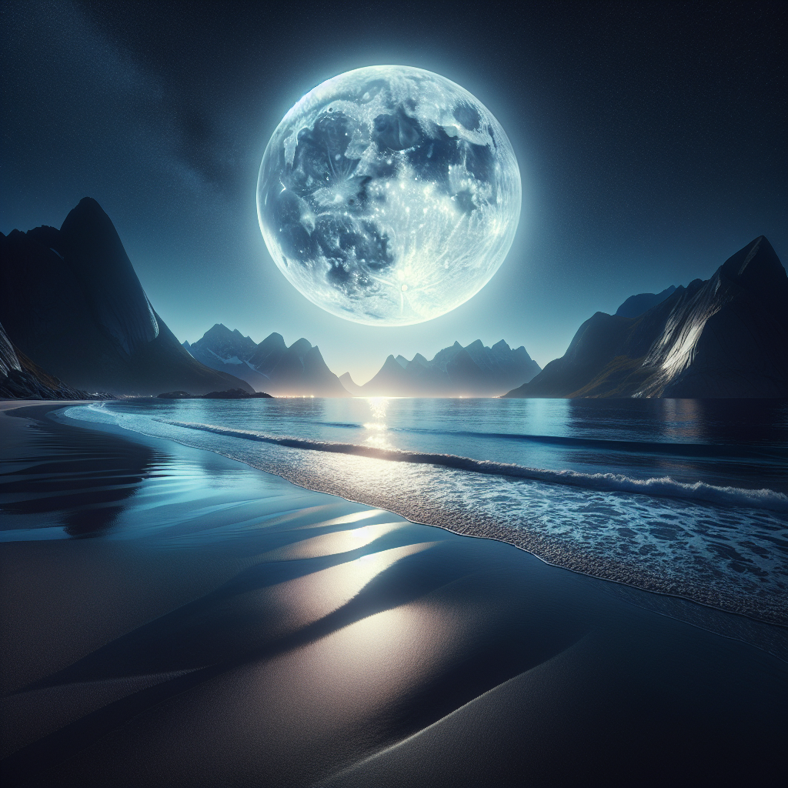

## Iteration 11

### Differences

- A dramatically large full moon dominates the night sky, illuminating the scene.
- Gentle waves wash onto a sandy beach with a backdrop of steep, dark mountains.
- A subtle glow on the horizon suggests either a setting or rising sun, adding a touch of warmth to the cool moonlit landscape.

### Prompt

The dramatically large full moon commands the night sky, casting its illumination over the scene where gentle waves wash onto a sandy beach against steep, dark mountains, while a subtle glow on the horizon hints at a setting or rising sun, infusing a touch of warmth into the cool moonlit landscape.

### Image

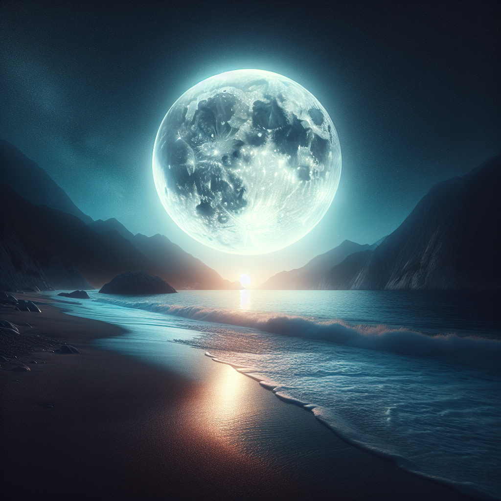

## Iteration 12

### Differences

- A large, detailed full moon dominates the night sky above a serene seascape.
- Gentle waves wash onto a sandy beach, with mountains rising steeply on either side.
- The scene is illuminated by a soft glow, likely from the moonlight, creating a tranquil and somewhat surreal atmosphere.

### Prompt

The large, detailed full moon presides over a serene seascape, casting a soft glow as gentle waves wash onto a sandy beach flanked by steep mountains, creating a tranquil and somewhat surreal atmosphere in the moonlight.

### Image

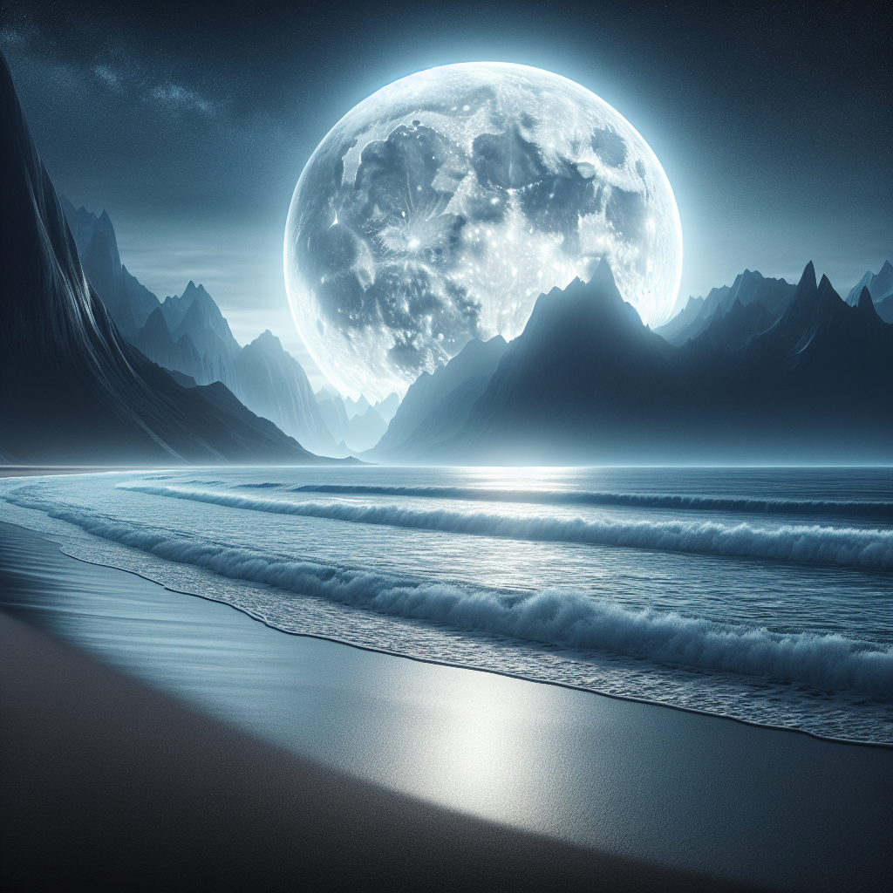

## Iteration 13

### Differences

- A large full moon dominates the night sky, casting a bright reflection on the sea below.
- Gentle waves lap onto a sandy shore, bordered by towering, jagged mountains.
- The scene is serene and illuminated by the moonlight, creating a tranquil and surreal landscape.

### Prompt

The large full moon looms in the night sky, its bright reflection shimmering on the sea, while gentle waves lap onto a sandy shore bordered by towering, jagged mountains, all bathed in serene moonlight that creates a tranquil and surreal landscape.

### Image

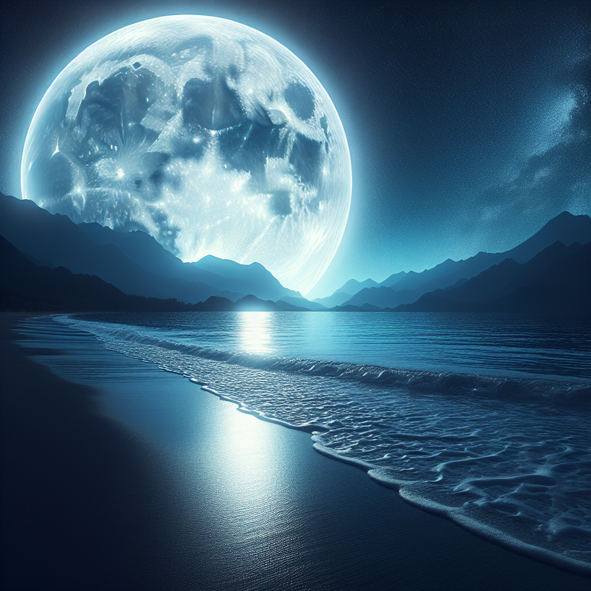

## Iteration 14

### Differences

- A large full moon dominates the night sky, casting a bright light over the scene.
- Gentle waves lap onto a sandy beach, reflecting the moonlight.
- Silhouetted mountains create a backdrop against the starlit sky, adding to the tranquility of the scene.

### Prompt

The large full moon casts a bright light over a tranquil scene where gentle waves lap onto a sandy beach, reflecting the moonlight, and silhouetted mountains rise against the starlit sky, contributing to the peacefulness of the setting.

### Image

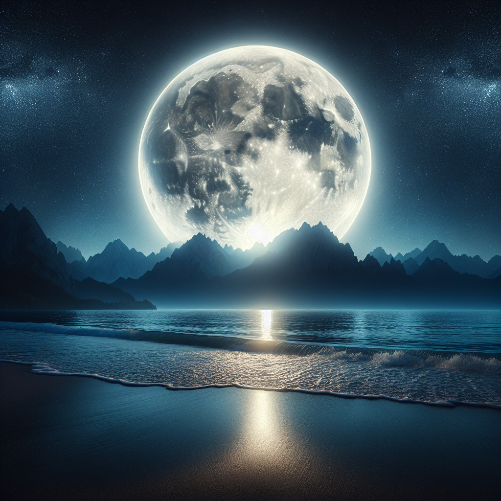

## Iteration 15

### Differences

- A large, detailed full moon dominates the night sky, casting a bright reflection on the sea below.
- The serene sea is bordered by a sandy shore in the foreground and a range of jagged mountains in the distance.
- Stars are subtly visible in the dark blue sky, adding to the tranquil and mystical atmosphere of the scene.

### Prompt

The large, detailed full moon takes center stage in the night sky, its bright reflection dancing on the sea below, while the serene waters edge onto a sandy shore in the foreground and meet a range of jagged mountains in the distance, with stars faintly glimmering in the dark blue sky, all contributing to the tranquil and mystical atmosphere of the scene.

### Image

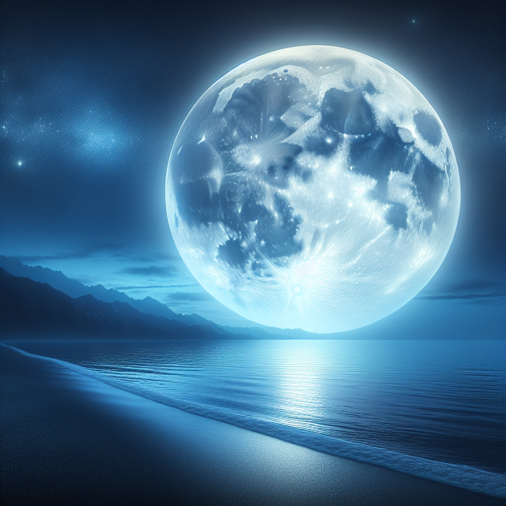

## Iteration 16

### Differences

- A large, detailed full moon dominates the night sky, casting a bright reflection on the sea.
- Gentle waves lap onto a sandy shore, illuminated by the moonlight.
- In the background, a mountain range silhouettes against the starry sky, adding to the tranquil nighttime scene.

### Prompt

A large, detailed full moon commands the night sky, its bright reflection mirrored on the sea, while gentle waves lap onto a sandy shore aglow with moonlight, and a mountain range silhouettes against the starry backdrop, enhancing the tranquil nighttime scene.

### Image

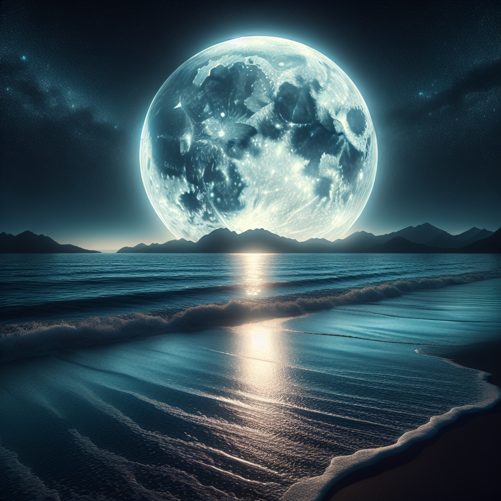

## Iteration 17

### Differences

- An oversized full moon dominates the night sky, casting a bright reflection across the sea.
- Gentle waves lap onto a sandy beach under a starry sky, with a mountain silhouette on the horizon.
- The scene is serene and surreal, suggesting a digitally manipulated or artistic representation rather than a real-world scenario.

### Prompt

The oversized full moon dominates the night sky, its bright reflection sprawling across the sea, as gentle waves lap onto a sandy beach beneath a starry expanse, with a mountain silhouette looming on the horizon, all contributing to a scene so serene and surreal it suggests a digitally manipulated or artistic creation rather than a slice of the real world.

### Image

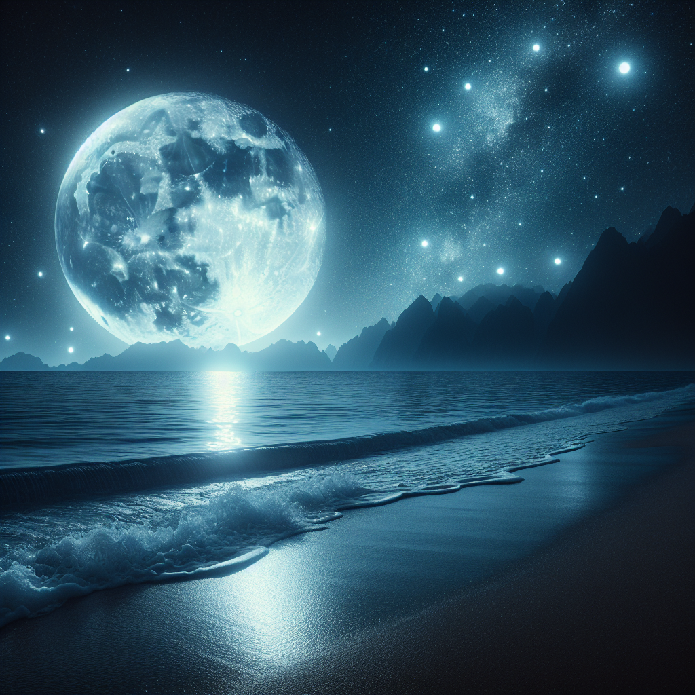

## Iteration 18

### Differences

- A large, luminous full moon dominates the night sky, casting a reflection on the sea.
- Gentle waves lap at a sandy beach under a star-studded sky.
- Jagged mountain silhouettes line the horizon, adding to the scene's tranquility.

### Prompt

The large, luminous full moon casts its reflection upon the sea, while gentle waves lap at a sandy beach under a star-studded sky, and jagged mountain silhouettes line the horizon, contributing to the scene's profound tranquility.

### Image

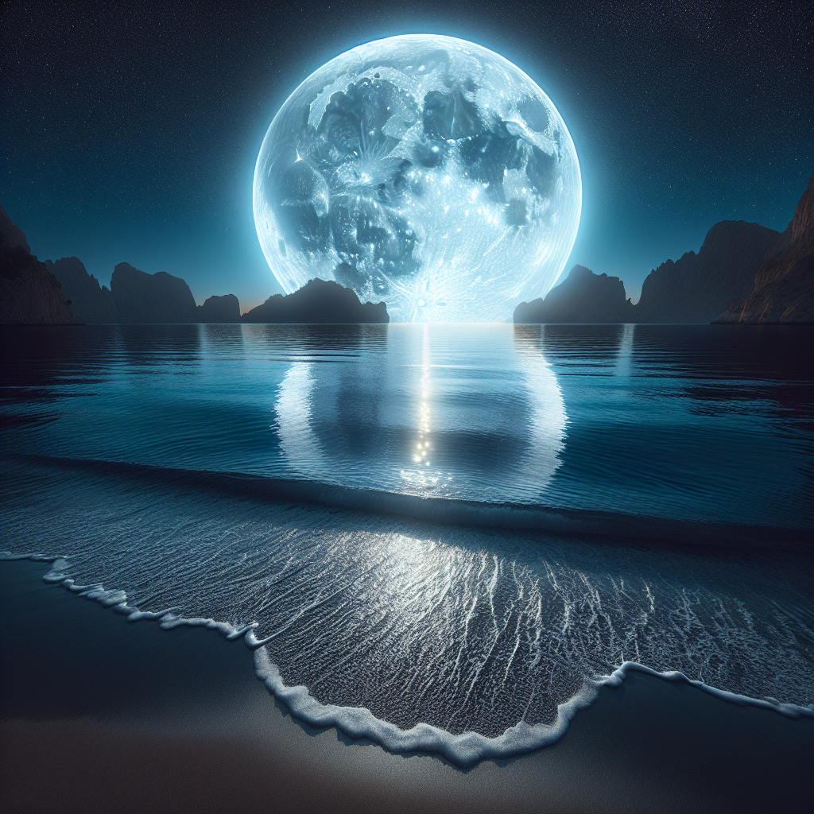

## Iteration 19

### Differences

- A large, luminous full moon dominates the night sky, casting a bright reflection across the calm sea surface.
- Gentle waves lap onto a sandy shore, with the moonlight highlighting the foam of the water's edge.
- Silhouetted mountainous landforms flank either side of the scene, creating a tranquil and secluded bay under a star-studded sky.

### Prompt

The large, luminous full moon reigns over the night, casting a bright reflection across the calm sea, while gentle waves lap onto a sandy shore, their foam highlighted by the moonlight, and silhouetted mountainous landforms flank the tranquil, secluded bay under a star-studded sky.

### Image

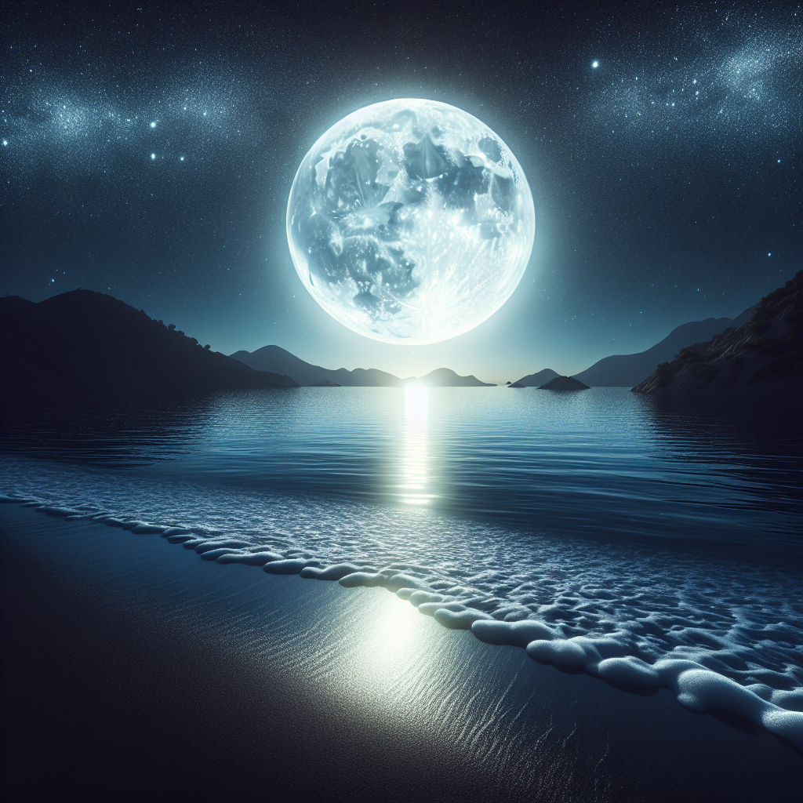

## Iteration 20

### Differences

- A large, bright full moon dominates the night sky, casting a reflection over the calm sea.
- Gentle waves lap onto a sandy beach under a star-studded sky.
- Silhouettes of mountains or hills are visible in the background, adding to the serene nighttime landscape.

### Prompt

The large, bright full moon dominates the night sky, its reflection shimmering over the calm sea, while gentle waves lap onto a sandy beach beneath a star-studded sky, with the silhouettes of mountains or hills etched in the background, contributing to the serene nighttime landscape.

### Image

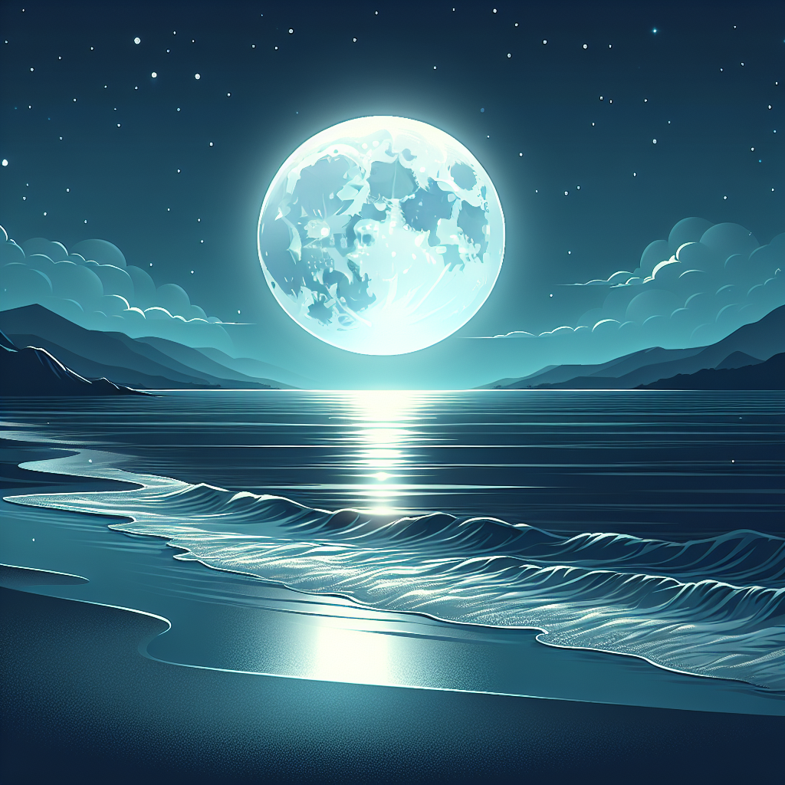

## Iteration 21

### Differences

- A large, luminous full moon dominates the night sky, casting a bright reflection on the sea below.
- Gentle waves lap at a sandy shore, with the moonlight creating a path of light across the water's surface.
- In the background, silhouetted mountains and clouds are visible under a starry sky, adding depth to the tranquil nighttime scene.

### Prompt

The large, luminous full moon dominates the night sky, its bright reflection painting a path of light across the sea, while gentle waves lap at a sandy shore, and in the background, silhouetted mountains and clouds stand under a starry sky, adding depth to the tranquil nighttime scene.

### Image

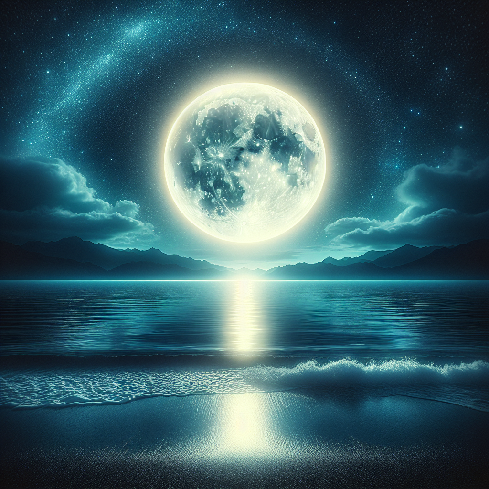

## Iteration 22

### Differences

- A large, luminous full moon dominates the night sky, casting a bright reflection on the sea below.
- The sea is calm with gentle ripples, and the moon's reflection creates a pathway of light across the water.
- In the background, a silhouette of a mountain range is visible under a starry sky, enhancing the sense of tranquility in the scene.

### Prompt

The large, luminous full moon casts a bright reflection on the sea, creating a pathway of light across the calm water with gentle ripples, while a silhouette of a mountain range under a starry sky enhances the sense of tranquility in the scene.

### Image

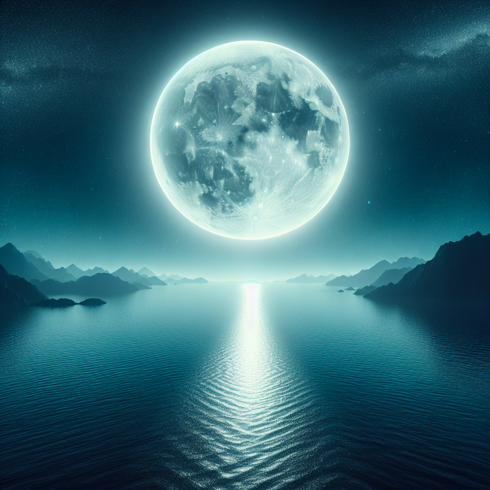

