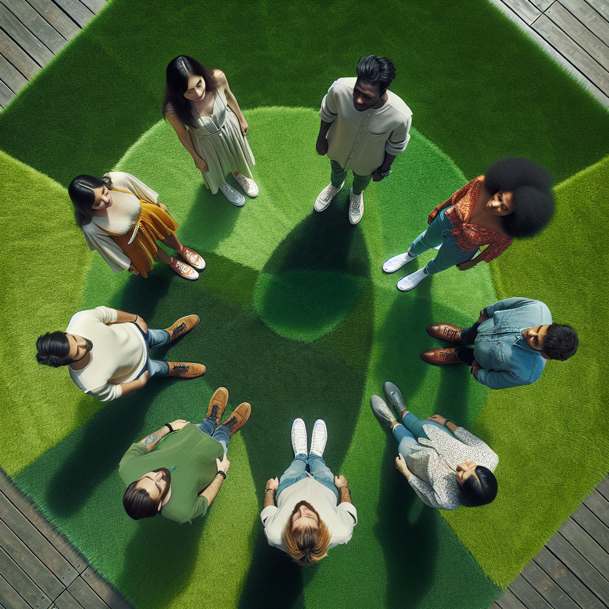
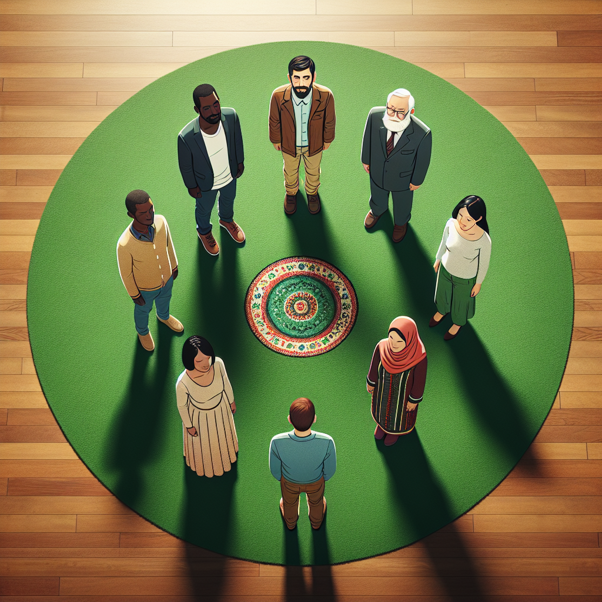
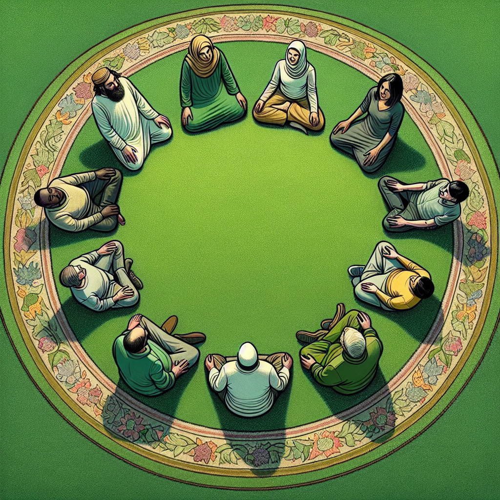
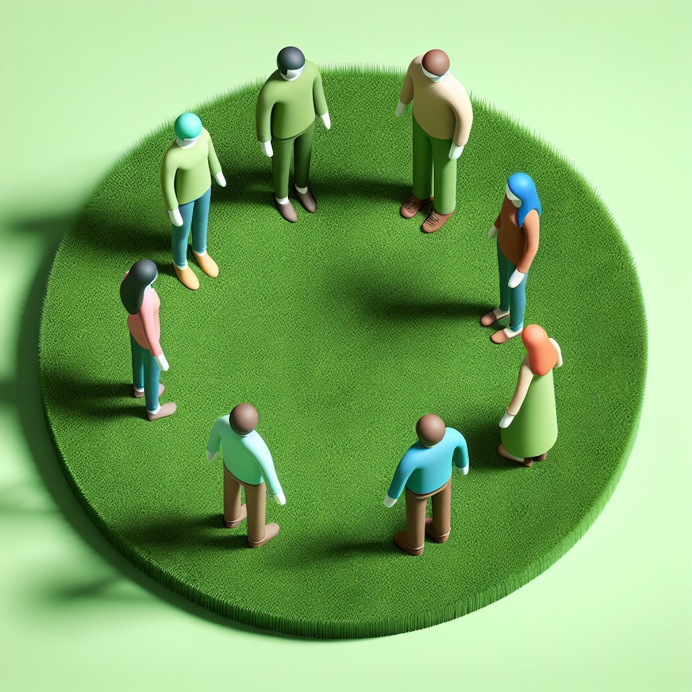
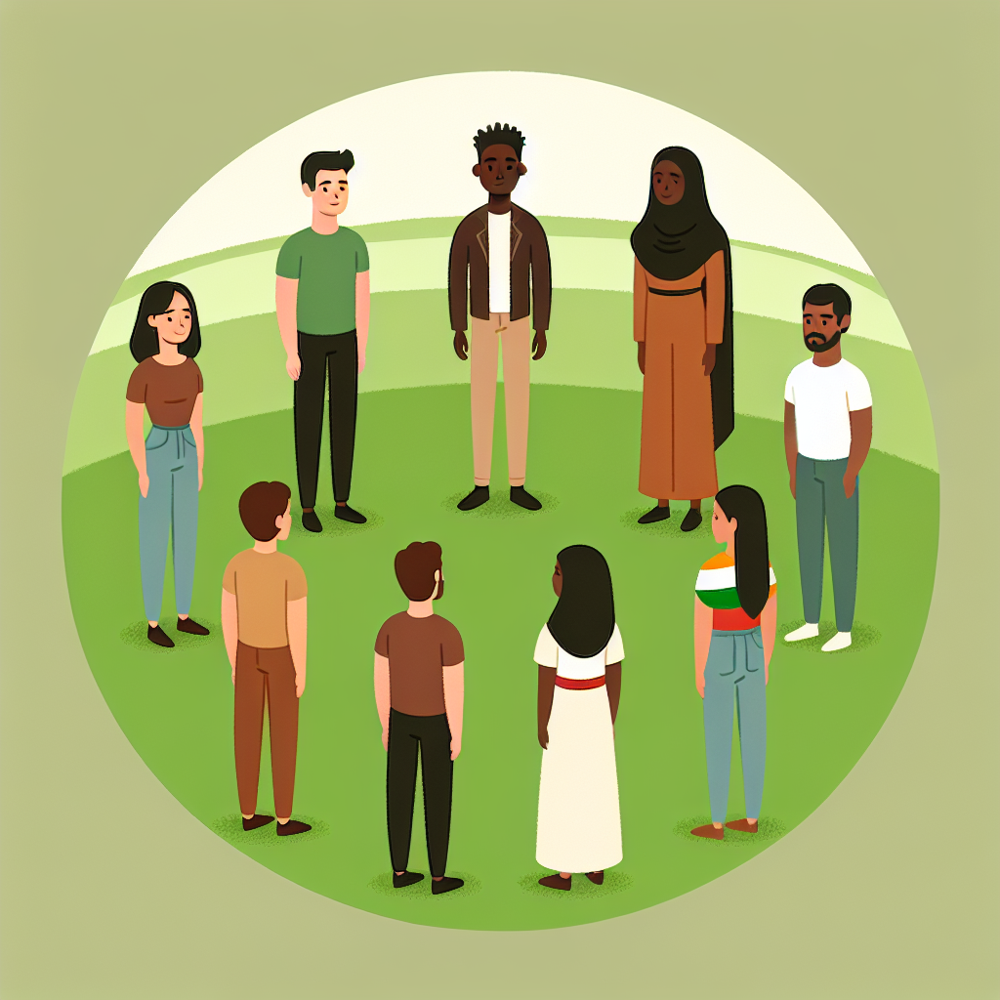
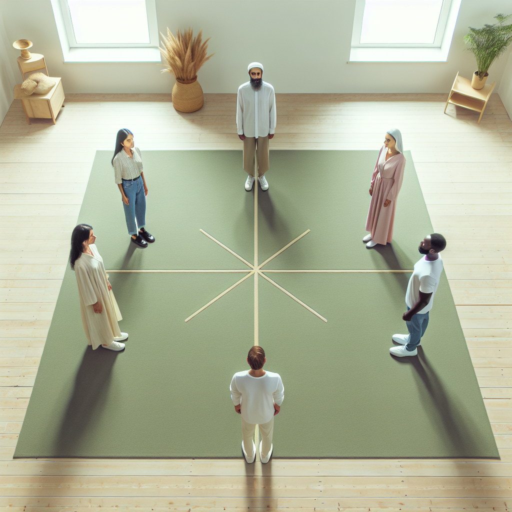
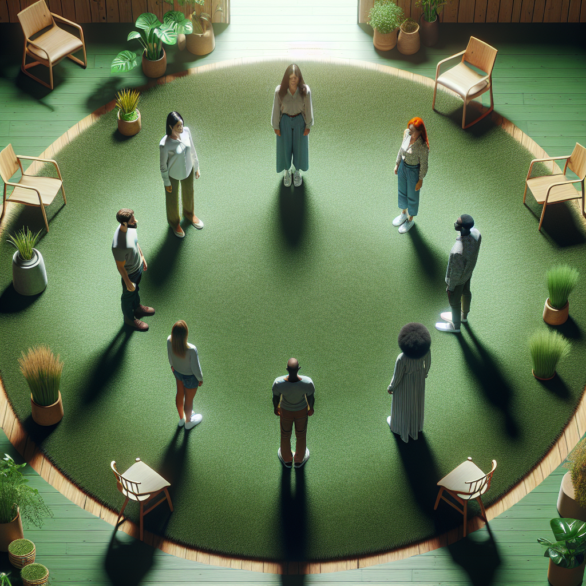

# Prompt "5 people standing in a circle on a green carpet"

## Iteration 1

### Differences

Object Presence/Count/Absence: There are indeed 5 people standing in a circle, as described.

Color Accuracy: The carpet on which the people are standing is green.

Size and Proportion: The size and proportions of the people relative to each other appear to be accurate.

Positional or Contextual Details: The people are positioned in a circle on the carpet, and there's a wooden floor adjacent to the green carpet which was not mentioned in the prompt but does not significantly affect the main subject.

The image accurately reflects the original description, with the only additional detail being the presence of the wooden floor next to the green carpet.

### Prompt

Five people standing in a circle on a green carpet, with a wooden floor surrounding the carpet area.

### Image

## Iteration 2

### Differences

Object Presence/Count/Absence: The image accurately depicts 5 people standing in a circle, as requested.

Color Accuracy: The carpet on which they are standing is green, which matches the prompt.

Size and Proportion: The size and proportion of the people relative to each other and the carpet seem appropriate.

Positional or Contextual Details: The people are positioned in a circle on the carpet, which aligns with the prompt. However, there is an additional small, ornate carpet or rug in the center of the circle, which was not mentioned in the prompt.

Overall, the image closely matches the original description, but the presence of the small carpet in the center is a discrepancy.

### Prompt

Five people standing in a circle on a green carpet, with no additional rugs or carpets within their circle.

### Image

## Iteration 3

### Differences

The image shows a group of people seated in a circle on a green carpet, not standing as the prompt specifies. Additionally, there are more than five people present in the circle. The carpet is indeed green and has a floral border, which aligns with the description of a green carpet but adds additional detail not mentioned in the prompt.

### Prompt

Five people standing in a circle on a plain green carpet without any patterns or borders.

### Image

## Iteration 4

### Differences

The image shows seven figures standing on a green carpet, not five as the prompt specifies. This is the most significant discrepancy. The figures are arranged in a somewhat circular formation, which aligns with the prompt's description of people standing in a circle. The carpet appears to be green, which is consistent with the description. However, the presence of two additional figures is a major deviation from the original prompt.

### Prompt

Five people standing in a circle on a plain green carpet, ensuring that no additional figures are present.

### Image

## Iteration 5

### Differences

The image shows a group of seven people standing in a circle, not five as the prompt specifies. Additionally, while the carpet appears to be green, there is a discrepancy in the number of people present.

- Object Presence/Count/Absence: There are two additional people present in the image.
- Color Accuracy: The carpet is green, which is accurate.
- Size and Proportion: The people are proportionate to each other, and their sizes are consistent with human proportions.
- Positional or Contextual Details: The people are standing in a circle as described, but the number of individuals is incorrect.

### Prompt

Five people standing in a circle on a plain green carpet, with each individual spaced evenly apart and no additional figures included.

### Image

## Iteration 6

### Differences

The image shows five people standing on a green carpet. They are positioned in a way that could be interpreted as forming a circle, with a star-like pattern on the carpet between them. The people are spaced out evenly, and the green carpet is placed on a wooden floor within an indoor setting that includes plants and furniture, suggesting a domestic or office environment.

Object Presence/Count/Absence: There are indeed five people present, as described.

Color Accuracy: The carpet is green, matching the prompt.

Size and Proportion: The size and proportion of the people in relation to each other and the environment appear to be accurate.

Positional or Contextual Details: The people are standing in positions that suggest the formation of a circle, and they are on the carpet.

Overall, the image accurately reflects the original description of "5 people standing in a circle on a green carpet."

### Prompt

Five people standing evenly spaced in a circle on a plain green carpet, with a wooden floor surrounding the carpet, and an indoor setting that may include plants and furniture.

### Image

