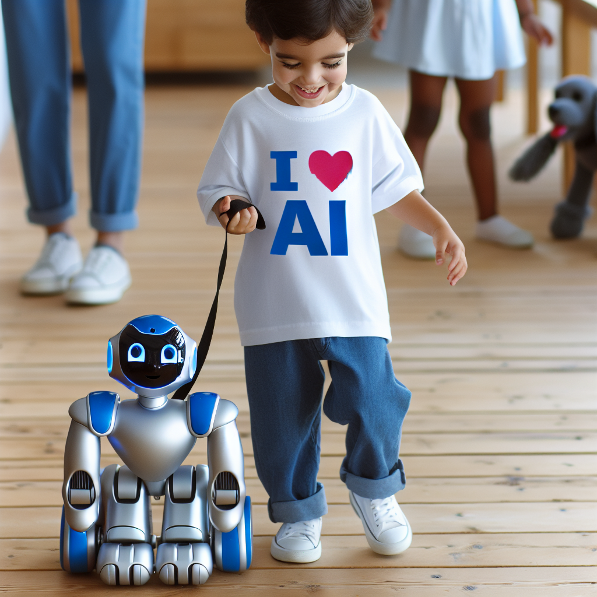
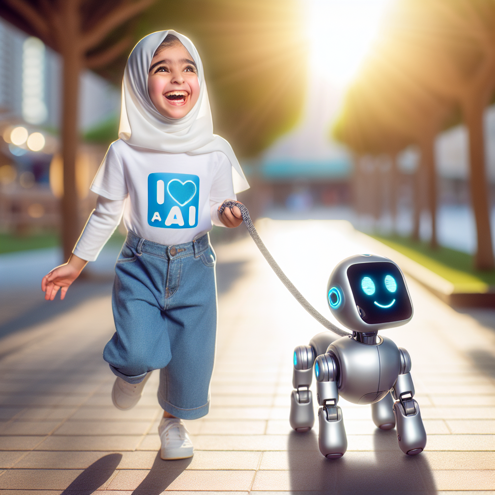

# Prompt "Kid wearing a white shirt with a blue print saying 'I love AI'. The kid holds a grey robot dog on a leash."

## Iteration 1

### Differences

Object Presence/Absence:
- The kid is wearing a white shirt with a blue print saying 'I love AI', which matches the prompt.
- The kid is holding a leash attached to a robot dog, which matches the prompt.

Color Mismatch:
- The robot dog is not grey as specified in the prompt; it is predominantly blue with some grey/silver parts.

Size and Proportion Issues:
- There are no significant size or proportion issues in relation to the prompt.

Positional or Contextual Errors:
- There are no positional or contextual errors in relation to the prompt.

Overall, the image is faithful to the original description except for the color mismatch of the robot dog, which should be grey according to the prompt but is shown as blue

### Prompt

Create an image featuring a child wearing a white shirt adorned with a blue print that reads 'I love AI'. The child is happily holding a leash that is connected to a robot dog. The robot dog should be entirely grey, showcasing a futuristic and friendly design. The setting is a sunny park where the child and the robot dog appear to be enjoying a leisurely walk together.

### Image

