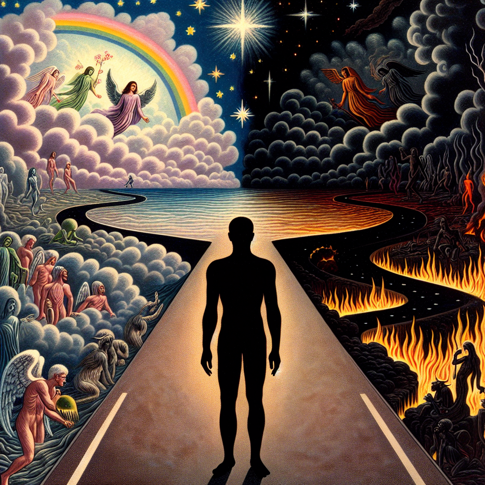
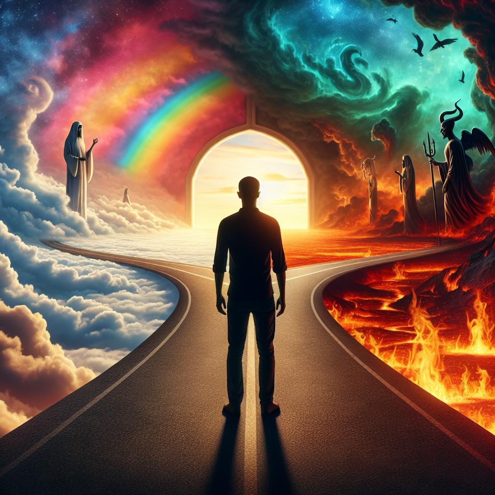
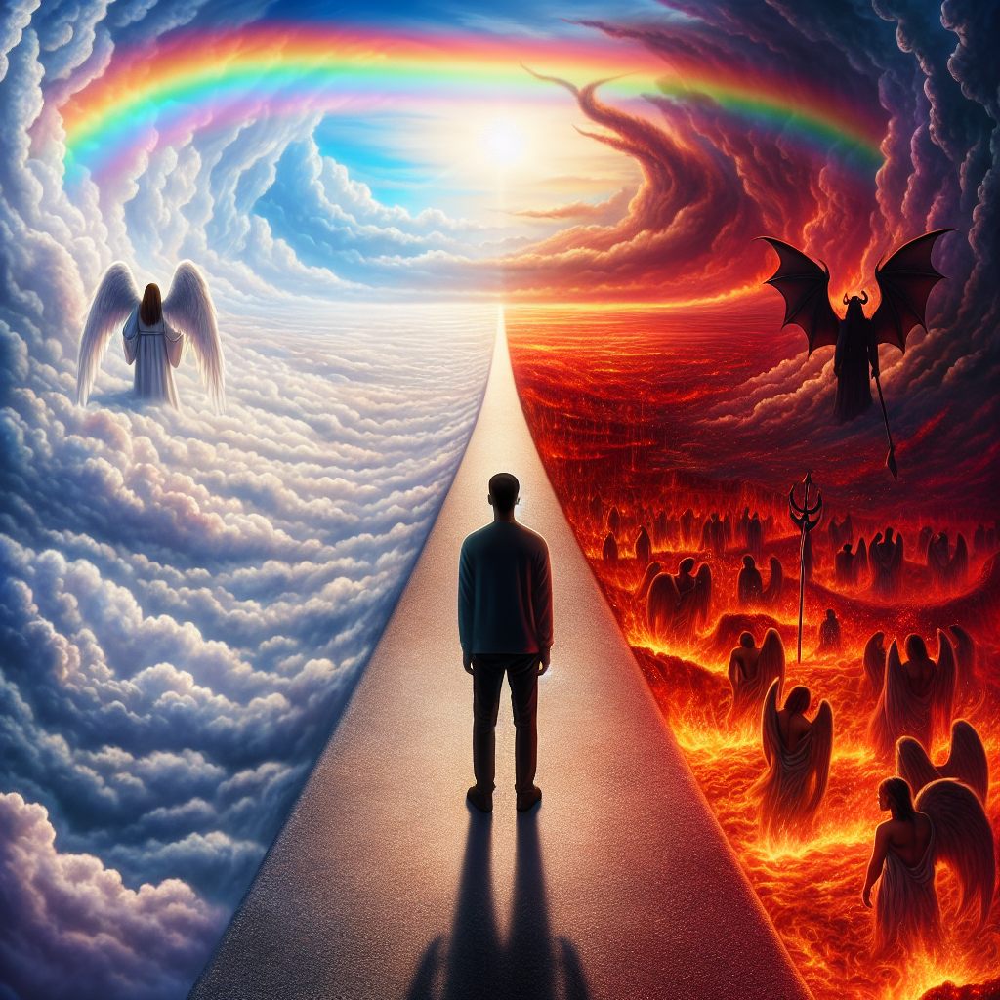

# Prompt "The black silhouette of a person in the middle. In front of it is a branching street. The left branch leads to heaven, a road with rainbows made out of clouds, surrounded by angels. The right branch leads to hell, a fiery road surrounded by demons"

## Iteration 1

### Differences

The image closely follows the original description with a black silhouette of a person in the middle, a branching street in front of it, with the left branch leading to a representation of heaven, complete with rainbows, clouds, and angels, and the right branch leading to a fiery depiction of hell, surrounded by demons.

Object Presence/Absence: The silhouette, branching street, heaven with rainbows and angels, and hell with fire and demons are all present as described.

Color Accuracy: The colors match the description, with heaven being represented by rainbows and clouds, and hell by fiery tones.

Size and Proportion: The proportions seem appropriate, with the silhouette centrally placed and the branching paths leading to their respective destinations.

Positional or Contextual Details: The positioning of the elements aligns with the prompt, with heaven on the left and hell on the right, as viewed from the perspective of the silhouette.

Overall, the image appears to be a very accurate representation of the original prompt.

### Prompt

A silhouette of a person stands at a crossroads, with two distinct paths ahead. The left path is a tranquil road ascending towards a heavenly realm, where ethereal clouds form the base of a vibrant rainbow arching overhead. This serene avenue is populated by benevolent angels, exuding an aura of peace and grace. On the right, a contrasting path descends into a hellish landscape, with flames licking the edges of the road and ominous demons lurking, embodying the essence of chaos and torment. The silhouette is poised equidistantly between these two divergent destinations, capturing a moment of choice between the virtuous tranquility of heaven and the infernal depths of hell.

### Image

## Iteration 2

### Differences

The image accurately depicts the black silhouette of a person in the middle, with a branching street in front. The left branch leads to a representation of heaven, with a road made out of clouds and a rainbow, and there are figures that could be interpreted as angels. The right branch leads to a fiery road with figures that resemble demons, representing hell. However, there are some discrepancies:

1. Object Presence/Absence: The angels and demons are present, but they are not as numerous as one might expect from the description, which suggests they should be "surrounded by angels/demons."
2. Color Accuracy: The colors match the description, with the left side showing a rainbow and cloud-like appearance, and the right side depicting fire and brimstone.
3. Size and Proportion: The size and proportions seem appropriate, with the person centrally located and the paths diverging to either side.
4. Positional or Contextual Details: The overall context is depicted correctly, but the specifics, such as the exact number of angels and demons and their arrangement, may not fully match the description.

In summary, the image captures the essence of the description but with some minor differences in the number and arrangement of angels and demons.

### Prompt

A silhouette of a person stands at a fork in the road, facing two distinct paths. The left path, leading towards a heavenly realm, is a wide road paved with soft, cloud-like material, under a magnificent, broad rainbow that stretches across the sky. This path is densely populated with numerous angels, ensuring that from any perspective, the angels appear to be a prominent, integral part of the scene. On the right, the path to hell is equally wide and vivid, with intense, fiery colors that suggest an inferno. This road is teeming with a multitude of demons, each contributing to a sense of a crowded, chaotic environment. The silhouette is centered between these paths, perfectly balanced, embodying the moment of decision between the peaceful, angel-filled ascent to heaven and the tumultuous, demon-filled descent into hell.

### Image

