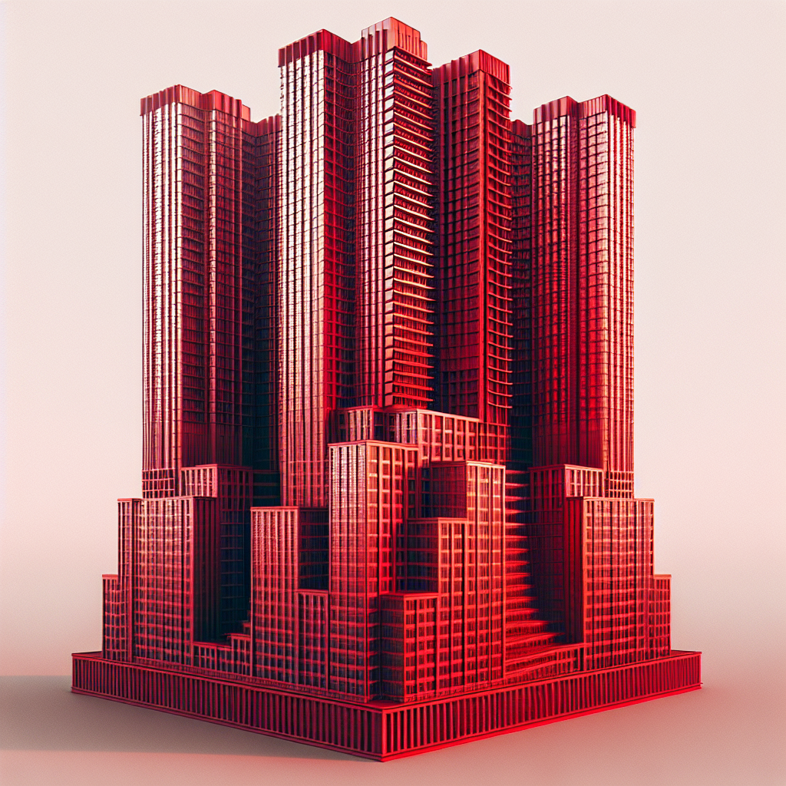

# Prompt "red skyscraper with 6 floors"

## Iteration 1

### Differences

- The skyscraper in the image has more than 6 floors; it appears to have at least 10 floors.
- The skyscraper is not entirely red; it has a significant amount of blue on the facade, with red being used as an accent color on the edges and corners.

### Prompt

Create an image of a red skyscraper that is exactly 6 floors high with no blue color on its facade.

### Image

## Iteration 2

### Differences

- The skyscraper in the image has more than 6 floors; it appears to have at least 10 floors.
- The color of the skyscraper is not a solid red; it has a gradient of red shades with lighting effects that make it appear to glow in some areas.

### Prompt

Create an image of a solid red skyscraper with no gradient or glowing effects, and exactly 6 floors.

### Image

## Iteration 3

### Differences

- The skyscraper in the image has more than 6 floors; it appears to have many more levels than specified.
- The color of the skyscraper is not a uniform red; it has gradients and variations in color, including shades of pink and darker tones, possibly due to lighting effects.

### Prompt

Create an image of a skyscraper with exactly 6 floors, uniformly colored in a consistent shade of red, without any gradients, variations, or lighting effects that would alter the red tone.

### Image

## Iteration 4

### Differences

- The skyscraper in the image has more than 6 floors; it appears to have approximately 20 floors.
- The color of the skyscraper is not purely red; it has a mix of dark red/maroon and dark colored windows.

### Prompt

Create an image of a skyscraper with exactly 6 floors, painted in a pure, solid red color, without any maroon tones or dark colored windows.

### Image

## Iteration 5

### Differences

- The skyscraper in the image has more than 6 floors; it appears to have around 12 or more visible floor levels.
- The skyscraper is not uniformly red; it has shades of red and some parts appear to be in different colors like dark grey or black.

### Prompt

Create an image of a skyscraper with exactly 6 floors, uniformly painted in a single shade of red, without any other colors or shades, including dark grey or black.

### Image

## Iteration 6

### Differences

- The skyscraper in the image has more than 6 floors; it appears to have multiple tiers with varying numbers of floors.
- The skyscraper is predominantly red, but it also has some darker red or shaded areas that are not uniformly bright red as might be suggested by the prompt.
- The surrounding buildings are not red; they are grayscale, which is consistent with the prompt if only the skyscraper was meant to be red.

### Prompt

Create an image of a single-tier skyscraper with exactly 6 floors, uniformly painted in a bright red color without any darker red or shaded areas. The skyscraper should be the only building in the image, with no surrounding buildings present.

### Image

## Iteration 7

### Differences

- The skyscraper in the image has more than 6 floors; it appears to have approximately 20 floors.
- The color of the skyscraper is not a uniform red; it has gradients of red with lighter and darker shades.
- The skyscraper has a complex geometric pattern with protruding elements, not a simple block design.

### Prompt

Create an image of a simple block-designed skyscraper with exactly 6 floors, uniformly colored in a consistent shade of red, without gradients or complex geometric patterns and protruding elements.

### Image

## Iteration 8

### Differences

- The skyscraper in the image has many more than 6 floors; it is a tall building with numerous stories.
- The surrounding buildings are also red but are not skyscrapers; they are low-rise structures.

### Prompt

Create an image of a standalone red skyscraper with exactly 6 floors, with no other buildings around it.

### Image

## Iteration 9

### Differences

- The skyscraper in the image has more than 6 floors; it appears to have at least 20 floors.
- The skyscraper has a complex design with multiple sections and protrusions, not a simple block shape as might be implied by the term "skyscraper."
- The color of the skyscraper is not uniformly red; it has a combination of red and gray with the windows and some architectural details in gray.

### Prompt

Create an image of a simple block-shaped skyscraper with exactly 6 floors, uniformly colored in red, with no gray windows or architectural details.

### Image

## Iteration 10

### Differences

- The skyscraper has more than 6 floors; it appears to have around 20 floors.
- The color of the skyscraper is not a uniform red; it has shading with darker and lighter tones.

### Prompt

Create an image of a skyscraper with exactly 6 floors, uniformly colored in a single shade of red without any shading, darker tones, or lighter tones.

### Image

