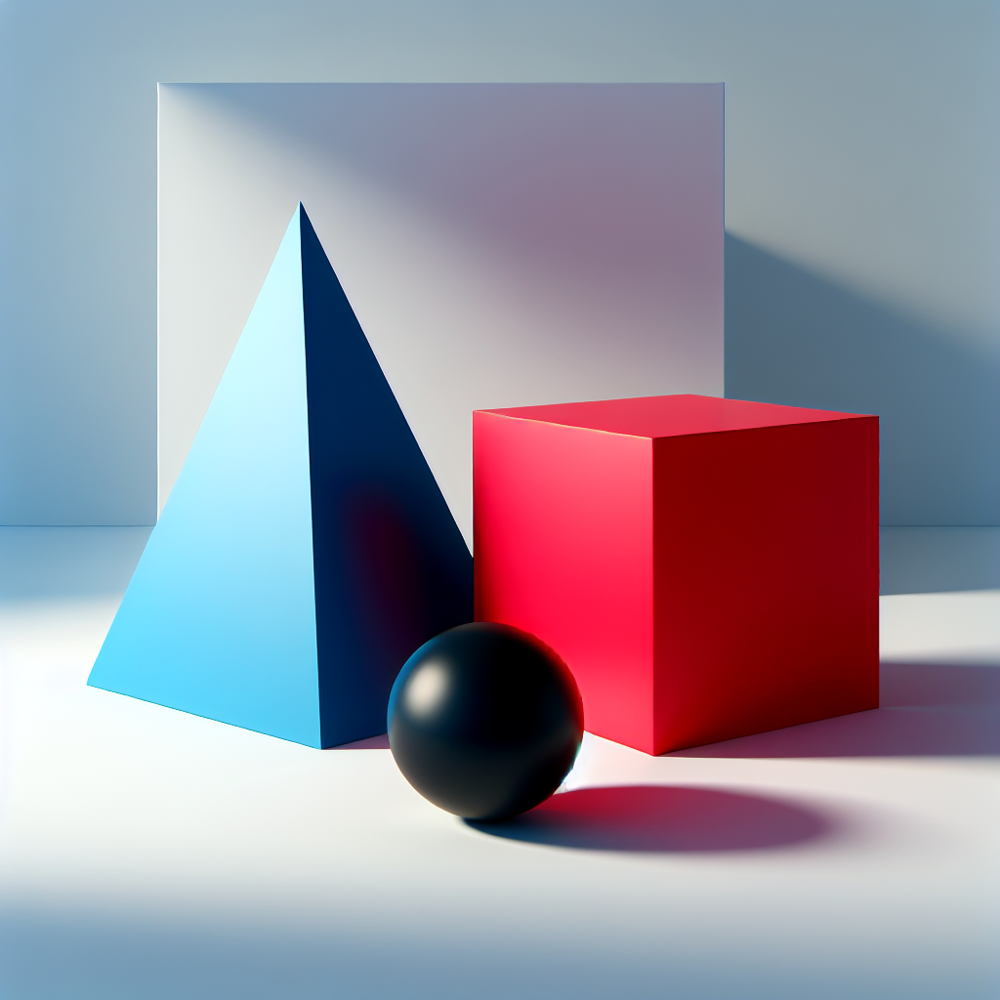
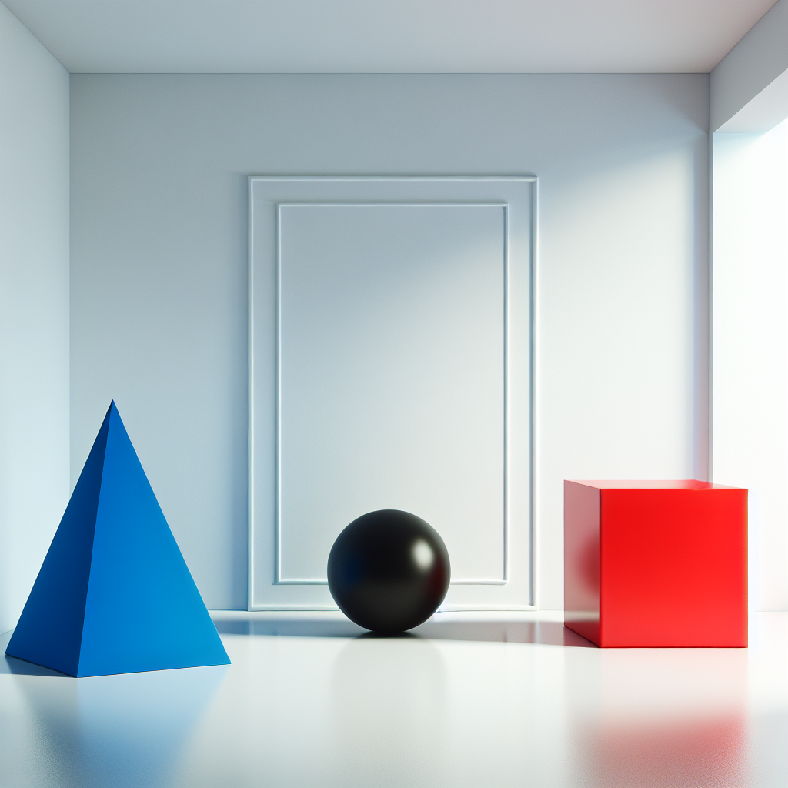
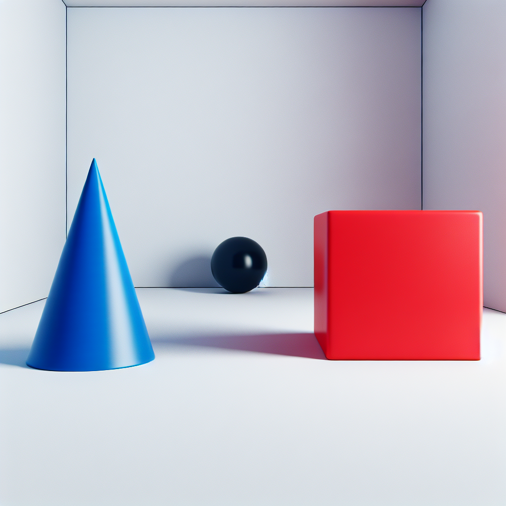

# Prompt "A blue cone on the left, a red cube on its right with a black ball behind both, all objects placed in a white room"

## Iteration 1

### Differences

The image shows a blue cone on the left and a red cube on its right, which is consistent with the prompt. There is also a black ball, but it is not positioned behind both objects as described; instead, it is placed in front of the cube and to the right of the cone, partially obstructing the view of the cube. All objects are indeed placed in a room that appears to be white, given the light walls and floor.

To summarize, the discrepancies are:
- The black ball is not behind both the blue cone and the red cube; it is positioned in front of the cube and to the right of the cone.

These are the significant discrepancies in the image when compared to the original description.

### Prompt

Create an image featuring a blue cone placed on the left side of a white room. To the right of the blue cone, position a red cube. Ensure that a black ball is situated behind both the blue cone and the red cube, so that it is partially visible from the viewer's perspective. The room should have light walls and a floor, maintaining a clean and simple aesthetic that emphasizes the objects.

### Image

## Iteration 2

### Differences

The image shows a blue cone on the left and a red cube on the right, with a black ball positioned behind both objects. All these objects are placed within a room that appears to be white, as described in the prompt. The cone, cube, and ball are correctly colored and the spatial arrangement follows the instructions given.

However, there are some discrepancies:

1. Object Presence/Absence: There are no missing objects, and all requested items are present.
2. Color Accuracy: The colors of the objects match the description.
3. Size and Proportion: The sizes of the objects seem appropriate relative to each other, but without specific size instructions, it's difficult to assess absolute accuracy.
4. Positional or Contextual Details: The black ball is not entirely behind both the cone and the cube as it appears slightly to the side, making it partially visible from this angle. Additionally, the room has a decorative frame or panel on the wall, which was not specified in the prompt.

Overall, the image closely matches the original description, but the position of the black ball and the additional decorative element on the wall are notable discrepancies.

### Prompt

Create an image where a blue cone is positioned on the left side and a red cube on the right side within a completely plain white room. Directly behind both the blue cone and the red cube, place a black ball so that it is entirely obscured by the two objects when viewed from the front, ensuring it is not visible from this angle. The room should be devoid of any decoration, including frames or panels, to maintain a minimalist aesthetic that keeps the focus entirely on the objects' shapes and colors.

### Image

