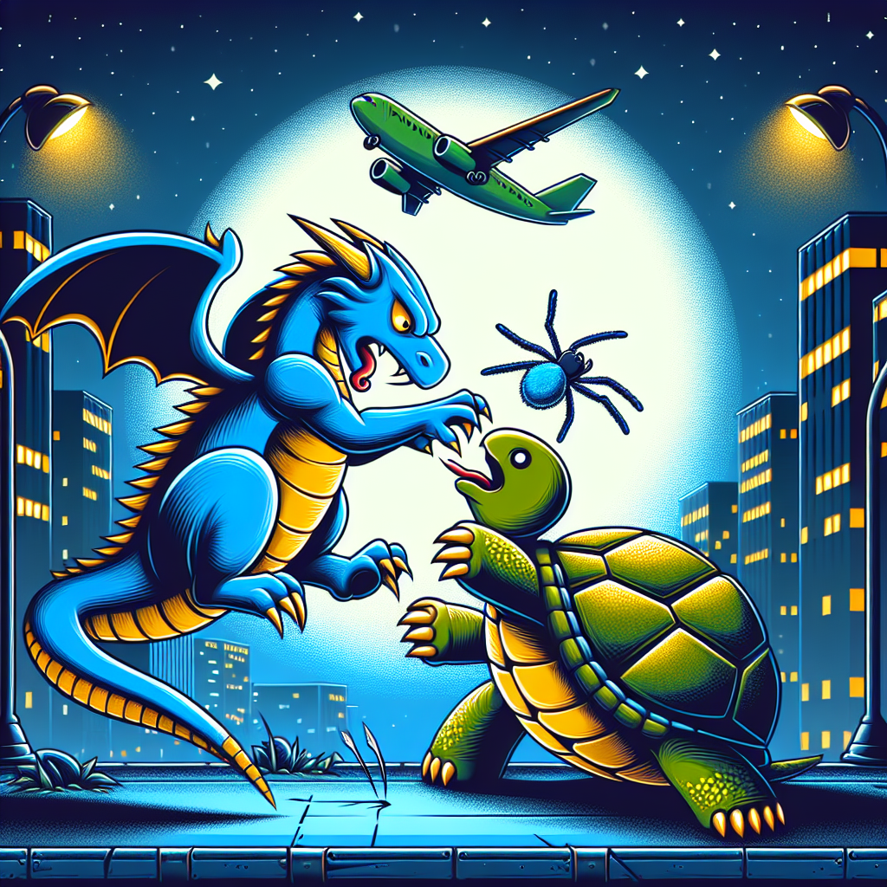
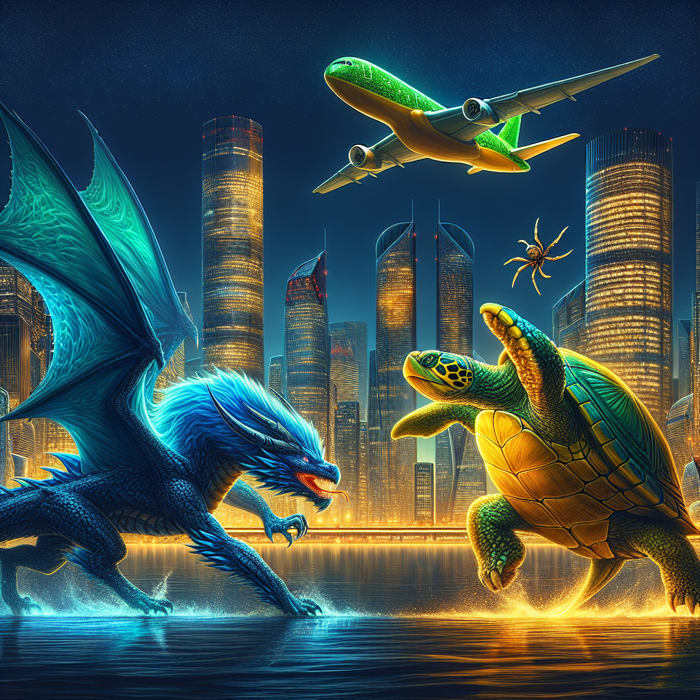
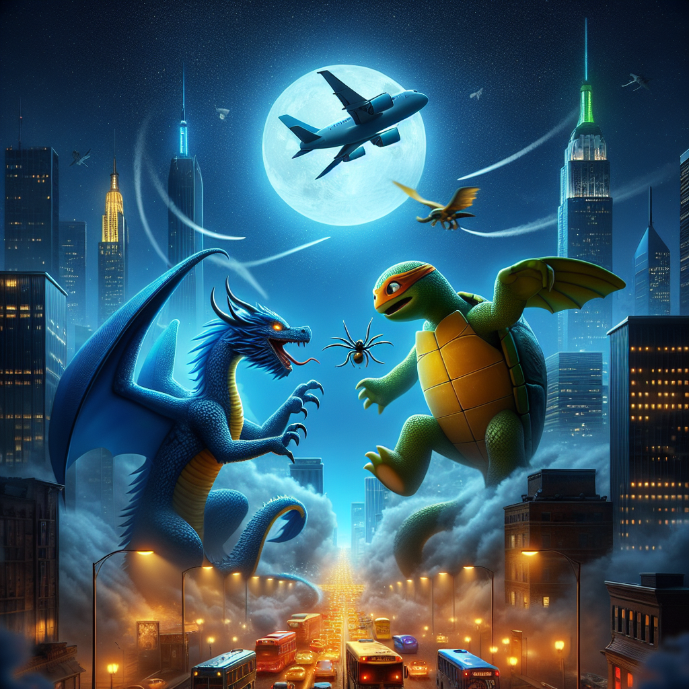
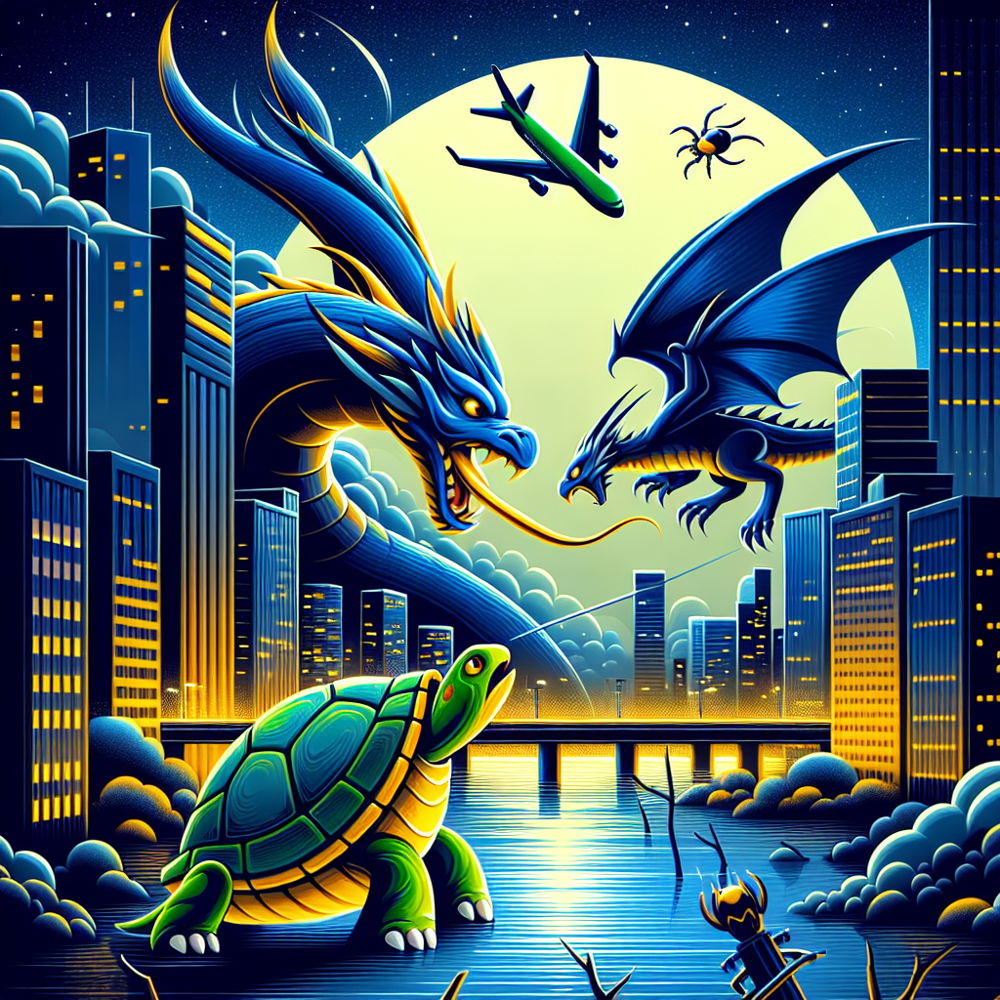
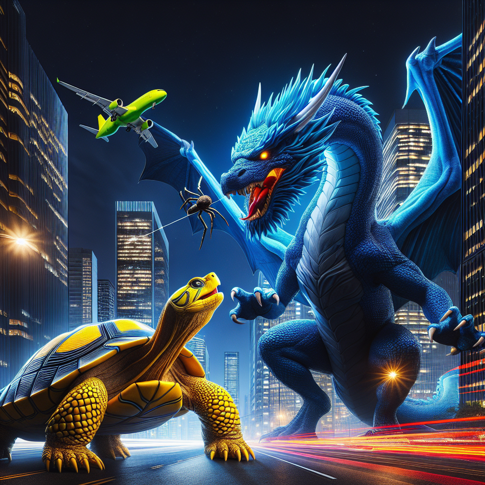

# Prompt "A blue dragon fighting with a yellow turtle. In the background is a modern city at night with street lights turned on. A green airplane is passing by. A small spider is crawling on the turtle's back."

## Iteration 1

### Differences

Object Presence/Absence:
- The blue dragon is present and engaged in a confrontation with the turtle.
- The yellow turtle is present, although it appears more greenish-yellow than purely yellow.
- The modern city at night is depicted in the background with street lights turned on.
- A green airplane is indeed passing by in the sky.
- A small spider is present on the turtle's back.

Color Accuracy:
- The dragon is correctly colored blue.
- The turtle's color leans towards greenish-yellow rather than a solid yellow.
- The airplane is green, matching the description.
- The city and street lights are depicted with accurate colors for a nighttime scene.

Size and Proportion:
- The dragon and turtle are proportionate to each other, with the dragon being larger, as one would expect.
- The airplane's size in relation to the dragon and turtle seems appropriate, considering it is meant to be in the background and at a higher altitude.
- The spider's size is small compared to the turtle, which is correct.

Positional or Contextual Details:
- The positioning of the dragon and turtle suggests a fight, in line with the prompt.
- The airplane is correctly placed in the sky, flying past the scene.
- The spider

### Prompt

Please create a dynamic scene featuring a confrontation between a blue dragon and a distinctly yellow turtle. The background should showcase a modern cityscape during the night, with street lights illuminating the environment. A green airplane should be included, flying in the sky above the skirmishing creatures. Additionally, incorporate a small spider on the turtle's back, ensuring it is noticeable but proportionate to the turtle. The overall composition should capture the intensity of the battle between the dragon and the turtle, with the city and passing airplane as secondary elements that add depth and context to the scene.

### Image

## Iteration 2

### Differences

Object Presence/Absence:
- There is a blue dragon present, as described.
- There is a yellow turtle present, as described.
- The modern city at night with street lights turned on is depicted in the background.
- A green airplane is passing by in the sky.
- A small spider is visible on the turtle's back.

Color Accuracy:
- The dragon is blue, matching the description.
- The turtle is yellow, also matching the description.
- The airplane is green, as specified.
- The city and street lights appear to be accurately colored for a nighttime scene.

Size and Proportion:
- The dragon and turtle are depicted in a size that suggests a battle, with the dragon being larger, which is appropriate for the creatures described.
- The airplane's size in relation to the dragon and turtle seems proportionally correct, as it is in the background and appears to be at a higher altitude.

Positional or Contextual Details:
- The spider is correctly placed on the turtle's back.
- The positioning of the dragon and turtle suggests they are engaged in a confrontation.
- The city is appropriately placed in the background, with the street lights adding to the night scene ambiance.

Overall, the image accurately reflects the original description across all

### Prompt

Create a captivating scene where a blue dragon and a yellow turtle are locked in an epic confrontation. The setting is a bustling modern city at night, with the glow of street lights casting a warm ambiance. Above them, a green airplane soars through the sky, adding a sense of scale and motion to the composition. On the turtle's back, a small spider is visible, adding an extra layer of detail to the scene. The overall image should be vibrant and dynamic, with each element—the blue dragon, the yellow turtle, the green airplane, and the small spider—clearly distinguishable and contributing to the narrative of the battle taking place in an urban landscape under the cover of night.

### Image

## Iteration 3

### Differences

Object Presence/Absence:
- There is a blue dragon present, as described.
- There is a turtle present, but it is green instead of yellow.
- A modern city at night with street lights turned on is depicted in the background.
- A green airplane is missing; instead, the airplane appears to be white or a light color.
- A small spider is present on the turtle's back.

Color Accuracy:
- The dragon is correctly colored blue.
- The turtle is incorrectly colored green instead of yellow.
- The airplane is not green as specified.

Size and Proportion:
- The size and proportion of the dragon and turtle appear appropriate for the scene.
- The size of the spider relative to the turtle seems accurate.

Positional or Contextual Details:
- The dragon and turtle are in a fighting stance, which aligns with the prompt.
- The cityscape is correctly shown in the background at night.
- Street lights are visible and turned on, creating the night scene ambiance.
- The airplane is in the background, flying in the sky, which fits the description, although its color is incorrect.

The major discrepancies are the color of the turtle (which should be yellow) and the color of the airplane (which should be green).

### Prompt

Create a visually striking image that captures a blue dragon and a yellow turtle engaged in a dramatic battle. The background should feature a modern cityscape at night, bathed in the glow of street lights. Ensure that the turtle is distinctly yellow, contrasting with the blue dragon. Above the scene, include a green airplane flying through the night sky, adding a sense of depth and movement to the composition. Also, place a small spider on the turtle's back to introduce an additional point of interest. The elements should be proportionate, with the dragon and turtle sized correctly to show their interaction, and the airplane should be scaled to convey its distance in the sky. The overall scene should be cohesive and vibrant, with each component—the blue dragon, the yellow turtle, the green airplane, and the small spider—distinct and integral to the narrative of the urban confrontation under the night sky.

### Image

## Iteration 4

### Differences

In the image provided, we see a blue dragon and a turtle, with a modern cityscape at night in the background. The city lights are indeed turned on, and there is an airplane in the sky. However, there are some discrepancies:

1. Object Presence/Absence: The turtle is not yellow as described in the prompt; it appears to be green with yellowish accents.
2. Color Accuracy: The airplane is not green; it appears to be dark blue or black.
3. Size and Proportion: The spider on the turtle's back seems proportionally large compared to a real spider on a real turtle, but this could be considered a stylistic choice for visibility in the image.
4. Positional or Contextual Details: The dragon and the turtle are indeed present, but the turtle does not seem to be actively fighting with the dragon; instead, it appears passive. The dragon seems to be in a more aggressive posture.

Due to these discrepancies, particularly the color inaccuracies and the lack of active engagement between the turtle and the dragon, the image does not perfectly match the original prompt.

### Prompt

Craft an image that vividly depicts a blue dragon in the midst of a fierce battle with a yellow turtle. The scene is set against the backdrop of a modern city at night, where the buildings are illuminated by the warm glow of street lights. The turtle should be a vibrant yellow, providing a stark contrast to the blue dragon. In the sky above the battling creatures, a green airplane should be flying, its color clearly distinguishable against the night sky. On the turtle's back, a small spider should be present, proportionate to the size of the turtle to maintain a realistic sense of scale. The dragon and the turtle should both appear actively engaged in the confrontation, with the dragon in an aggressive stance and the turtle in a defensive or equally aggressive posture to convey the intensity of their interaction. The overall image should bring to life the dynamic and colorful encounter between these mythical and natural creatures in an urban setting.

### Image

