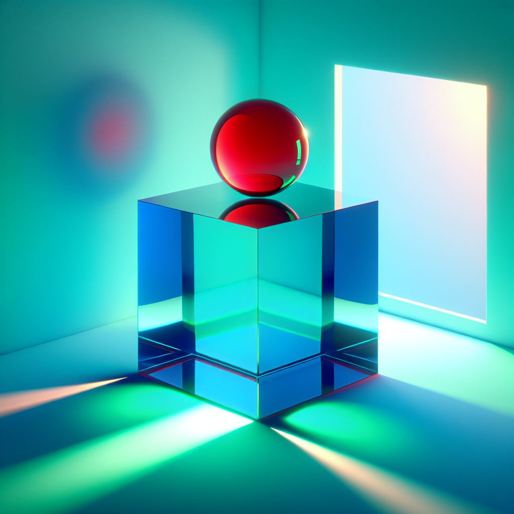
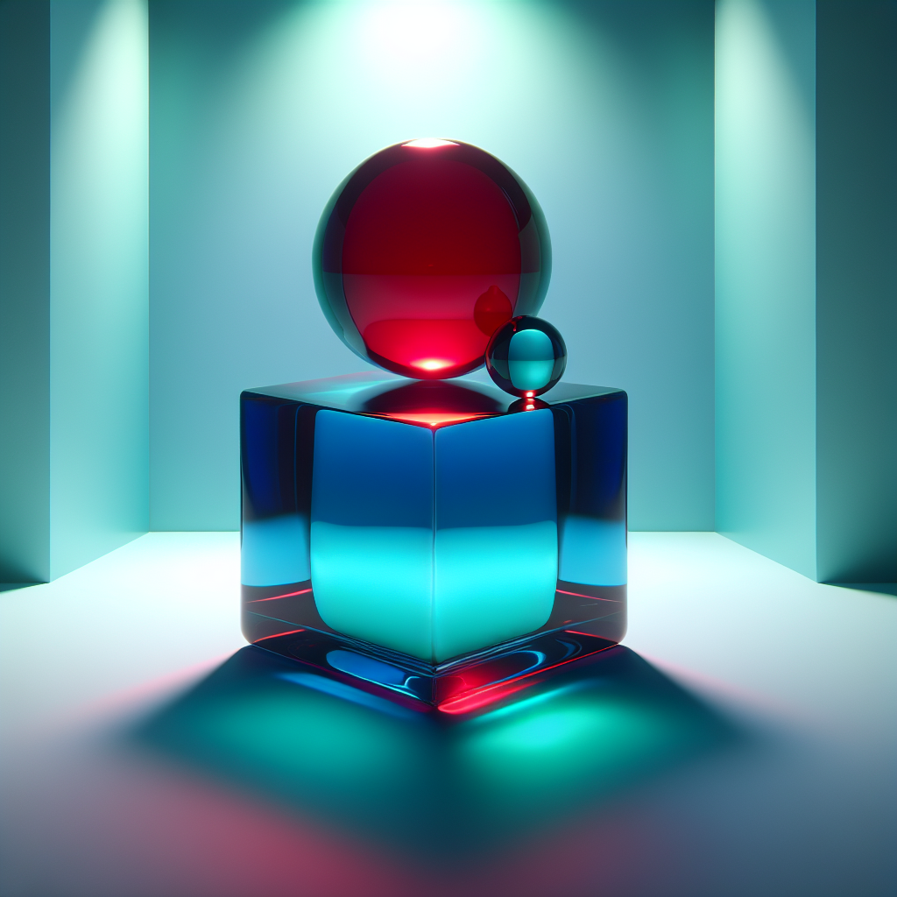
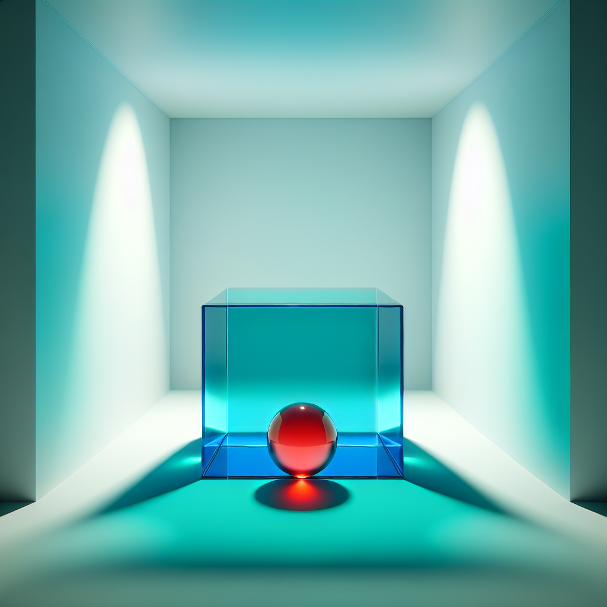
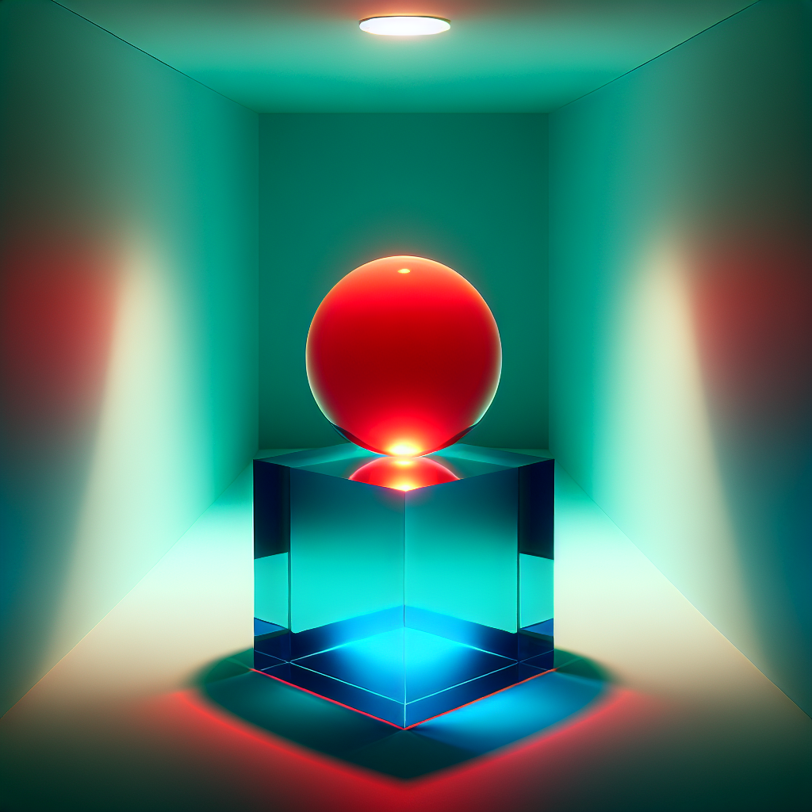
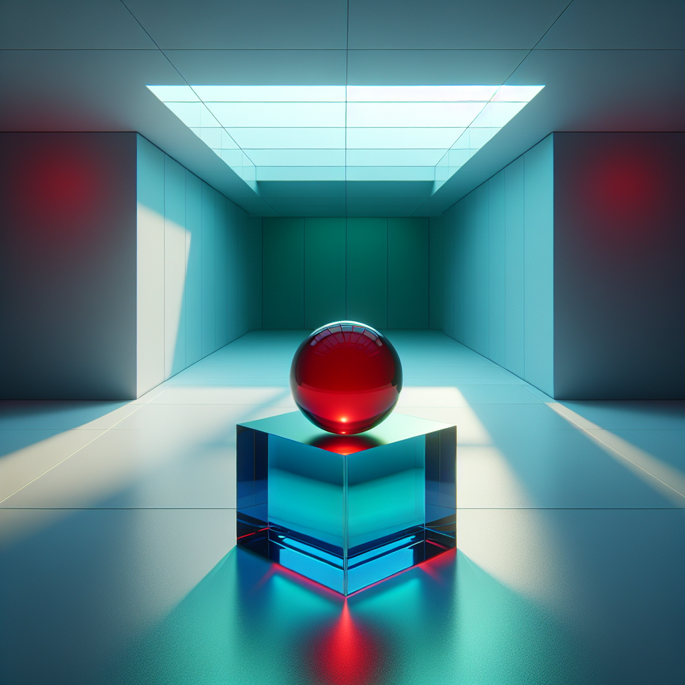
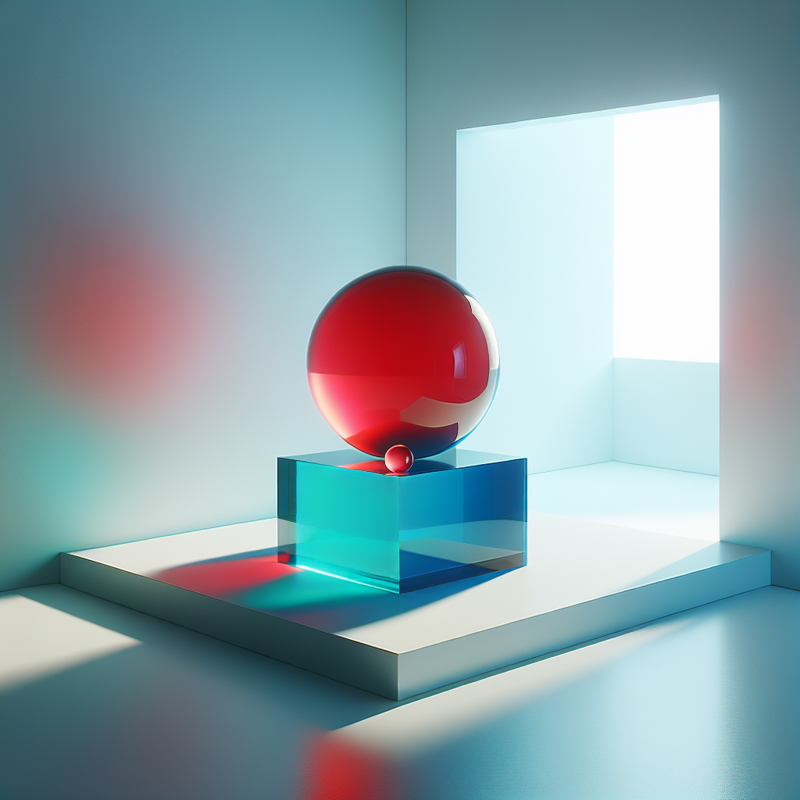
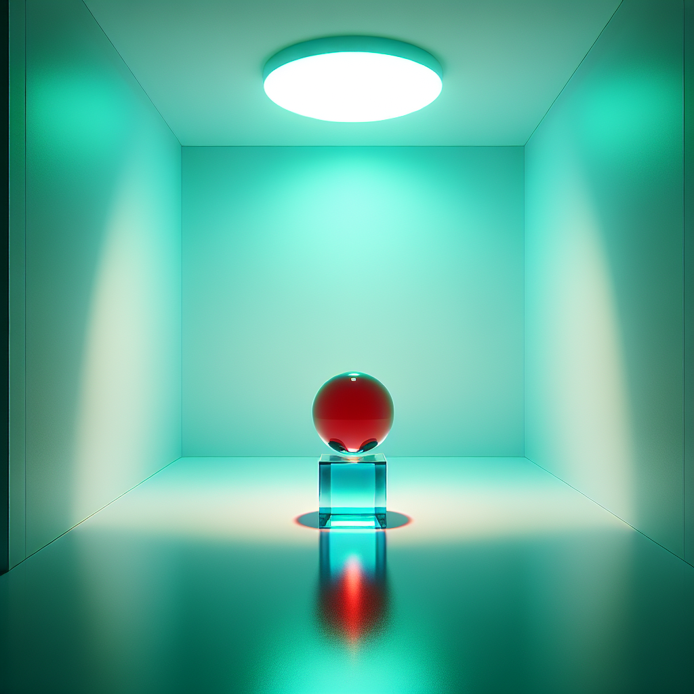
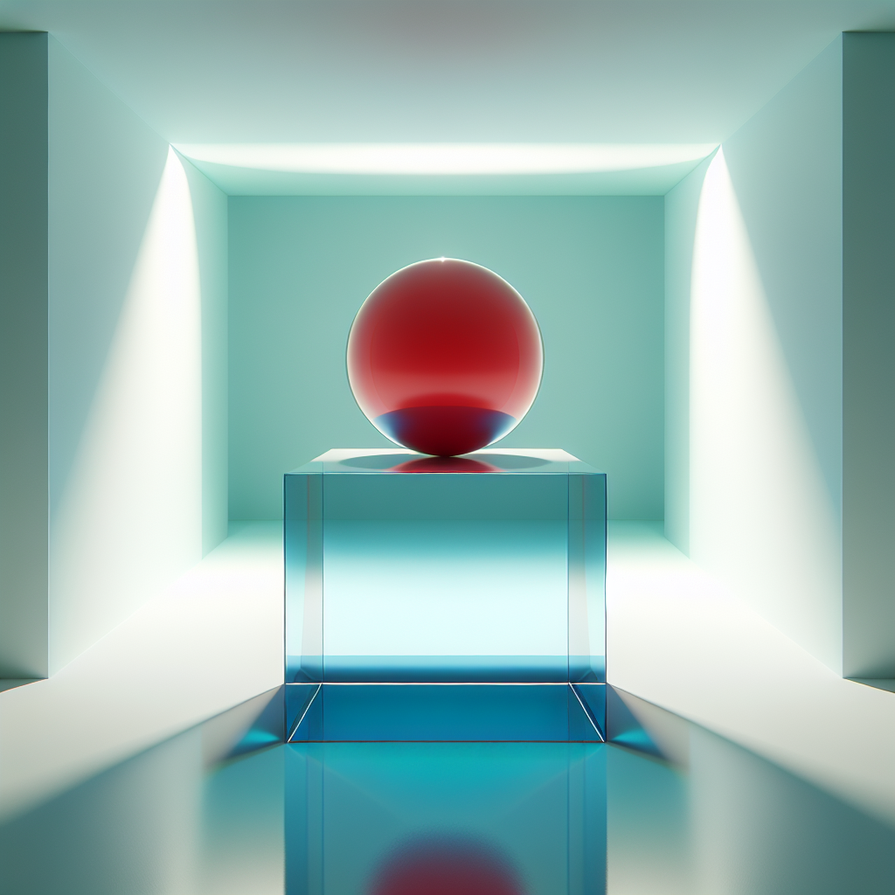
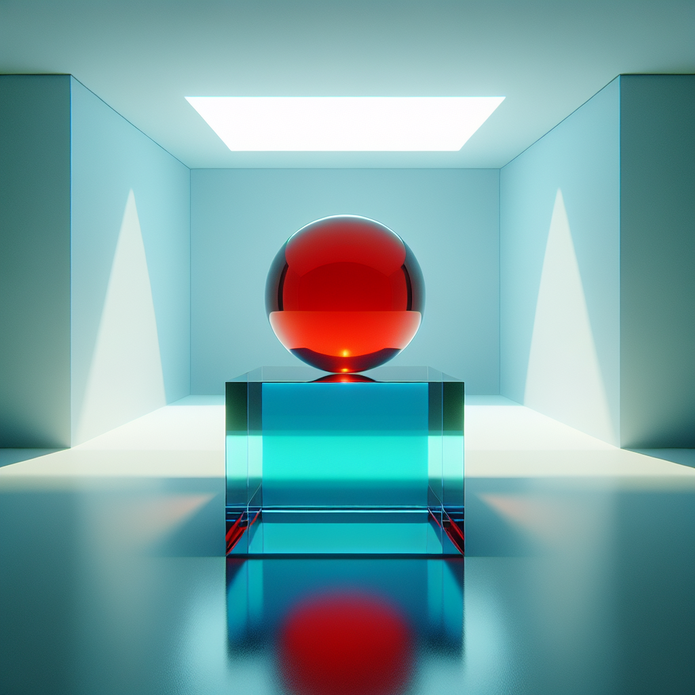
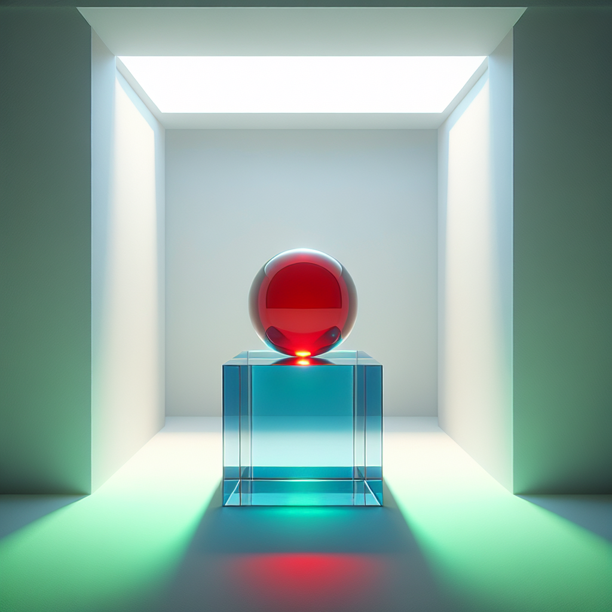

# Prompt "A red glass ball on top of a blue glass cube in a white room with green light"

## Iteration 1

### Differences

Object Presence/Absence:
- The image correctly includes a red glass ball and a blue glass cube.

Color Mismatch:
- The room is not white as specified; it appears to be illuminated with blue and green light, which affects the perception of the wall colors.
- The light in the room is not solely green as the prompt suggests. There is a mixture of blue and green light, with green light being prominent but not exclusive.

Size and Proportion Issues:
- There are no apparent size and proportion issues; the red glass ball and blue glass cube seem to be in correct proportion to each other.

Positional or Contextual Errors:
- The red glass ball is correctly positioned on top of the blue glass cube.

Overall, the most significant

### Prompt

Create an image featuring a red glass ball resting on top of a blue glass cube. The setting is a room with pure white walls, providing a neutral background that does not influence the colors of the objects. Illuminate the scene with a soft, green light that casts gentle hues on the objects, ensuring the light source emits green light exclusively. The size and proportions of the red glass ball and blue glass cube should be realistic and in correct proportion to each other, maintaining the balance as depicted with the ball on top of the cube. The focus should be on achieving a harmonious composition that highlights the vivid red of the glass ball and the deep blue of the glass cube, with the green lighting adding a subtle, monochromatic ambiance to the scene.

### Image

## Iteration 2

### Differences

Object Presence/Absence:
- There is an additional smaller red glass ball present on the blue cube, which was not mentioned in the original prompt.

Color Mismatch:
- The room is not entirely white as specified; it has colored reflections and gradients, likely due to the green light and the properties of the glass objects.
- The light in the room appears to be multicolored with shades of blue and red, in addition to green.

Positional or Contextual Errors:
- The green light does not uniformly illuminate the room; instead, it is part of a multicolored lighting effect.

Overall, the image does capture the main elements of the prompt with a red glass ball on top of a blue glass cube in a room with green light

### Prompt

Create an image featuring a single red glass ball resting on top of a blue glass cube. The setting is a room with pure white walls, ensuring that the walls do not reflect any additional colors onto the objects. Illuminate the scene with a uniform green light that casts a monochromatic glow throughout the room, highlighting the objects without introducing any other colors. The green light should be the sole light source, emphasizing the red and blue colors of the glass objects without creating multicolored reflections or gradients. The focus should be on the solitary red glass ball and the blue glass cube, with no additional objects present. The composition should convey a sense of simplicity and purity in color, with the green lighting adding a serene ambiance to the scene.

### Image

## Iteration 3

### Differences

Object Presence/Absence:
- The image correctly includes a red glass ball and a blue glass cube.

Color Mismatch:
- The room is not white as specified; it appears to have a blue tint, likely influenced by the blue cube and the green light.
- The light in the room is green, which is consistent with the prompt, but it also casts a blue tint, which may not be what was expected.

Size and Proportion Issues:
- There are no apparent issues with the size and proportion of the objects relative to each other.

Positional or Contextual Errors:
- The red glass ball is correctly positioned on top of the blue glass cube.

Overall, the most significant discrepancy is the color of the room, which is not white

### Prompt

Create an image that features a single red glass ball resting on top of a blue glass cube. The setting should be a room with walls that are a pure, unadulterated white, ensuring that the walls themselves do not cast any additional colors onto the objects within the room. The scene should be illuminated with a green light that is the only light source, casting a uniform green glow throughout the room. This green light should highlight the objects and maintain the integrity of the red and blue colors of the glass ball and cube, respectively, without creating any additional tints or color casts on the white walls. The size and proportions of the red glass ball and the blue glass cube should be realistic, and the ball should be positioned centrally on top of the cube. The composition should emphasize clarity and simplicity, showcasing the vivid contrast between the red and blue glass objects under the singular green lighting.

### Image

## Iteration 4

### Differences

Object Presence/Absence:
- The red glass ball is present.
- The blue glass cube is present.

Color Mismatch:
- The room is not white as specified; it appears to be tinted green due to the lighting, which could be considered a minor discrepancy since the green light affects the perceived color of the room.

Size and Proportion Issues:
- There are no apparent issues with the size and proportion of the ball and cube in relation to each other.

Positional or Contextual Errors:
- The green light is present, but it is not clear if the light source is green or if the light is white and the room's surfaces are causing the green tint. This could be considered a minor discrepancy.

Overall, the image closely matches

### Prompt

Create an image that includes the following elements:

1. A single red glass ball placed centrally on top of a blue glass cube. The red glass ball should be the only item resting on the cube.
2. The setting is an indoor scene with walls that are a crisp, pure white to ensure that the walls do not alter the colors of the objects with any tint or hue.
3. The room should be illuminated by a green light source that casts a clear green hue throughout the space, accentuating the red and blue colors of the glass objects without introducing any other color reflections or gradients onto the white walls.
4. The size and proportions of the red glass ball and the blue glass cube should be realistic and in correct proportion to one another, with the ball being appropriately sized to balance on the cube.
5. The composition should be simple and clean, with a focus on the contrast and interplay between the red and blue glass objects under the green lighting, ensuring that the overall ambiance is serene and the colors are true to life without any additional color casts.

### Image

## Iteration 5

### Differences

Object Presence/Absence:
- The red glass ball is present.
- The blue glass cube is present.

Color Mismatch:
- The room is not white; it appears to be a teal or cyan color.
- The light in the room is not green; it appears to be a mix of white and blue light, with red reflections possibly from the ball.

Size and Proportion Issues:
- There are no apparent size and proportion issues with the objects in relation to the prompt.

Positional or Contextual Errors:
- The objects are positioned correctly with the red glass ball on top of the blue glass cube.

Overall, the most significant discrepancy is the color of the room, which is not white as described in the prompt, and the color of

### Prompt

Create an image with the following specifications:

1. A single red glass ball should be the focal point, placed directly on top of a blue glass cube. There should be no other objects on the cube.
2. The environment is an indoor setting with walls that are a stark, clean white. This white should be unaffected by any colored lighting and remain true to a neutral white shade in the image.
3. Illuminate the scene with a green light that should be the only light source. This green light should cast a consistent green hue across the entire scene, enhancing the colors of the red glass ball and the blue glass cube without creating any additional color reflections or gradients on the white walls.
4. The sizes of the red glass ball and the blue glass cube should be proportionate to each other, with the ball sized appropriately to sit on top of the cube without any imbalance.
5. The overall composition should be simple and elegant, emphasizing the clarity and purity of the colors—the red of the ball, the blue of the cube, and the green of the light—against the neutral white background of the room.

### Image

## Iteration 6

### Differences

Object Presence/Absence:
- The red glass ball is present.
- The blue glass cube is present.
- The white room is present.

Color Mismatch:
- The green light mentioned in the prompt is not evident. The lighting in the room appears to be white or neutral, which does not match the specified green lighting.

Size and Proportion Issues:
- There are no significant issues with the size and proportion of the objects based on the information provided in the prompt.

Positional or Contextual Errors:
- The red glass ball is correctly positioned on top of the blue glass cube.
- The cube and ball are appropriately placed within the white room.

In summary, the most significant discrepancy is the absence of green lighting in the room, which affects

### Prompt

Create an image that includes the following elements:

1. A single red glass ball, which should be the only item placed centrally on top of a blue glass cube.
2. The setting is an indoor scene with walls that are a pure, unblemished white. The white walls should not reflect any colors and should remain a true white in the image.
3. The scene should be exclusively illuminated by a green light source. This green light should cast a clear and distinct green hue throughout the room, emphasizing the red and blue colors of the glass objects. The lighting should not introduce any other colors to the scene, ensuring that the walls stay white and only the objects are tinted by the green light.
4. The red glass ball and the blue glass cube should be in realistic proportion to each other, with the ball being appropriately sized to sit on top of the cube without any issue of balance.
5. The composition should be straightforward and refined, with a focus on the contrast between the red and blue glass objects under the influence of the green lighting. The overall ambiance should be calm and the colors should be accurately represented without any additional color casts.

### Image

## Iteration 7

### Differences

Object Presence/Absence:
- The red glass ball is present.
- The blue glass cube is present.

Color Mismatch:
- The room is not white as specified; it appears to be affected by the green light, giving it a greenish hue.
- The light source is green, which matches the prompt.

Size and Proportion Issues:
- There are no apparent issues with the size and proportion of the ball and cube relative to each other.

Positional or Contextual Errors:
- The ball is correctly positioned on top of the cube.

Overall, the most significant discrepancy is the color of the room, which should be white but appears green due to the lighting. The objects themselves (the red ball and blue cube) and their positioning are

### Prompt

Create an image with the following details:

1. A single red glass ball should be the central object, placed on top of a blue glass cube. There should be no other items on the cube.
2. The setting is an indoor scene with walls that are a pure, bright white. The walls should reflect no color and should remain distinctly white in the image, regardless of the lighting used.
3. The scene should be illuminated with a green light source. This green light should cast a clear green hue on the objects, enhancing the red and blue colors of the glass ball and cube. The light should be designed in such a way that it does not alter the white color of the walls or introduce any other colors to the scene.
4. The sizes of the red glass ball and the blue glass cube should be proportionate to each other, with the ball sized appropriately to sit on top of the cube in a balanced manner.
5. The composition should be simple and elegant, emphasizing the contrast between the red and blue glass objects under the green lighting. The overall ambiance should be serene, with the true colors of the objects and the white room clearly depicted without any additional color casts.

### Image

## Iteration 8

### Differences

Object Presence/Absence:
- There is a red glass ball present.
- There is a blue glass cube present.

Color Mismatch:
- The room is not white; it appears to be influenced by the green light, giving the walls a greenish tint.
- The light in the room is green, as specified.

Size and Proportion Issues:
- No issues detected; the size and proportions of the ball and cube seem to be as expected.

Positional or Contextual Errors:
- The red glass ball is correctly positioned on top of the blue glass cube.
- The cube is placed in a room that appears to be illuminated by green light, as per the prompt.

Overall, the image is faithful to the original description with the exception of

### Prompt

Create an image with the following specifications:

1. Include a single red glass ball, which should be the only object placed on top of a blue glass cube.
2. The setting is an indoor scene with walls that are a pure, bright white. The white of the walls should remain true and unaffected by any colored lighting within the room.
3. Illuminate the scene with a green light source that casts a distinct green hue onto the red glass ball and blue glass cube, enhancing their colors. The lighting should be carefully managed to ensure that it does not tint the white walls, which should retain their pure white appearance.
4. Ensure that the size and proportions of the red glass ball and the blue glass cube are realistic and in correct proportion to one another, with the ball being appropriately sized to sit on top of the cube without any issue of balance.
5. The composition should be clean and focused, with a strong emphasis on the contrast between the red and blue glass objects under the green lighting. The overall ambiance should be tranquil, with the colors of the objects clearly and accurately represented against the neutral backdrop of the white room.

### Image

## Iteration 9

### Differences

Object Presence/Absence:
- The red glass ball is present.
- The blue glass cube is present.

Color Mismatch:
- The lighting in the room is not green as specified; instead, it appears to be a standard white or slightly blueish light.

Size and Proportion Issues:
- There are no apparent issues with the size and proportion of the red glass ball and the blue glass cube in relation to each other.

Positional or Contextual Errors:
- The objects are positioned correctly with the red glass ball on top of the blue glass cube.

The most significant discrepancy is the color of the light, which is not green as described in the prompt.

### Prompt

Create an image with the following characteristics:

1. Place a single red glass ball on top of a blue glass cube. Ensure that the red glass ball is the only object on the cube.
2. The setting should be an indoor scene with walls that are a stark, unadulterated white. The walls must remain a true white and should not pick up any color from the lighting or the objects within the room.
3. The entire scene should be illuminated with a green light source. This green light should bathe the red glass ball and the blue glass cube in a clear green hue, accentuating their colors without affecting the white of the walls. The lighting should be arranged to prevent any non-green hues or reflections on the white surfaces.
4. The red glass ball and the blue glass cube should be in correct proportion to each other, with the ball sized appropriately to sit on top of the cube in a stable manner.
5. The composition should be straightforward and refined, with the focus on the vivid contrast between the red and blue glass objects under the influence of the green lighting. The overall effect should be one of calmness and clarity, with the true colors of the objects distinctly visible against the neutral white background.

### Image

