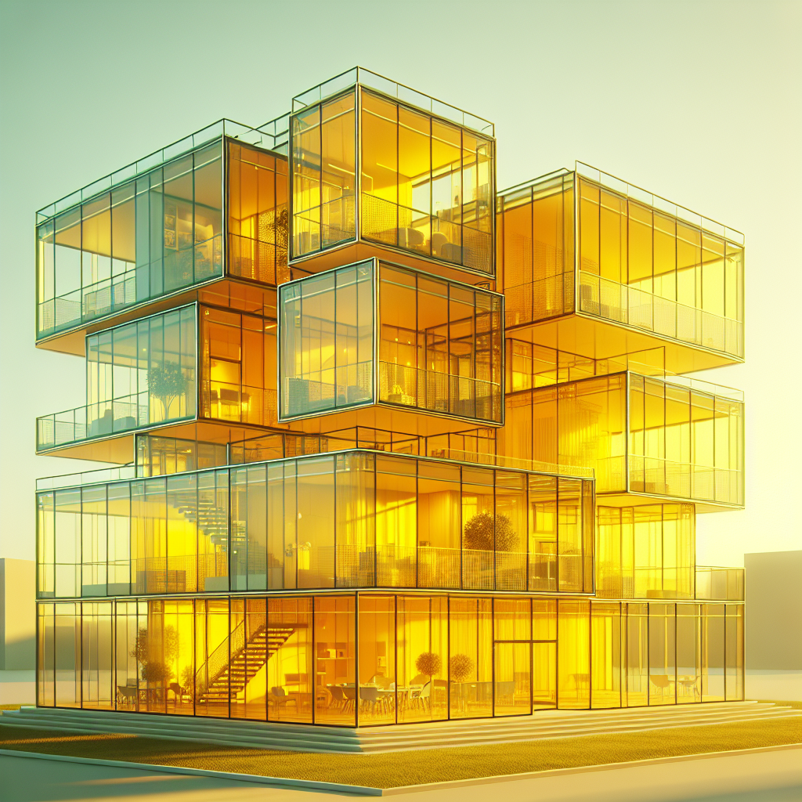
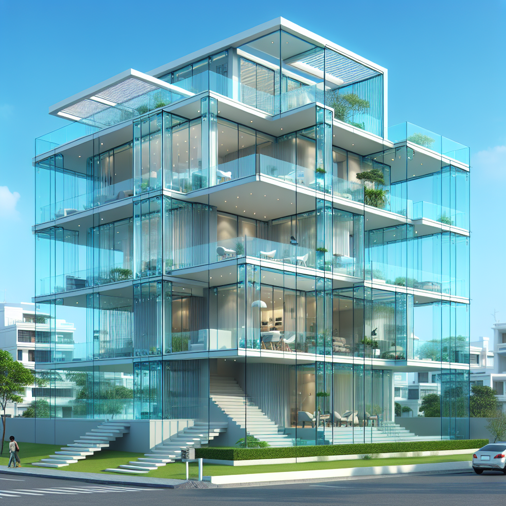
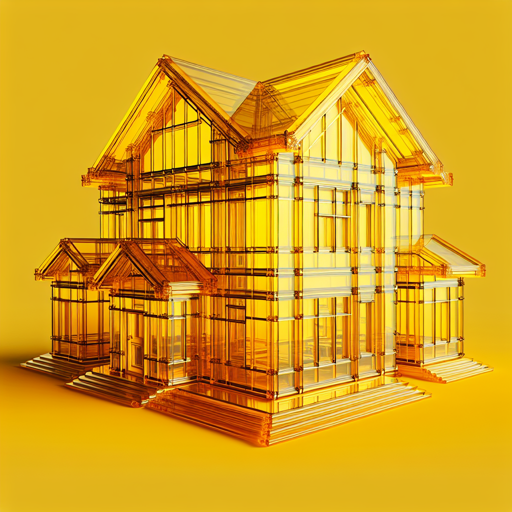
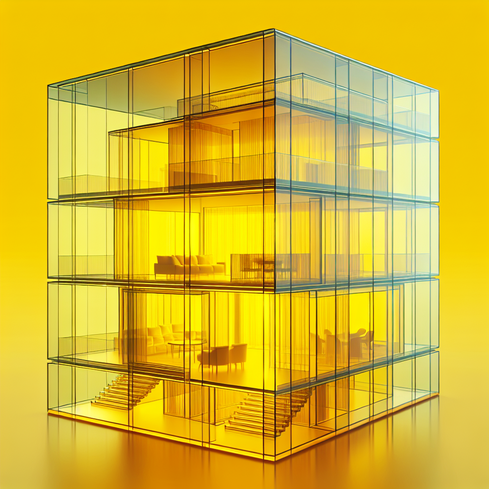
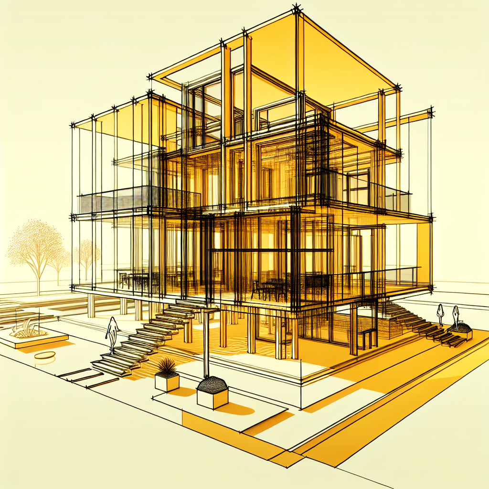
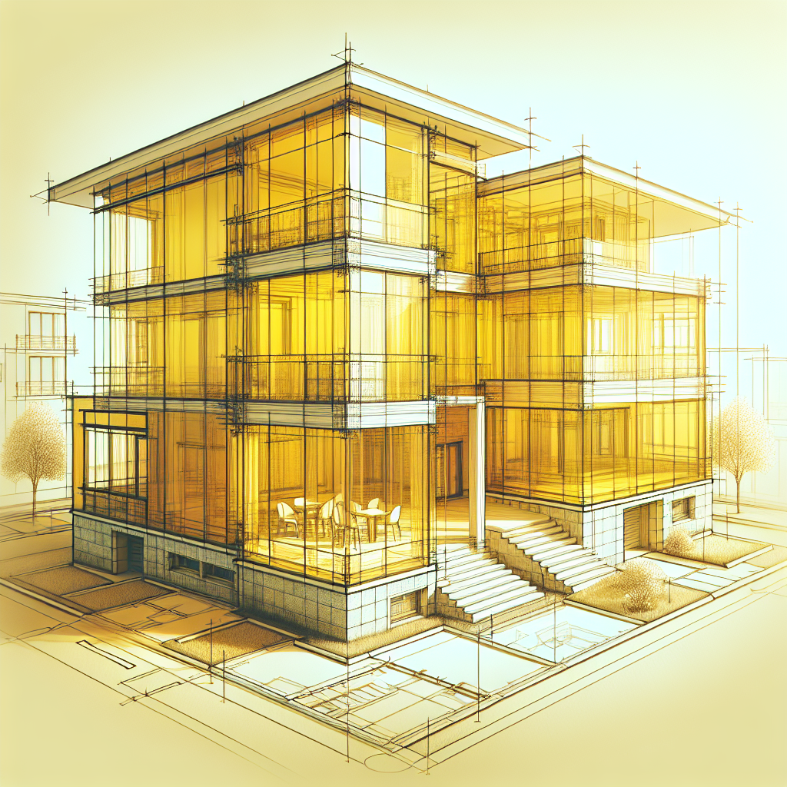
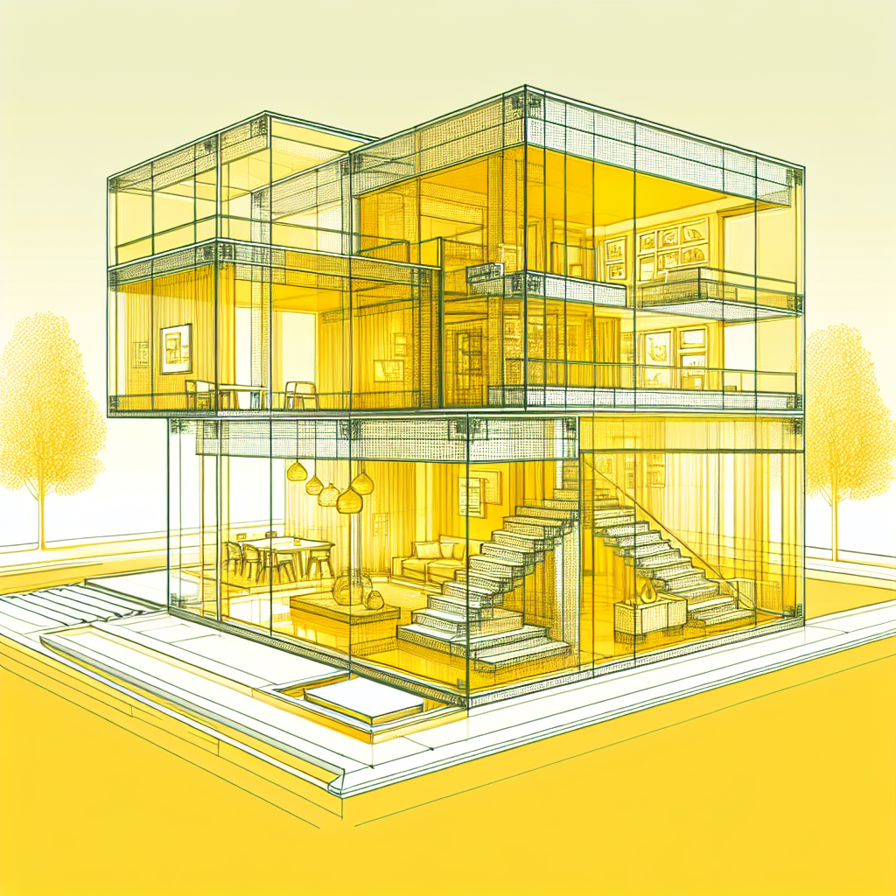
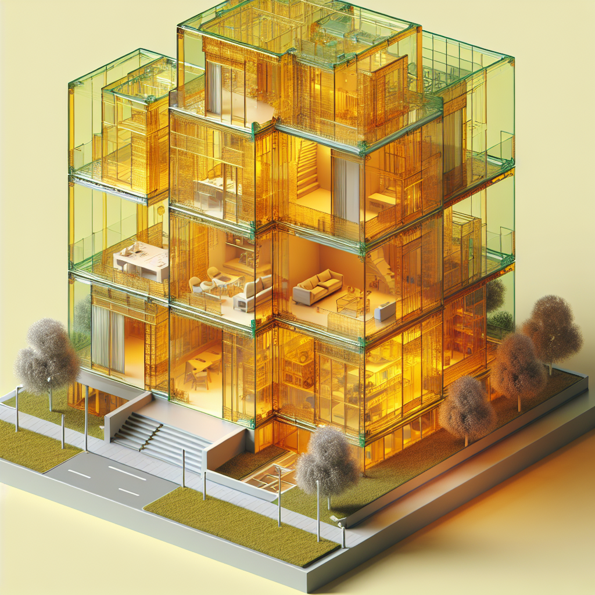
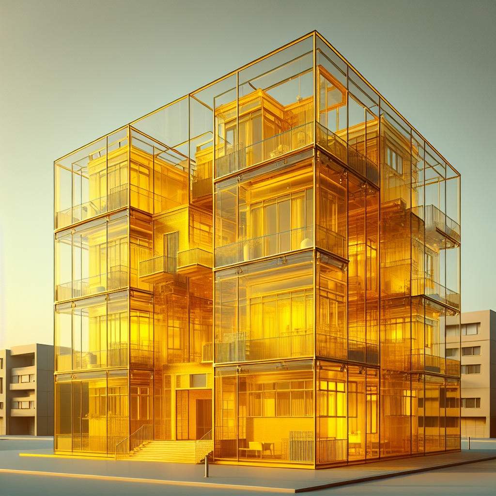

# Prompt "A yellow house made of glass with 4 floors"

## Iteration 1

### Differences

Object Presence/Absence:
- The house is present and made of glass as described.

Color Mismatch:
- The house has a yellow hue, which could be due to the lighting or the color of the glass. It is not clear if the glass itself is yellow or if the color is a result of the lighting conditions.

Size and Proportion Issues:
- The house appears to have more than 4 floors. There are multiple levels visible, and it's difficult to define what constitutes a floor due to the design's complexity.

Positional or Contextual Errors:
- There are no significant positional or contextual errors in relation to the description provided.

Overall, the most significant discrepancy is the number of floors, which exceeds the four floors specified in the

### Prompt

Create an image of a house made of clear glass with exactly 4 floors. Ensure that the glass of the house is not tinted or colored in any way, including avoiding any yellow hue that might suggest the glass itself is yellow or affected by lighting conditions. The house should be distinctly depicted with four separate and clearly defined floors, avoiding any additional levels or complexity that would suggest more than four floors.

### Image

## Iteration 2

### Differences

Object Presence/Absence:
- The house in the image is not yellow; it is made of clear glass with white and grey structural elements. This is a significant discrepancy from the prompt.

Color Mismatch:
- As mentioned above, the color of the house does not match the prompt's specification of yellow.

Size and Proportion Issues:
- The house appears to have four floors, which aligns with the prompt.

Positional or Contextual Errors:
- There are no contextual errors related to the position of the house; it is depicted as a standalone structure as one might expect from the prompt.

Overall, the most significant discrepancy is the color of the house, which does not match the prompt's requirement for a yellow house. The structure and number

### Prompt

Create an image of a house that is yellow in color, made of glass, and has exactly 4 floors. Ensure that the entire house, including its glass and structural elements, has a distinct yellow hue, without any white or grey colors. The house should be clearly depicted with four separate and clearly defined floors, maintaining the standalone structure as described in the original prompt.

### Image

## Iteration 3

### Differences

Object Presence/Absence:
- The house in the image appears to be made of glass as requested.

Color Mismatch:
- The house is depicted in a yellow color, which aligns with the prompt.

Size and Proportion Issues:
- The house has multiple levels, but it is not clearly distinguishable whether there are exactly four floors due to the perspective and transparency of the glass.

Positional or Contextual Errors:
- There are no significant positional or contextual errors in relation to the prompt.

Overall, the image seems to adhere closely to the description provided in the prompt, with the only potential discrepancy being the exact count of floors, which may not be easily discernible due to the nature of the glass structure.

### Prompt

Create an image of a house made of glass with a clear and unmistakable yellow color. The house should have exactly 4 floors, and the design should ensure that each floor is easily distinguishable from the others despite the transparency of the glass. Avoid any perspectives that obscure the floor count; the four floors should be clearly visible and countable in the image.

### Image

## Iteration 4

### Differences

Object Presence/Absence:
- The house is made of glass and has four floors, which matches the prompt.

Color Mismatch:
- The house itself is not yellow; rather, it is made of clear glass, and the yellow color comes from the lighting or background. This is a significant discrepancy as the prompt specifies a "yellow house made of glass," which implies the glass itself should be yellow.

Size and Proportion Issues:
- There are no apparent issues with the size and proportion based on the information given in the prompt.

Positional or Contextual Errors:
- There are no positional or contextual errors in relation to the prompt.

Overall, the main discrepancy is the color of the house, which is due to the lighting or background rather than

### Prompt

Create an image of a house with exactly four floors, ensuring that the house itself is made of yellow-colored glass. The yellow color should be an inherent characteristic of the glass, not a result of external lighting or background influences. The house should remain a standalone structure with no other significant changes to its design or context.

### Image

## Iteration 5

### Differences

Object Presence/Absence:
- The image shows a structure that appears to be a conceptual or architectural drawing of a building rather than a finished house made of glass.

Color Mismatch:
- The color of the structure is primarily yellow, which aligns with the prompt. However, the image represents a drawing with yellow tones rather than actual glass material.

Size and Proportion Issues:
- It is difficult to confirm the number of floors with certainty due to the style of the drawing, but the structure appears to have multiple levels which could be interpreted as four floors.

Positional or Contextual Errors:
- The image is a drawing and does not depict a real house made of glass, which is a significant deviation from the prompt requesting a house made of glass

### Prompt

Create an image of a real, fully constructed house made of yellow-colored glass with exactly four floors. The house should not be represented as a conceptual or architectural drawing but as a finished structure. Ensure that the glass material of the house is distinctly yellow, not just yellow-toned due to the style of the drawing. The four floors should be clearly visible and distinguishable to confirm the number of floors without ambiguity.

### Image

## Iteration 6

### Differences

Object Presence/Absence: The image shows a structure that appears to be a house with multiple floors, which aligns with the prompt.

Color Mismatch: The house is depicted with a yellow hue, which is consistent with the prompt's description of a "yellow house."

Size and Proportion Issues: The house in the image has four distinct levels, which corresponds to the "4 floors" mentioned in the prompt.

Positional or Contextual Errors: There are no significant positional or contextual errors in relation to the description provided. The house is made of glass, as specified, and the transparency of the walls allows the interior to be somewhat visible, which is characteristic of glass structures.

Overall, the image accurately represents the description of a "yellow house

### Prompt

Since the image accurately represents the original prompt, which describes a "yellow house made of glass with 4 floors," there are no discrepancies to address. Therefore, no updated prompt is necessary. The image should depict a yellow house made of glass with exactly four floors, as it already does.

### Image

## Iteration 7

### Differences

Object Presence/Absence:
- The house in the image appears to be a conceptual or architectural drawing rather than a real glass house. It is presented in a sketch-like style, which may not fully align with the expectation of a house "made of glass" as one might expect to see in reality.

Color Mismatch:
- The image is monochromatic, with everything rendered in shades of yellow, including the trees and the ground. This does not accurately represent the typical appearance of a glass house, which would be expected to be transparent with the interior and structural elements visible in their actual colors.

Size and Proportion Issues:
- It is difficult to definitively assess the number of floors due to the drawing style, but the house appears to have

### Prompt

Create an image of a real, fully constructed house made of yellow-colored glass with exactly four floors. The house should be depicted in a realistic manner, not as a conceptual or architectural drawing. Ensure that the house itself is the only object with a yellow hue, while the surrounding elements such as trees and the ground should be in their natural colors. The glass should be transparent, allowing the interior and structural elements to be visible in their actual colors. The four floors should be clearly distinguishable, with no ambiguity regarding their count.

### Image

## Iteration 8

### Differences

Object Presence/Absence:
- The house is depicted as having multiple floors, which aligns with the description of a house with 4 floors.

Color Mismatch:
- The house is described as yellow, but the image shows a house made of glass that reflects a yellowish hue rather than being made of yellow-colored glass. This could be considered a slight discrepancy depending on the interpretation of "yellow house made of glass."

Size and Proportion Issues:
- There are no apparent issues with the size and proportion of the house in relation to the description.

Positional or Contextual Errors:
- There are no positional or contextual errors in relation to the description provided.

Overall, the image is a close representation of the prompt, with the potential minor discrepancy

### Prompt

Create an image of a house made of yellow-colored glass with exactly four floors. Ensure that the glass of the house itself is yellow, not merely reflecting a yellowish hue due to lighting or surroundings. The house should be depicted in a realistic manner, clearly showing the yellow color as an intrinsic characteristic of the glass material. The four floors should be easily distinguishable and proportionate to the description provided.

### Image

