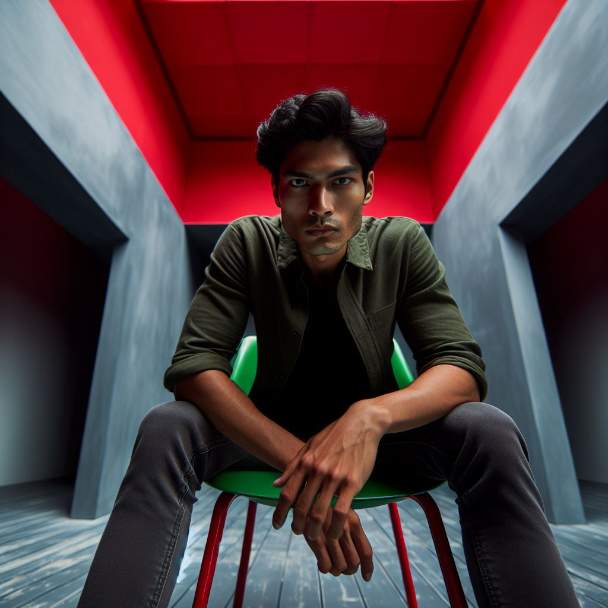
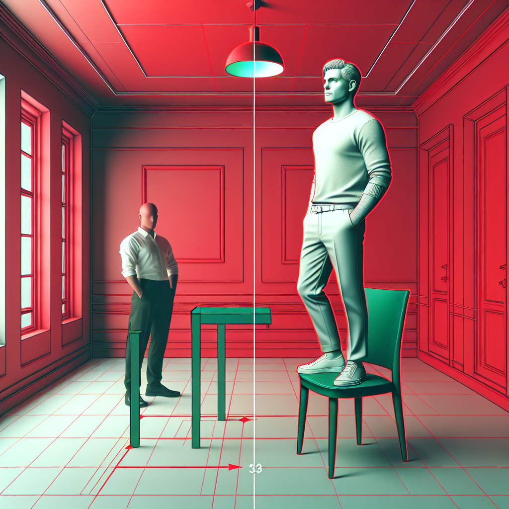
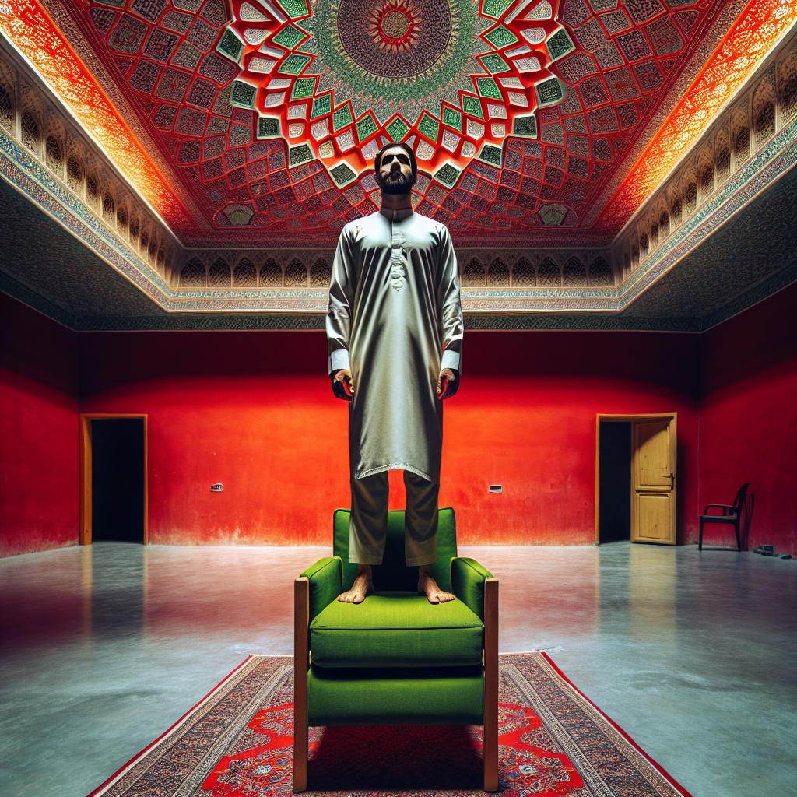

# Prompt "Man standing on a green chair in a room with a red ceiling"

## Iteration 1

### Differences

Object Presence/Absence:
- The man is not standing on the chair as described, but is instead sitting on it. This is a significant discrepancy as it changes the action being depicted.

Color Mismatch:
- The ceiling is red as described, so there is no discrepancy here.

Size and Proportion Issues:
- There are no apparent size or proportion issues with respect to the prompt.

Positional or Contextual Errors:
- The position of the man is incorrect based on the prompt. He should be standing rather than sitting.

Overall, the most significant error in the image is that the man is sitting on the chair instead of standing on it, which directly contradicts the original prompt.

### Prompt

Create an image of a man standing on a green chair. Ensure that the man is depicted in a standing position on the chair, not sitting. The room should have a red ceiling, which is already correctly depicted in the previous image. There are no changes needed regarding the size, proportions, or the color of the ceiling.

### Image

## Iteration 2

### Differences

Object Presence/Absence:
- The image shows two men, one standing on the floor and one standing on a chair, instead of just one man standing on a chair as the prompt describes.

Color Mismatch:
- The ceiling is red, which matches the prompt.
- The chair is green, which also matches the prompt.

Size and Proportion Issues:
- There are no obvious size or proportion issues concerning the main elements (the man, chair, and ceiling) in relation to the prompt.

Positional or Contextual Errors:
- The man who should be standing on the chair is correctly positioned, but the presence of the second man standing on the floor is an error.

In summary, the most significant discrepancy is the presence of an additional man

### Prompt

Create an image of a single man standing on a green chair. There should be no other people in the image. The ceiling of the room should be red, which is already correctly depicted. Ensure that there are no size or proportion issues with the man, the chair, or the ceiling. The man should be the only subject, standing on the chair, and not on the floor.

### Image

