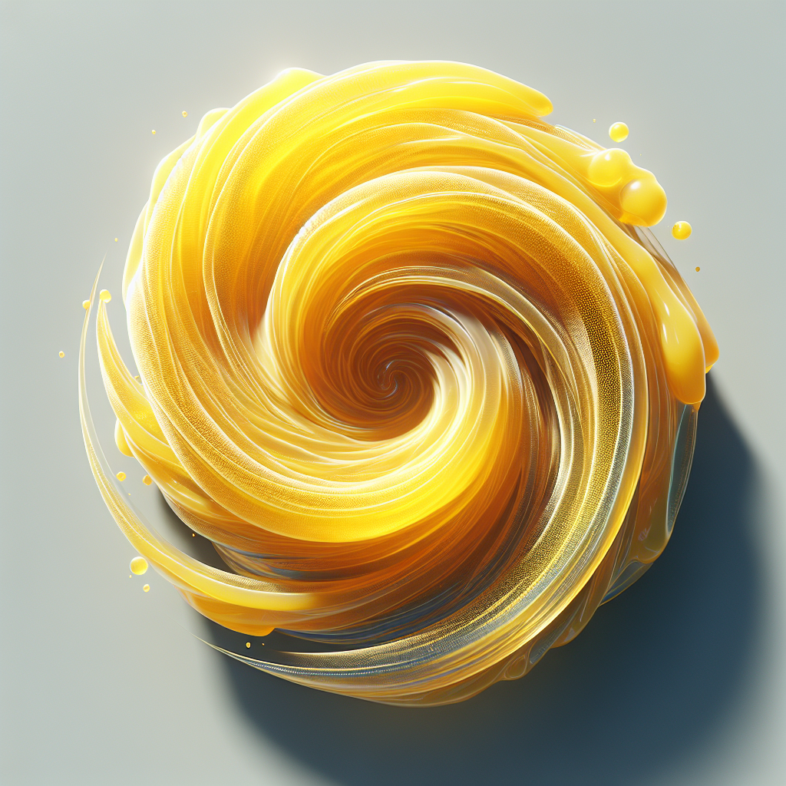
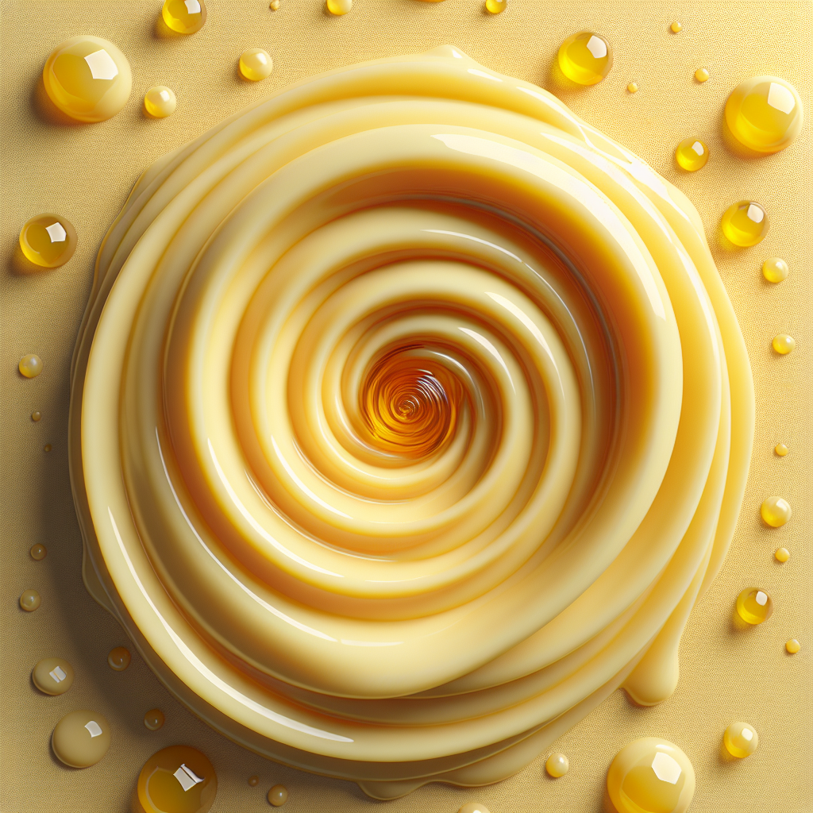

# Prompt "one vortex in clear yellow honey, shown from above"

## Iteration 1

### Differences

- The honey is not clear; it is opaque and has a creamy texture.
- There are multiple small droplets of honey scattered around the main vortex, which are not mentioned in the prompt.
- The surface on which the honey is placed is visible and has a shadow, which is not specified in the prompt.

If we are to ignore the surface and shadow as they might be considered part of the background, the first two points still stand.

### Prompt

Create an image of a creamy yellow honey vortex seen from above, with additional small droplets of honey surrounding it.

### Image

